# Agregar lugares a su espacio de trabajo y visualizar métricas dinámicas

## ¿Cómo agrego lugares?

Agregar un nuevo lugar a su espacio de trabajo le proporciona la capacidad de utilizar todas las funcionalidades de UNBL para cualquier área de interés (área protegida, nivel administrativo subnacional, área transfronteriza, límite de comunidad indígena, etc.). Una vez que el lugar ha sido agregado a su espacio de trabajo UNBL, podrá: (1) mostrar métricas dinámicas para esta área de interés (como estadísticas zonales); y (2) recortar cualquier capa ráster publicada en la plataforma pública UNBL (con una licencia de acceso abierto) a esta área de interés y luego descargarla como un archivo GeoTIFF para trabajo adicional en un software SIG de escritorio. Agregar un lugar implica cargar un archivo vectorial (polígono o multipolígono) a UNBL.

Para agregar un nuevo lugar:

1.	Navegue a la página 'Lugares' desde el menú desplegable en el lado izquierdo de la interfaz de administración.

2.	Haga clic en el botón 'CREAR NUEVO LUGAR'.

	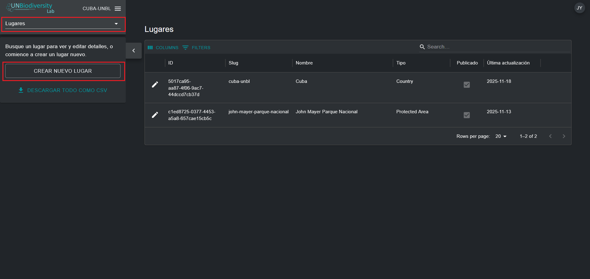

3.	En la página 'Nuevo lugar' que aparece, complete la siguiente información:

	a.	*Título*: Inserte el nombre del lugar. Recomendamos mantenerlos cortos y claros. Actualmente, no se permiten caracteres especiales.

	b.	*Tipo de lugar*: Seleccione la clase apropiada del menú desplegable. Esto será útil para filtrar sus búsquedas más tarde. Puede elegir entre *Biome or Ecosystem, Community and Indigenous Area, Country, Cross-Boundary Area, Other Jurisdiction, Protected Area, Species Range* o *Study Area*.

	c.	*Slug*: Inserte un identificador único para el lugar que contenga solo letras minúsculas, números y guiones. No se pueden usar espacios. Esto identificará de manera única su lugar de todos los demás dentro del sistema UNBL. Recomendamos usar el botón 'GENERA UN NOMBRE DEL SLUG' para ayudarle a generar un slug apropiado.

	d.	*Archivo de forma*: Cargue un archivo de polígono (o multipolígono) para definir su lugar. Los formatos soportados son GeoJSON (.geojson, .geojsonl), archivos de Google Earth (.kml, .kmz) o Shapefiles de ESRI (.zip que contenga archivos .shp, .dbf, .shx, .prj). Si usa un GeoJSON, el tamaño del archivo no debe ser mayor de 6MB. El sistema permite cargas de hasta 6MB, pero recomendamos encarecidamente usar archivos de no más de 2MB para un renderizado óptimo y cálculos de métricas. Si usa archivos de Google Earth o Shapefiles de ESRI, asegúrese de que el sistema de referencia de coordenadas sea WGS-84, también conocido como EPSG: 4326.

	e.	Si toda la información ingresada es válida, el botón 'GUARDAR Y VER DETALLES' se iluminará en azul. Haga clic en este botón para cargar su lugar a UNBL.

	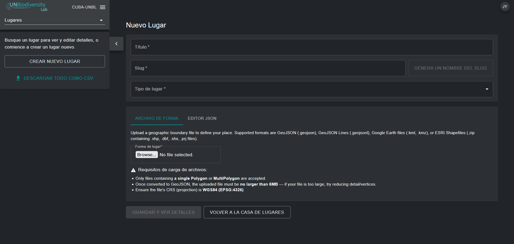

4.	Una vez que guarde su nuevo lugar, será llevado a la página de edición del lugar. Para que su lugar sea descubrible y visible en la vista del mapa, debe publicar el lugar haciendo clic en el botón de activación 'Publicado'. Los lugares no publicados permanecen en la interfaz de administración hasta que esté listo para publicarlos en la vista del mapa UNBL.

5.	Para hacer de este un lugar destacado para su espacio de trabajo, haga clic en el botón de activación 'Destacado'. Esto actuará como un marcador para que el lugar aparezca en la parte superior de la lista en la pestaña 'Lugares' cada vez que no se seleccione una ubicación.

	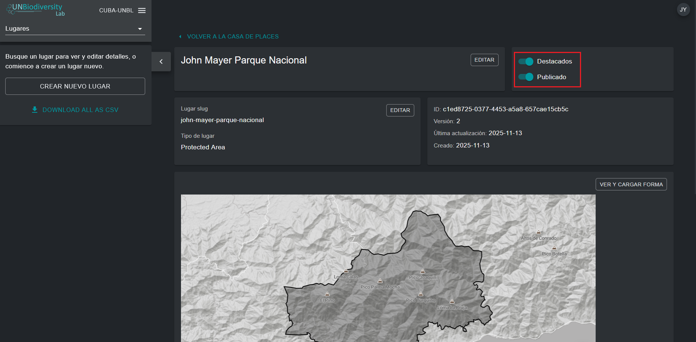

## ¿Cómo edito lugares?

También puede hacer ediciones a lugares existentes y ver su lugar en un mapa base para inspeccionar visualmente que el archivo está correctamente orientado en la vista del mapa. Para hacer esto:

1.	Navegue a la página 'Lugares' desde el menú desplegable en el lado izquierdo de la interfaz de administración.

2.	Seleccione el lugar que le interesa de la lista de lugares haciendo clic en el icono {style="display: inline; width: 1em; height: 2em; width: 2em;"} en el lado más a la izquierda de la entrada del lugar.

	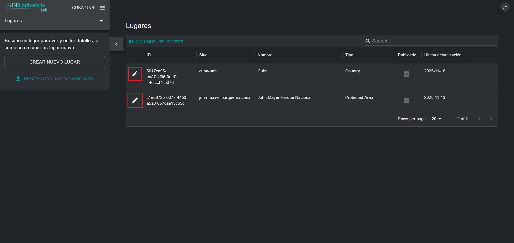

3.	Haga clic en el botón 'VER Y CARGAR FORMA' cerca de la esquina superior derecha de la ventana del mapa base para ver información geoespacial básica sobre su lugar – incluyendo coordenadas del cuadro delimitador (extensión), área del lugar en hectáreas y las coordenadas del punto de origen – y cargar cualquier nueva versión del lugar que pueda tener en el futuro.

	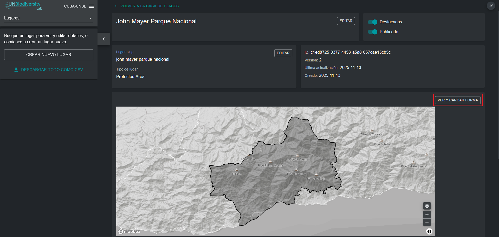

4.	Use el botón 'Forma de lugar' para cargar nuevos archivos para su lugar actualizado. Haga clic en 'FORMA DE ACTUALIZACIÓN' para guardar sus cambios. También puede descargar su versión actual de este lugar a su computadora local como un GeoJSON haciendo clic en el botón 'Download GeoJSON' (debajo de la vista del mapa).

	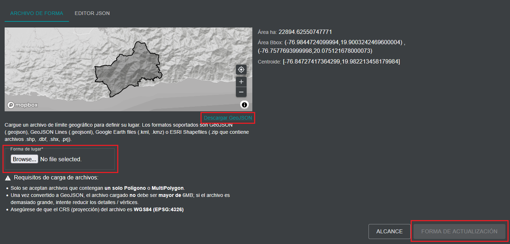

## ¿Cómo muestro métricas para mis lugares agregados?

Las métricas dinámicas se vuelven automáticamente disponibles para su lugar tan pronto como lo carga en UNBL. Para mostrar métricas dinámicas para lugares dentro de su espacio de trabajo UNBL:

1.	Navegue a la vista del mapa UNBL haciendo clic en el nombre de su espacio de trabajo en la interfaz de administración del espacio de trabajo en la esquina superior izquierda, y luego haga clic en 'Map View'.

	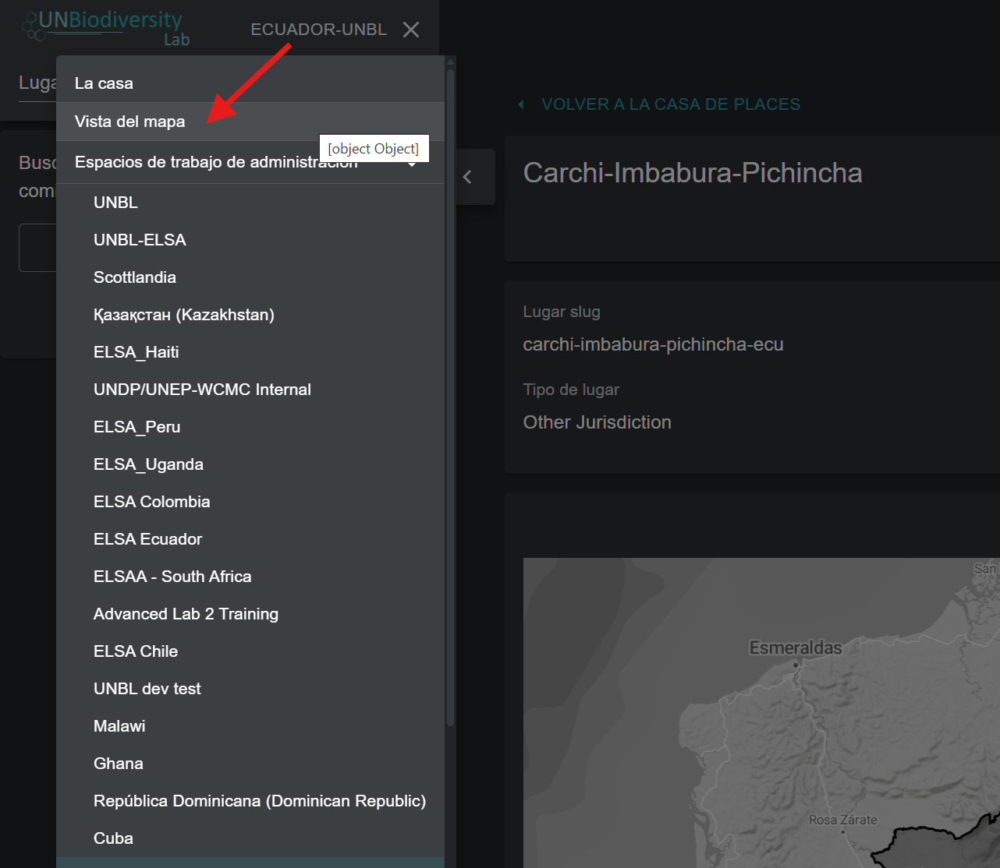

2.	En la pestaña 'LUGARES', busque y seleccione un lugar cargado en su espacio de trabajo UNBL.

	!!!Note
		Los lugares se filtran por tipo *Pais* por defecto al abrir la vista del mapa UNBL. Si su lugar es de una categoría diferente, como Protected Area o Área transfronteriza y no de tipo *Pais*, entonces necesita hacer clic en el botón 'CLARA' para borrar todos los filtros, o expandir el menú desplegable 'FILTERS' y desmarcar la casilla de país y seleccionar su filtro de interés para encontrar su lugar.

3.	Al seleccionar un lugar, las métricas dinámicas se mostrarán automáticamente en el panel izquierdo. Elija entre una lista de las nueve métricas dinámicas estándar o dos métricas de indicadores principales haciendo clic en el botón 'METRICS' o 'HEADLINE INDICATORS'.

	!!!Note
		Las métricas de indicadores principales y la métrica de Protected Area solo están disponibles para lugares de tipo *Pais* con un código de país M49 especificado.

	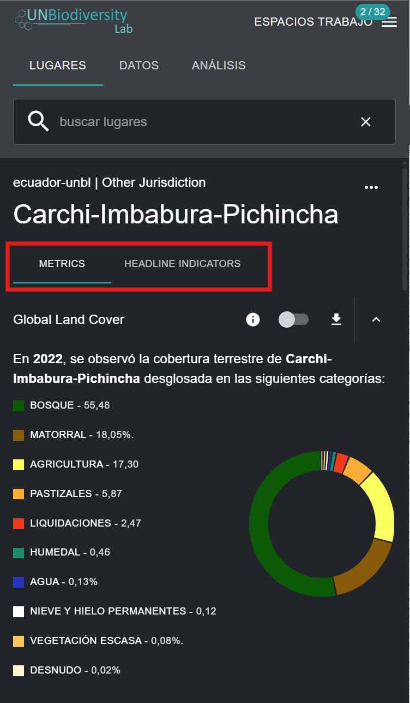

4.	Haga clic en el botón de activación junto a cualquier métrica específica si desea ver este conjunto de datos en el mapa. Haga clic en el botón de alternancia de nuevo o en el icono {style="display: inline; width: 1em; height: 2em; width: 2em;"} en la leyenda de la capa para eliminar este conjunto de datos de la vista del mapa. También puede hacer clic en el icono de flecha hacia arriba para ocultar la métrica de la vista en la pestaña de métricas disponibles, y viceversa.

	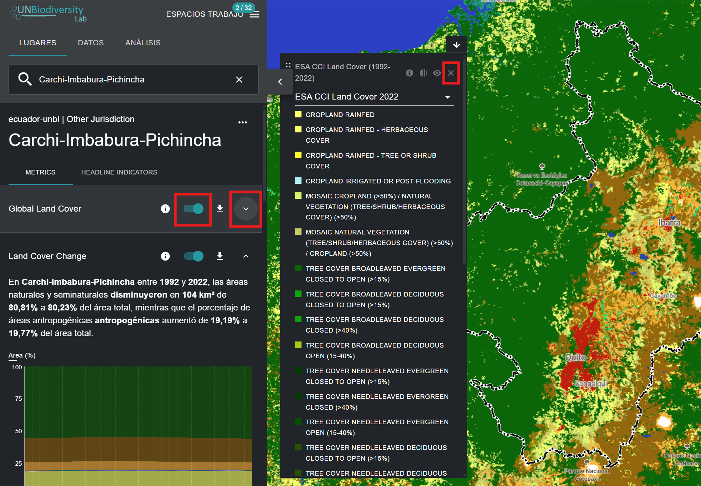

5.	Haga clic en el icono {style="display: inline; width: 1em; height: 2em; width: 2em;"} en el widget de métricas o en la leyenda de la capa (si tiene un conjunto de datos activado) para ver la información de la capa. Las páginas de información proporcionan una breve descripción de los datos, artículos relacionados para leer, datos sin procesar para descargar (si están disponibles gratuitamente) y especificaciones de licencia.

	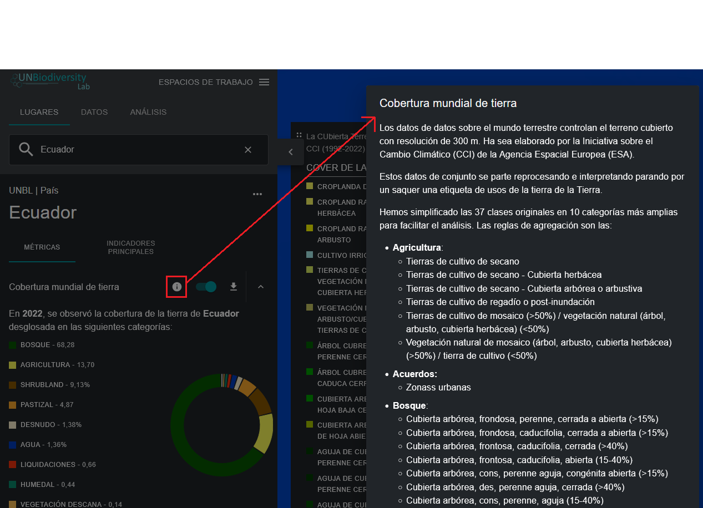

6.	Para descargar datos de resumen para la métrica en formato .csv o .json, haga clic en el icono 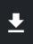{style="display: inline; width: 1em; height: 2em; width: 2em;"}. Luego puede elegir si descargar datos de resumen a su directorio local en formato de valores separados por comas o formato .json. También puede descargar los datos desde enlaces de fuente en las páginas de información de la capa.

	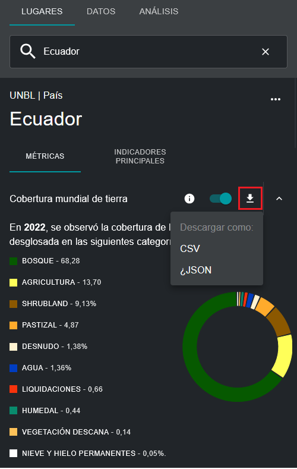
