# Ajouter des lieux à votre espace de travail et visualiser les métriques dynamiques

## Comment ajouter des lieux ?

L'ajout d'un nouveau lieu à votre espace de travail vous permet d'utiliser toutes les fonctionnalités du UNBL pour toute zone d'intérêt (aire protégée, niveau administratif infranational, zone transfrontalière, limite de communauté autochtone, etc.). Une fois le lieu ajouté à votre espace de travail UNBL, vous pourrez : (1) afficher des métriques dynamiques pour cette zone d'intérêt (sous forme de statistiques zonales) ; et (2) découper toute couche raster publiée sur la plateforme publique du UNBL (avec une licence en accès libre) selon cette zone d'intérêt, puis la télécharger en tant que fichier GeoTIFF pour un travail ultérieur dans un logiciel SIG de bureau. L'ajout d'un lieu implique le téléchargement d'un fichier vectoriel (polygone ou multipolygone) sur le UNBL.

Pour ajouter un nouveau lieu :

1.	Naviguez vers la page « Lieux » depuis le menu déroulant sur le côté gauche de l'interface d'administration.

2.	Cliquez sur le bouton « CREER UN NOUVEAU LIEU ».

	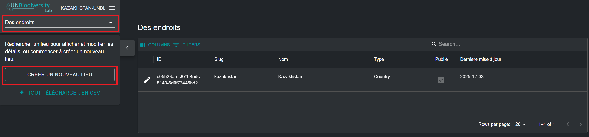

3.	Dans la page « Nouveau lieu » qui apparaît, remplissez les informations suivantes :

	a.	*Titre* : Insérez le nom du lieu. Nous recommandons de les garder courts et clairs. Actuellement, aucun caractère spécial n'est autorisé.

	b.	*Type de lieu* : Sélectionnez la classe appropriée dans le menu déroulant. Cela sera utile pour filtrer vos recherches ultérieurement. Vous pouvez choisir parmi *Biome ou écosystème, communauté et zone autochtone, pays, zone transfrontalière, autre juridiction, aire protégée, aire de répartition des espèces* ou *aire d'étude*.

	c.	*Slug* : Insérez un identifiant unique pour le lieu qui contient uniquement des lettres minuscules, des chiffres et des tirets. Les espaces ne peuvent pas être utilisés. Cela identifiera de manière unique votre lieu parmi tous les autres dans le système UNBL. Nous recommandons d'utiliser le bouton « GENERER UN SLUG » pour vous aider à générer un slug approprié.

	d.	*Forme du lieu* : Téléchargez un fichier polygone (ou multipolygone) pour définir votre lieu. Les formats pris en charge sont GeoJSON (.geojson, .geojsonl), les fichiers Google Earth (.kml, .kmz) ou les fichiers de formes ESRI (.zip contenant les fichiers .shp, .dbf, .shx, .prj). Si vous utilisez un GeoJSON, la taille du fichier ne doit pas dépasser 6 Mo. Le système permet des téléchargements jusqu'à 6 Mo, mais nous recommandons fortement d'utiliser des fichiers de 2 Mo maximum pour un rendu et des calculs de métriques optimaux. Si vous utilisez des fichiers Google Earth ou des fichiers de formes ESRI, assurez-vous que le système de référence des coordonnées est WGS-84, également connu sous le nom d'EPSG : 4326.

	e.	Si toutes les informations saisies sont valides, le bouton « SAUVEGARDER ET VOIR LES DETAILS » s'allumera en bleu. Cliquez sur ce bouton pour télécharger votre lieu sur le UNBL.

	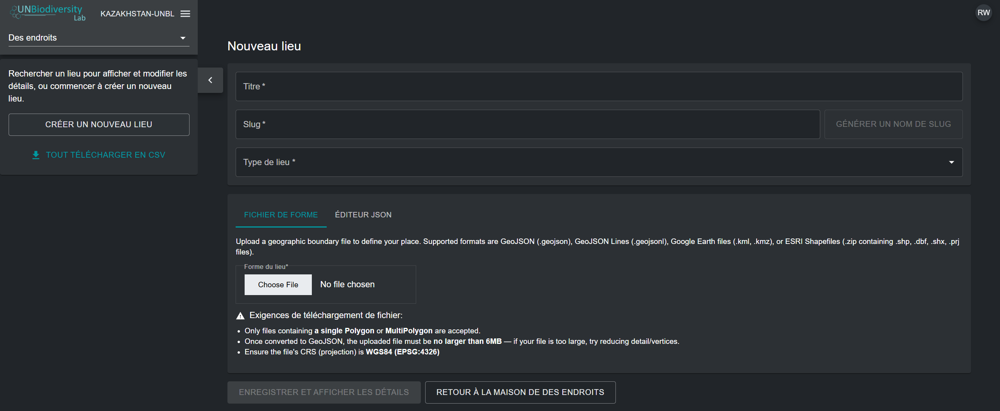

4.	Une fois votre nouveau lieu enregistré, vous serez amené à la page de modification du lieu. Pour que votre lieu soit découvrable et visible dans la vue cartographique, vous devez publier le lieu en cliquant sur le bouton bascule « Publié ». Les lieux non publiés restent dans l'interface d'administration jusqu'à ce que vous soyez prêt à les publier dans la vue cartographique du UNBL.

5.	Pour faire de ce lieu un lieu en vedette pour votre espace de travail, cliquez sur le bouton bascule « Mis en avant ». Cela agira comme un signet afin que le lieu apparaisse en haut de la liste dans l'onglet « Lieux » chaque fois qu'un emplacement n'est pas sélectionné.

	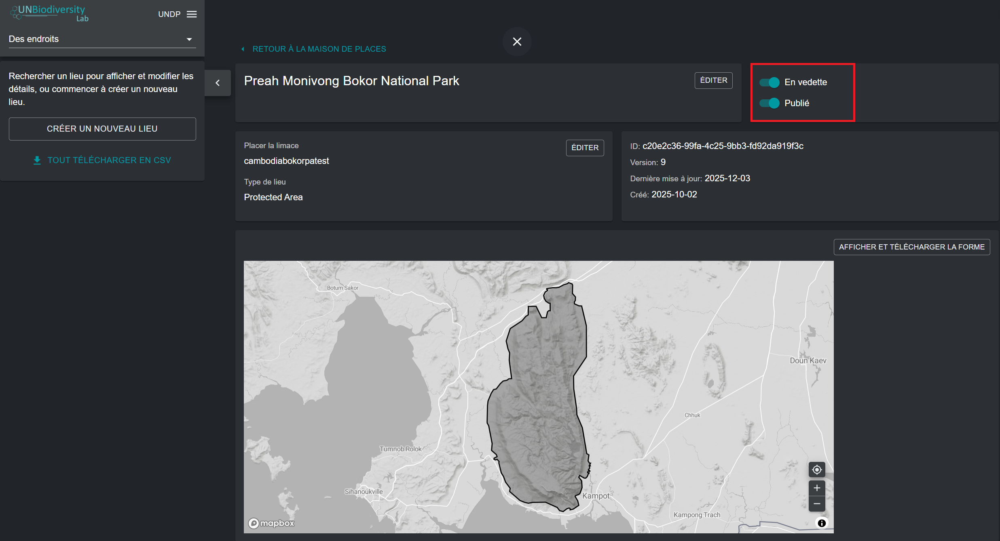

## Comment modifier des lieux ?

Vous pouvez également apporter des modifications aux lieux existants et visualiser votre lieu sur un fond de carte pour inspecter visuellement que le fichier est correctement orienté dans la vue cartographique. Pour ce faire :

1.	Naviguez vers la page « Lieux » depuis le menu déroulant sur le côté gauche de l'interface d'administration.

2.	Sélectionnez le lieu qui vous intéresse dans la liste des lieux en cliquant sur l'icône {style="display: inline; width: 1em; height: 2em; width: 2em;"} sur le côté le plus à gauche de l'entrée du lieu.

	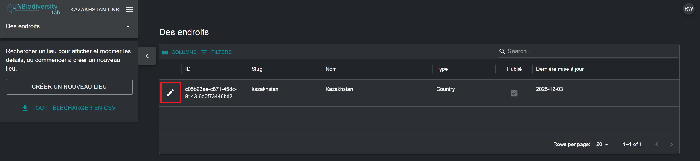

3.	Cliquez sur le bouton « VOIR ET CHARGER LE SHAPE » près du coin supérieur droit de la fenêtre du fond de carte pour voir quelques informations géospatiales de base sur votre lieu – y compris les coordonnées de la boîte englobante (étendue), la superficie du lieu en hectares et les coordonnées du point d'origine – et télécharger toute nouvelle version du lieu que vous pourriez avoir à l'avenir.

	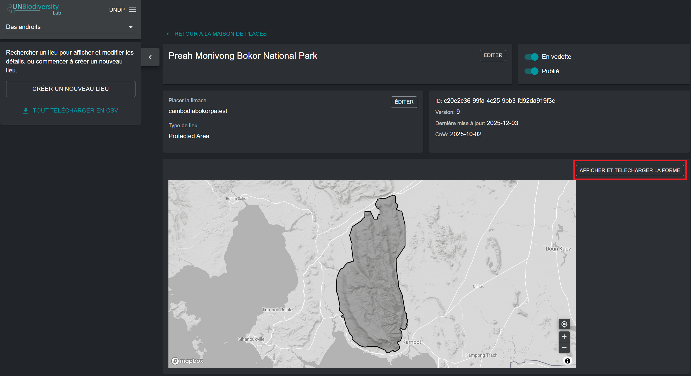

4.	Utilisez le bouton « Choisir le fichier » pour télécharger de nouveaux fichiers pour votre lieu mis à jour. Cliquez sur « METTRE A JOUR LE SHAPE » pour enregistrer vos modifications. Vous pouvez également télécharger votre version actuelle de ce lieu sur votre ordinateur local en tant que GeoJSON en cliquant sur le bouton « Download GeoJSON » (sous la vue cartographique).

	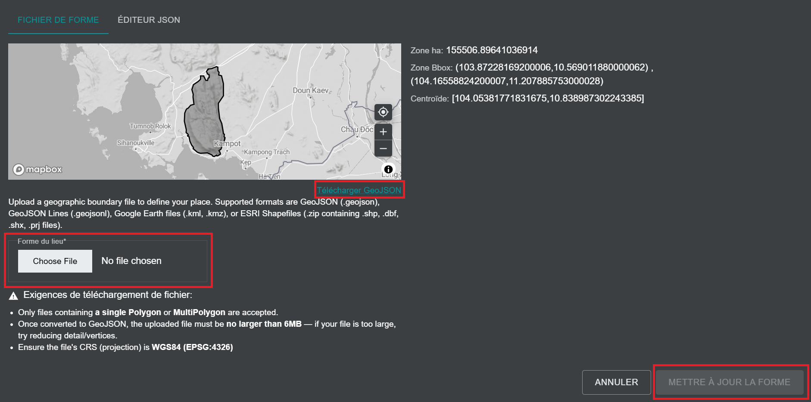

## Comment afficher les métriques pour mes lieux ajoutés ?

Les métriques dynamiques deviennent automatiquement disponibles pour votre lieu dès que vous le téléchargez sur le UNBL. Pour afficher les métriques dynamiques pour les lieux dans votre espace de travail UNBL :

1.	Naviguez vers la vue cartographique du UNBL en cliquant sur le nom de votre espace de travail dans l'interface d'administration de l'espace de travail dans le coin supérieur gauche, puis cliquez sur « Vue carte ».

	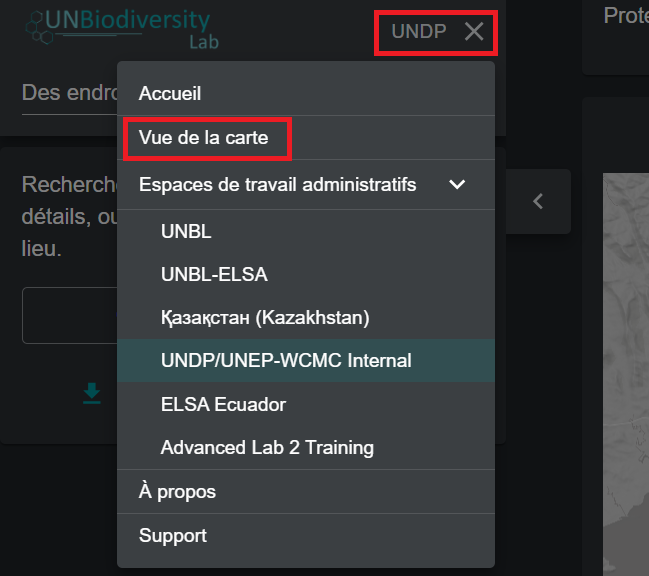

2.	Dans l'onglet « LIEUX », recherchez et sélectionnez un lieu téléchargé dans votre espace de travail UNBL.

	!!!Note
		Les lieux sont filtrés par type *pays* par défaut lors de l'ouverture de la vue cartographique UNBL. Si votre lieu est d'une catégorie différente, comme une aire protégée ou une zone transfrontalière et non de type *pays*, vous devez cliquer sur le bouton « EFFACER » pour effacer tous les filtres, ou développer le menu déroulant « FILTRES » et décocher la case pays et sélectionner votre filtre d'intérêt pour trouver votre lieu.

3.	Lors de la sélection d'un lieu, les métriques dynamiques seront automatiquement affichées dans le panneau de gauche. Choisissez entre une liste des neuf métriques dynamiques standard ou deux métriques d'indicateurs phares en cliquant sur le bouton « METRIQUES » ou « INDICATEURS PRINCIPAUX ».

	!!!Note
		Les métriques d'indicateurs principaux et la métrique Aires Protégées ne sont disponibles que pour les lieux de type *pays* avec un code de pays M49 spécifié.

	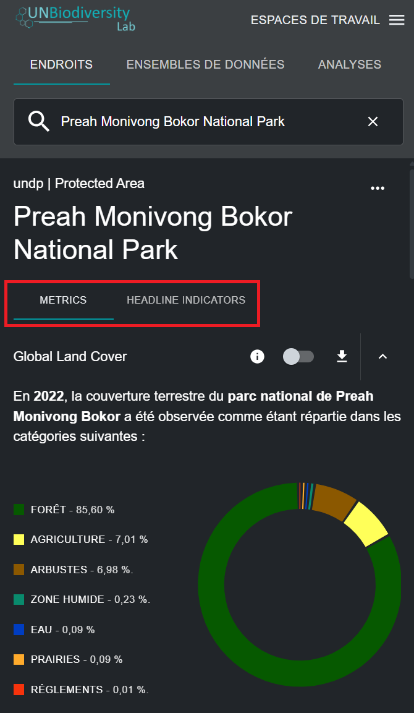

4.	Cliquez sur le bouton bascule à côté de n'importe quelle métrique spécifique si vous souhaitez visualiser ce jeu de données sur la carte. Cliquez à nouveau sur le bouton bascule ou sur l'icône {style="display: inline; width: 1em; height: 2em; width: 2em;"} dans la légende de la couche pour supprimer ce jeu de données de la vue cartographique. Vous pouvez également cliquer sur l'icône de flèche vers le haut pour masquer la métrique de la vue dans l'onglet des métriques disponibles, et vice versa.

	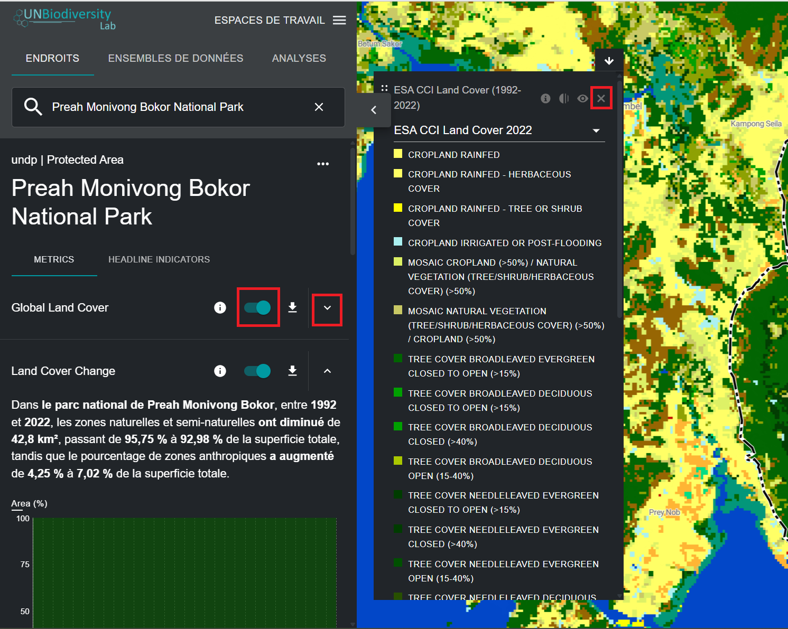

5.	Cliquez sur l'icône {style="display: inline; width: 1em; height: 2em; width: 2em;"} dans le widget de métrique ou dans la légende de la couche (si vous avez un jeu de données activé) pour visualiser les informations de la couche. Les pages d'information fournissent une brève description des données, les articles scientifiques connexes à lire, les données brutes à télécharger (si disponibles gratuitement) et les spécifications de licence.

	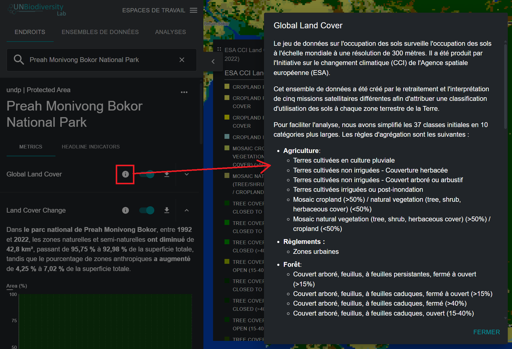

6.	Pour télécharger les données récapitulatives de la métrique au format .csv ou .json, cliquez sur l'icône {style="display: inline; width: 1em; height: 2em; width: 2em;"}. Vous pouvez ensuite choisir de télécharger les données récapitulatives dans votre répertoire local au format valeurs séparées par des virgules ou au format .json. Vous pouvez également télécharger les données à partir des liens sources dans les pages d'information de la couche.

	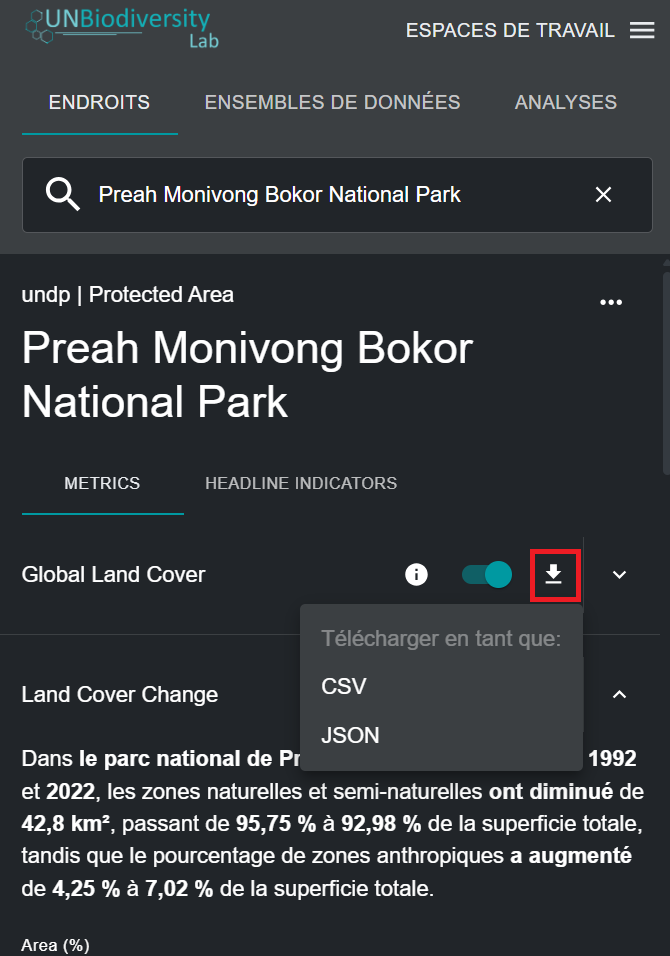
