# Adicionar lugares ao seu espaço de trabalho e visualizar métricas dinâmicas

## Como adiciono lugares?

Adicionar um novo lugar ao seu espaço de trabalho proporciona-lhe a capacidade de utilizar todas as funcionalidades do UNBL para qualquer área de interesse (área protegida, nível administrativo subnacional, área transfronteiriça, limite de comunidade indígena, etc.). Uma vez que o lugar tenha sido adicionado ao seu espaço de trabalho UNBL, poderá: (1) exibir métricas dinâmicas para esta área de interesse (como estatísticas zonais); e (2) recortar qualquer camada raster publicada na plataforma pública UNBL (com uma licença de acesso aberto) para esta área de interesse e depois descarregá-la como um ficheiro GeoTIFF para trabalho adicional num software SIG de desktop. Adicionar um lugar envolve carregar um ficheiro vetorial (polígono ou multipolígono) para o UNBL.

Para adicionar um novo lugar:

1.	Navegue até à página 'Places' do menu suspenso no lado esquerdo da interface de administração.

2.	Clique no botão 'CREATE NEW PLACE'.

	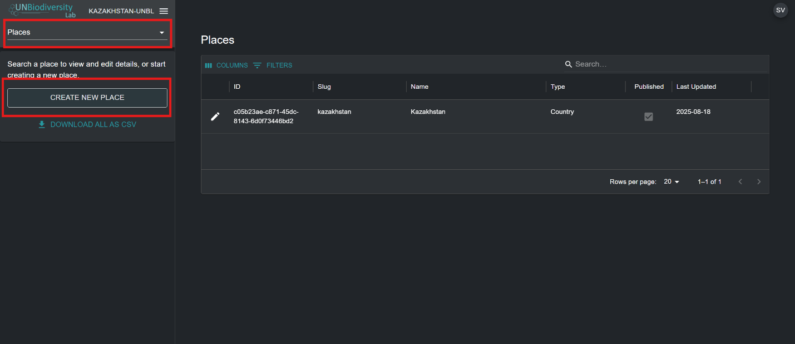

3.	Na página 'New place' que aparece, preencha a seguinte informação:

	a.	*Title*: Insira o nome do lugar. Recomendamos mantê-los curtos e claros. Atualmente, não são permitidos caracteres especiais.

	b.	*Place type*: Selecione a classe apropriada do menu suspenso. Isto será útil para filtrar as suas pesquisas mais tarde. Pode escolher entre *Biome or Ecosystem, Community and Indigenous Area, Country, Cross-Boundary Area, Other Jurisdiction, Protected Area, Species Range* ou *Study Area*.

	c.	*Slug*: Insira um identificador único para o lugar que contenha apenas letras minúsculas, números e hífens. Não podem ser usados espaços. Isto identificará de forma única o seu lugar de todos os outros dentro do sistema UNBL. Recomendamos usar o botão 'GENERATE A SLUG NAME' para ajudá-lo a gerar um slug apropriado.

	d.	*Place shape*: Carregue um ficheiro de polígono (ou multipolígono) para definir o seu lugar. Os formatos suportados são GeoJSON (.geojson, .geojsonl), ficheiros Google Earth (.kml, .kmz) ou ESRI Shapefiles (.zip contendo ficheiros .shp, .dbf, .shx, .prj). Se usar um GeoJSON, o tamanho do ficheiro não deve ser maior que 6MB. O sistema permite carregamentos até 6MB, mas recomendamos fortemente usar ficheiros não maiores que 2MB para renderização ótima e cálculos de métricas. Se usar ficheiros Google Earth ou ESRI Shapefiles, assegure-se de que o sistema de referência de coordenadas é WGS-84, também conhecido como EPSG: 4326.

	e.	Se toda a informação introduzida for válida, o botão 'SAVE AND VIEW DETAILS' acenderá em azul. Clique neste botão para carregar o seu lugar para o UNBL.

	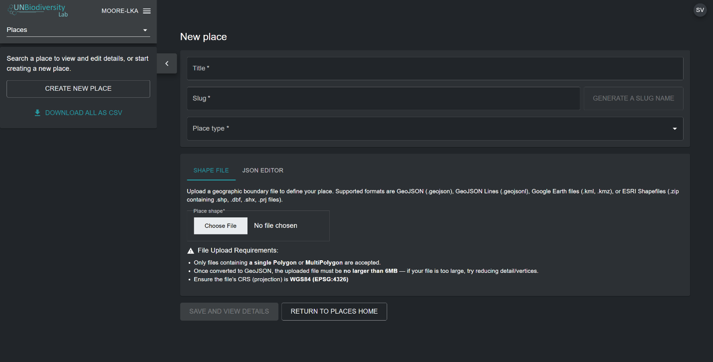

4.	Uma vez que guarde o seu novo lugar, será levado para a página de edição do lugar. Para que o seu lugar seja descobrível e visível na vista do mapa, deve publicar o lugar clicando no botão de alternância 'Published'. Os lugares não publicados permanecem na interface de administração até que esteja pronto para publicá-los na vista do mapa UNBL.

5.	Para tornar este um lugar em destaque para o seu espaço de trabalho, clique no botão de alternância 'Featured'. Isto atuará como um marcador para que o lugar apareça no topo da lista no separador 'Places' sempre que uma localização não esteja selecionada.

	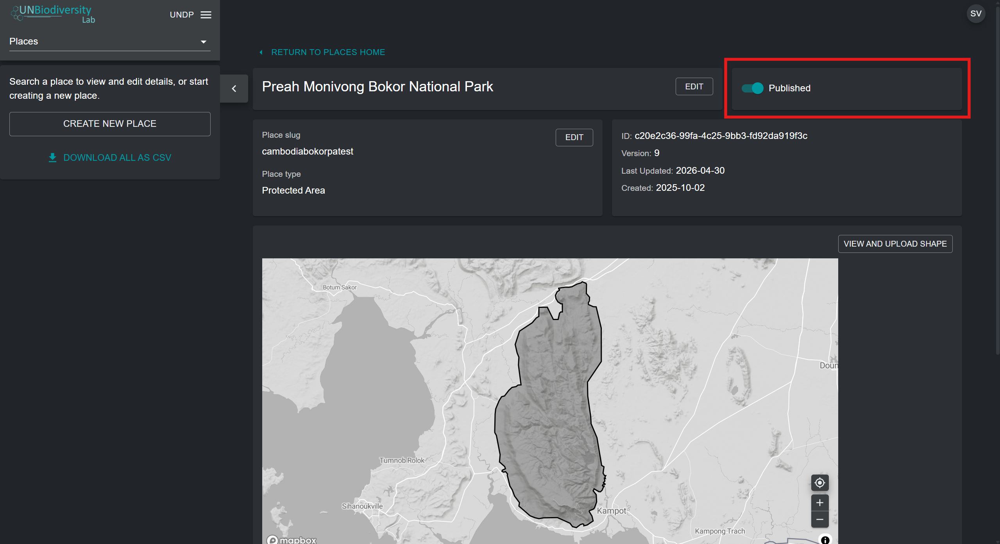

## Como edito lugares?

Também pode fazer edições a lugares existentes e ver o seu lugar num mapa base para inspecionar visualmente se o ficheiro está corretamente orientado na vista do mapa. Para fazer isto:

1.	Navegue até à página 'Places' do menu suspenso no lado esquerdo da interface de administração.

2.	Selecione o lugar que lhe interessa da lista de lugares clicando no ícone {style="display: inline; width: 1em; height: 2em; width: 2em;"} no lado mais à esquerda da entrada do lugar.

	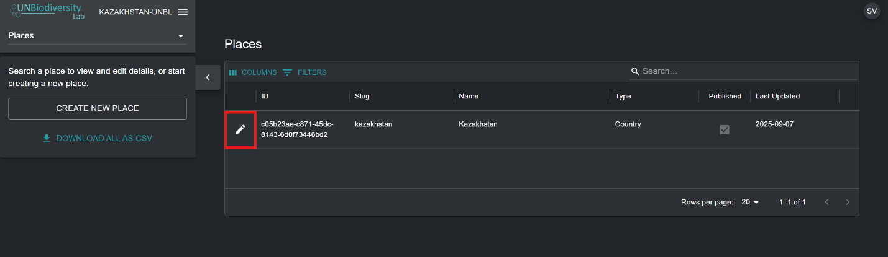

3.	Clique no botão 'VIEW AND UPLOAD SHAPE' perto do canto superior direito da janela do mapa base para ver alguma informação geoespacial básica sobre o seu lugar – incluindo coordenadas da caixa delimitadora (extensão), área do lugar em hectares e as coordenadas do ponto de origem – e carregar quaisquer novas versões do lugar que possa ter no futuro.

	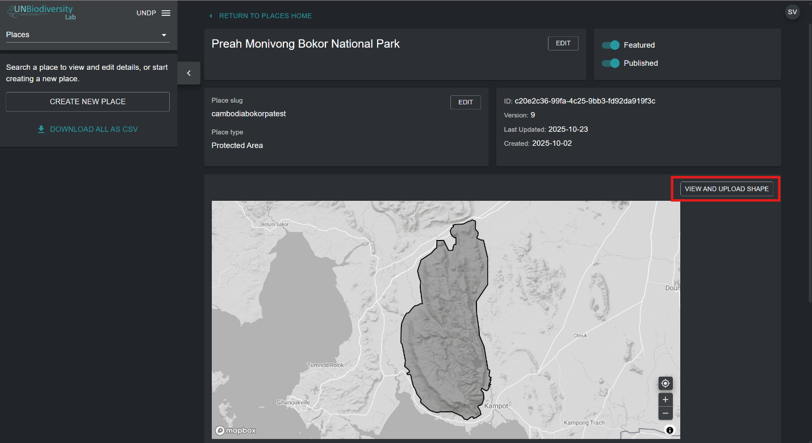

4.	Use o botão 'Choose File' para carregar novos ficheiros para o seu lugar atualizado. Clique em 'UPDATE SHAPE' para guardar as suas alterações. Também pode descarregar a sua versão atual deste lugar para o seu computador local como um GeoJSON clicando no botão 'Download GeoJSON' (abaixo da vista do mapa).

	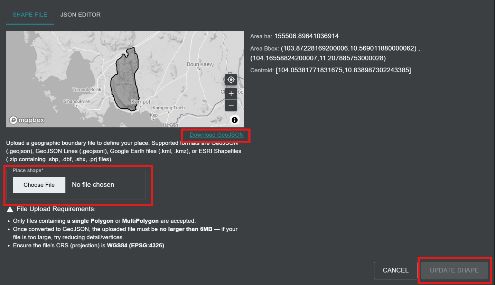

## Como mostro métricas para os meus lugares adicionados?

As métricas dinâmicas tornam-se automaticamente disponíveis para o seu lugar assim que o carrega no UNBL. Para exibir métricas dinâmicas para lugares dentro do seu espaço de trabalho UNBL:

1.	Navegue até à vista do mapa UNBL clicando no nome do seu espaço de trabalho na interface de administração do espaço de trabalho no canto superior esquerdo, e depois clique em 'Map View'.

	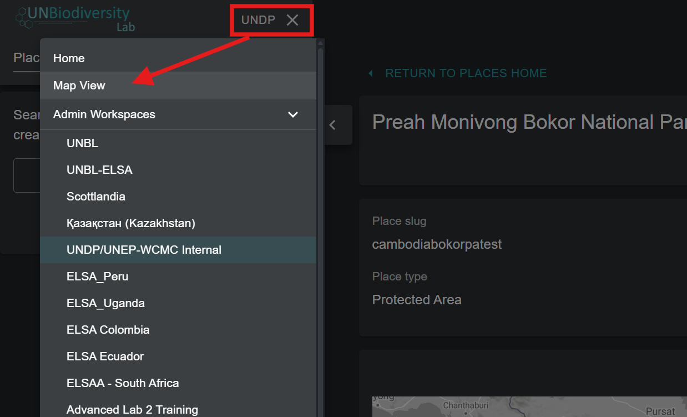

2.	No separador 'PLACES', pesquise e selecione um lugar carregado no seu espaço de trabalho UNBL.

	!!!Note
		Os lugares são filtrados por tipo *Country* por defeito ao abrir a vista do mapa UNBL. Se o seu lugar for de uma categoria diferente, como Protected Area ou Cross-Boundary Area e não tipo *Country*, então precisa de clicar no botão 'CLEAR' para limpar todos os filtros, ou expandir o menu suspenso 'FILTERS' e desmarcar a caixa de país e selecionar o seu filtro de interesse para encontrar o seu lugar.

3.	Ao selecionar um lugar, as métricas dinâmicas serão automaticamente exibidas no painel esquerdo. Escolha entre uma lista das nove métricas dinâmicas padrão ou duas métricas de indicadores principais clicando no botão 'METRICS' ou 'HEADLINE INDICATORS'.

	!!!Note
		As métricas de indicadores principais e a métrica Protected Area apenas estão disponíveis para lugares de tipo *Country* com um código de país M49 especificado.

	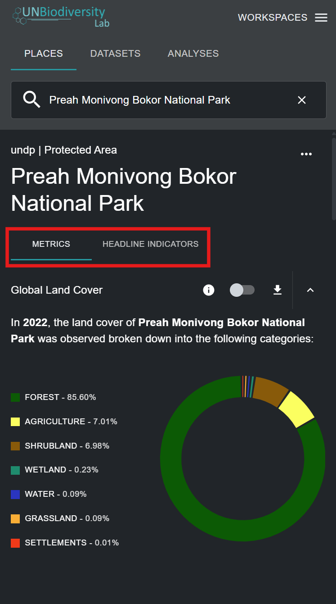

4.	Clique no botão de alternância ao lado de qualquer métrica específica se quiser ver este conjunto de dados no mapa. Clique no botão de alternância novamente ou no ícone {style="display: inline; width: 1em; height: 2em; width: 2em;"} na legenda da camada para remover este conjunto de dados da vista do mapa. Também pode clicar no ícone de seta para cima para ocultar a métrica da vista no separador de métricas disponíveis, e vice-versa.

	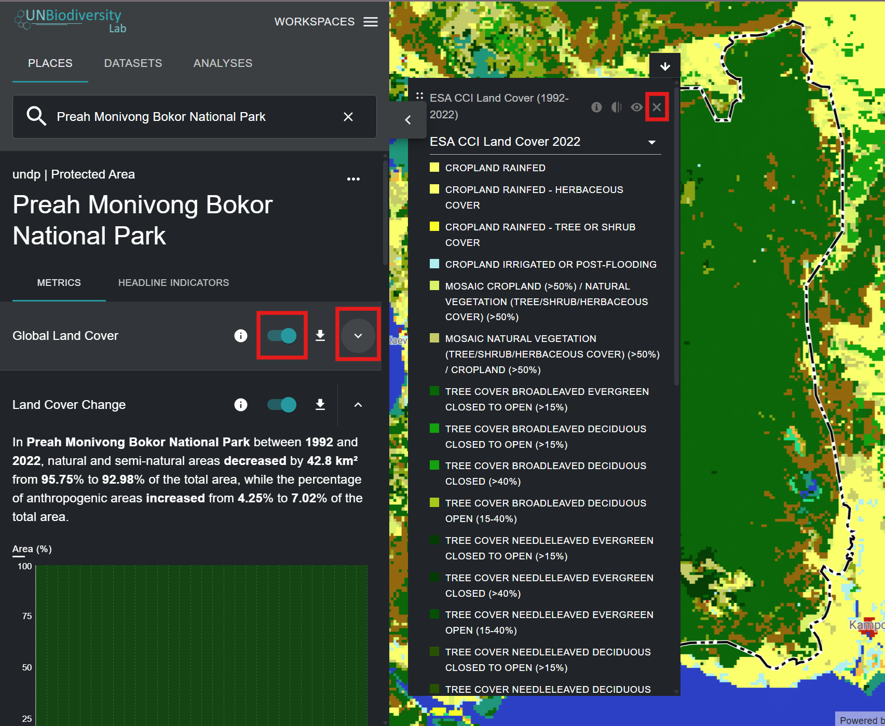

5.	Clique no ícone {style="display: inline; width: 1em; height: 2em; width: 2em;"} no widget de métricas ou na legenda da camada (se tiver um conjunto de dados alternado) para ver a informação da camada. As páginas de informação fornecem uma breve descrição dos dados, artigos relacionados para ler, dados brutos para descarregar (se disponíveis gratuitamente) e especificações de licença.

	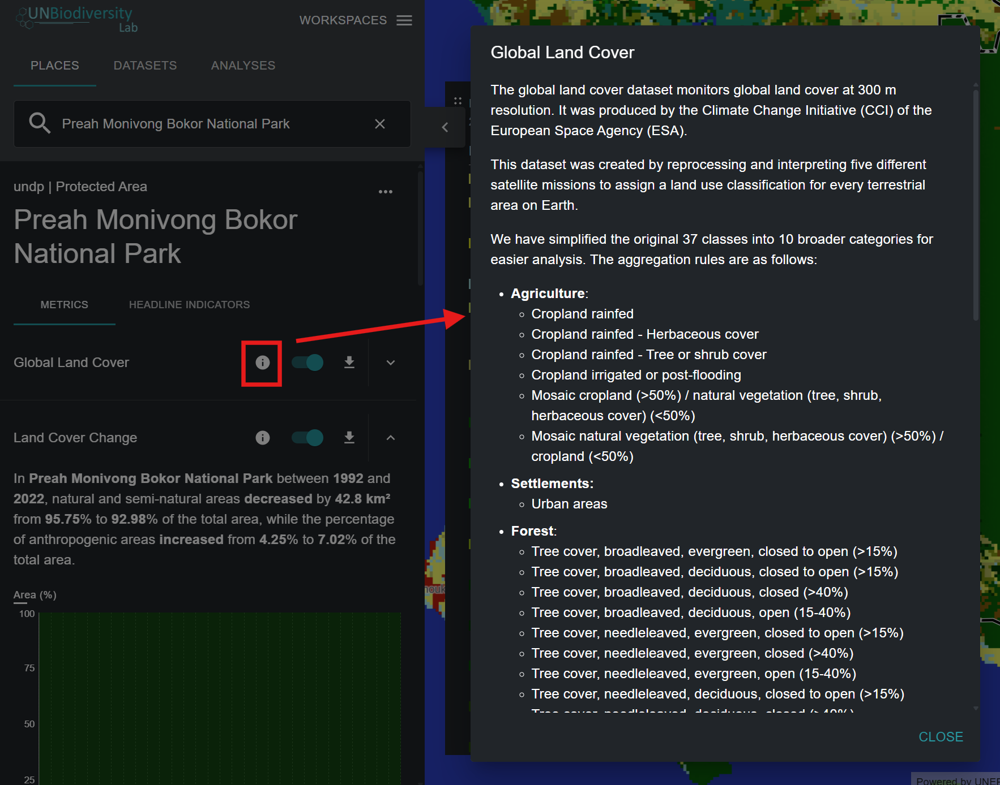

6.	Para descarregar dados de resumo para a métrica em formato .csv ou .json, clique no ícone {style="display: inline; width: 1em; height: 2em; width: 2em;"}. Pode então escolher se descarrega dados de resumo para o seu diretório local em formato de valores separados por vírgulas, ou formato .json. Também pode descarregar os dados de links de fonte nas páginas de informação da camada.

	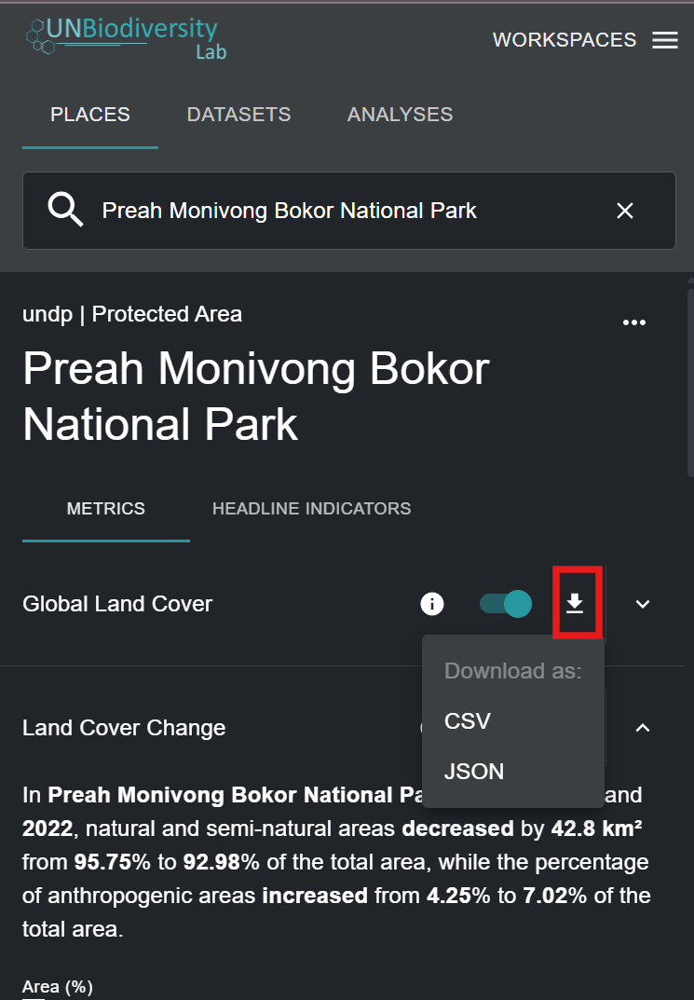
