# Добавление мест в ваше рабочее пространство и просмотр динамических показателей

## Как мне добавить места? {#kak-dobavit-mesta}

Добавление нового места в ваше рабочее пространство даёт вам возможность использовать все функции UNBL для любой области интересов (охраняемая территория, субнациональный административный уровень, трансграничная территория, граница территории коренных народов и т.д.). После добавления места в ваше рабочее пространство UNBL вы сможете: (1) отображать динамические показателейи для этой области интереса (в виде зональной статистики); и (2) обрезать любой растровый слой, опубликованный на публичной платформе UNBL (с лицензией открытого доступа), по этой области интереса и затем скачать его как файл GeoTIFF для дальнейшей работы в настольном программном обеспечении ГИС. Добавление места включает загрузку векторного файла (полигона или мультиполигона) в UNBL.

Для добавления нового места:

1.	Перейдите на страницу «Места» из выпадающего меню в левой части администраторского интерфейса.

2.	Нажмите кнопку «СОЗДАТЬ НОВОЕ МЕСТО».

	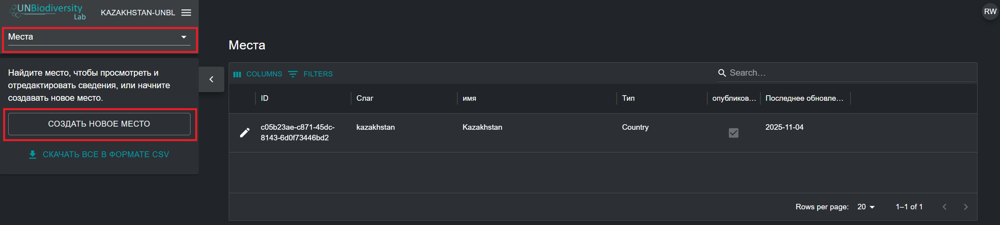

3.	В появившейся странице «Новое место» заполните следующую информацию:

	a.	*Название*: Вставьте название места. Мы рекомендуем делать их короткими и понятными. В настоящее время специальные символы не допускаются.

	b.	*Тип места*: Выберите соответствующий класс из выпадающего меню. Это будет полезно для фильтрации ваших поисков позже. Вы можете выбрать из *Biome or Ecosystem, Community and Indigenous Area, Country, Cross-Boundary Area, Other Jurisdiction, Protected Area, Species Range* или *Study Area*.

	c.	*Слаг*: Вставьте уникальный идентификатор для места, содержащий только строчные буквы, цифры и дефисы. Пробелы использовать нельзя. Это уникально идентифицирует ваше место среди всех других в системе UNBL. Мы рекомендуем использовать кнопку «ГЕНЕРИРОВАТЬ НАИМЕНОВАНИЕ СЛАГА», чтобы помочь вам сгенерировать подходящий слаг.

	d.	*Шейп-файл*: Загрузите файл полигона (или мультиполигона) для определения вашего места. Поддерживаемые форматы: GeoJSON (.geojson, .geojsonl), файлы Google Earth (.kml, .kmz) или ESRI Shapefiles (.zip, содержащий файлы .shp, .dbf, .shx, .prj). При использовании GeoJSON размер файла не должен превышать 6 МБ. Система позволяет загрузки до 6 МБ, но мы настоятельно рекомендуем использовать файлы не более 2 МБ для оптимального рендеринга и расчёта показателей. При использовании файлов Google Earth или ESRI Shapefiles убедитесь, что система координат — WGS-84, также известная как EPSG: 4326.

	e.	Если вся введённая информация действительна, кнопка «СОХРАНИТЬ И ПРОСМОТРЕТЬ ДЕТАЛИ» загорится синим цветом. Нажмите эту кнопку, чтобы загрузить ваше место в UNBL.

	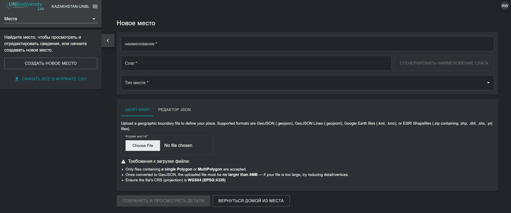

4.	После сохранения нового места вы будете перенаправлены на страницу редактирования места. Чтобы ваше место было обнаруживаемым и видимым в виде карты, вы должны опубликовать место, нажав кнопку переключения для «Опубликовано». Неопубликованные места остаются в административном интерфейсе, пока вы не будете готовы опубликовать их в виде карты UNBL.

5.	Чтобы сделать это выделеным местом для вашего рабочего пространства, нажмите кнопку переключения «Выделено». Это будет действовать как закладка, чтобы место появлялось в верхней части списка во вкладке «Места» каждый раз, когда не выбрано не какого местоположения.

	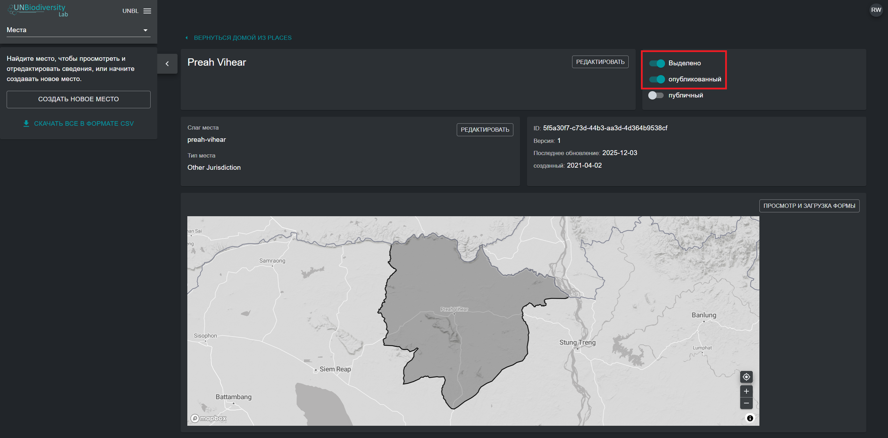

## Как мне редактировать места? {#kak-redaktirovat-mesta}

Вы также можете вносить изменения в существующие места и просматривать ваше место на базовой карте для визуальной проверки правильности ориентации файла в виде карты. Для этого:

1.	Перейдите на страницу «Места» из выпадающего меню в левой части администраторского интерфейса.

2.	Выберите интересующее вас место из списка мест, нажав на значок {style="display: inline; width: 1em; height: 2em; width: 2em;"} в крайней левой части записи места.

	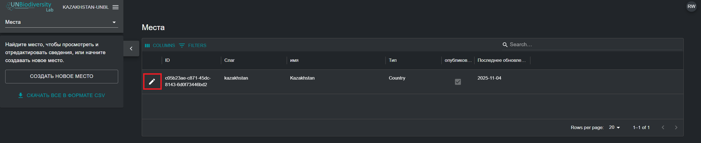

3.	Нажмите на кнопку «ПРОСМОТР И ЗАГРУЗКА ФОРМЫ» в правом верхнем углу окна базовой карты, чтобы увидеть базовую геопространственную информацию о вашем месте — включая координаты ограничивающей рамки (экстент), площадь места в гектарах и координаты начальной точки — и загрузить любые новые версии места, которые у вас могут появиться в будущем.

	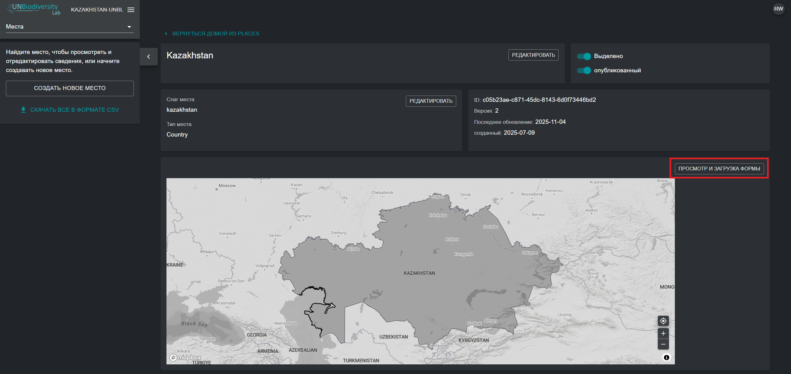

4.	Используйте кнопку «Выбрать файл» для загрузки новых файлов для вашего обновлённого места. Нажмите «ОБНОВЛЕНИЕ ФОРМЫ», чтобы сохранить изменения. Вы также можете загрузить текущую версию этого места на свой локальный компьютер в формате GeoJSON, нажав кнопку «Скачать GeoJSON» (под видом карты).

	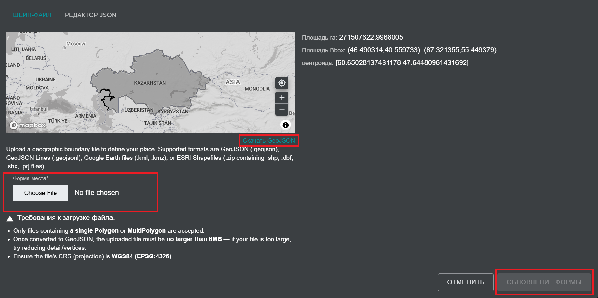

## Как мне отображать показатели для моих добавленных мест? {#kak-otobrazhat-metriki-dlya-moix-dobavlennyx-mest}

Динамические показатели автоматически становятся доступными для вашего места, как только вы загружаете его в UNBL. Для отображения динамических показателей для мест в вашем рабочем пространстве UNBL:

1.	Перейдите к виду карты UNBL, нажав на название вашего рабочего пространства в административном интерфейсе рабочего пространства в левом верхнем углу, а затем нажмите «Просмотр карты».

	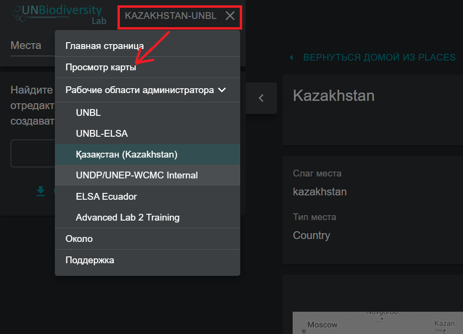

2.	Во вкладке «МЕСТА» найдите и выберите место, загруженное в ваше рабочее пространство UNBL.

	!!!Note "Примечание"
		Места фильтруются по типу *Страна* по умолчанию при открытии вида карты UNBL. Если ваше место относится к другой категории, такой как *Protected Area* или *Трансграничная зона*, а не типу *Страна*, тогда вам нужно нажать на кнопку «ОЧИСТИТЬ», чтобы очистить все фильтры, или раскрыть выпадающее меню «ФИЛЬТРЫ» и снять флажок с «Страна» и выбрать интересующий вас фильтр, чтобы найти ваше место.

3.	При выборе места, динамические показателейи будут автоматически отображаться в левой панели. Выберите между списком девяти стандартных динамических показателей или двух показателей ключевых индикаторов, нажав на кнопку «МЕТРИКИ» или «ОСНОВНЫЕ ИНДИКАТОРЫ».

	!!!Note "Примечание"
		Метрики основных индикаторов и показателя Protected Area доступны только для мест типа *Страна* с указанным кодом страны M49.

	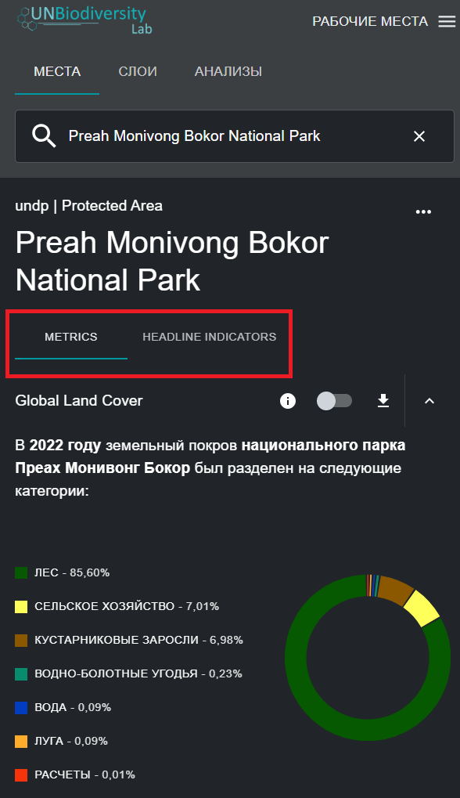

4.	Нажмите кнопку переключения рядом с любым конкретным показателем, если вы хотите просмотреть связанный набор данных на карте. Нажмите кнопку переключения снова или значок {style="display: inline; width: 1em; height: 2em; width: 2em;"} в легенде слоя, чтобы убрать этот набор данных из вида карты. Вы также можете нажать на значок стрелки вверх, чтобы скрыть показатель из вида во вкладке доступных показателей, и наоборот.

	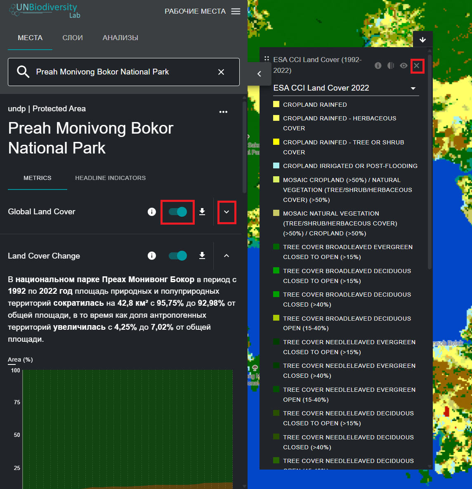

5.	Нажмите на значок {style="display: inline; width: 1em; height: 2em; width: 2em;"} в виджете показателей или в легенде слоя (если у вас включён набор данных), чтобы просмотреть информацию о слое. Информационные окна предоставляют краткое описание данных, связанные статьи для чтения, необработанные данные для загрузки (если они свободно доступны) и спецификации лицензии.

	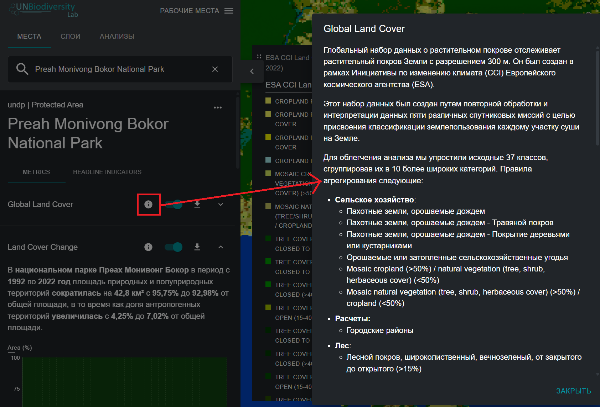

6.	Чтобы скачать сводные данные для показателейи в формате .csv или .json, нажмите на значок {style="display: inline; width: 1em; height: 2em; width: 2em;"}. Затем вы можете выбрать, скачать ли сводные данные в локальный каталог в формате .csv, или в формате .json. Вы также можете скачать данные по исходным ссылкам в информационных окнах связаными со слоем.

	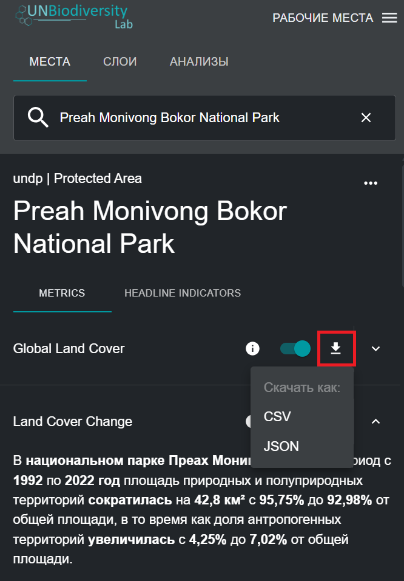
