# Agregar sus propios datos geoespaciales a su espacio de trabajo

Los espacios de trabajo UNBL soportan la carga de datos ráster geoespaciales en el siguiente formato de archivo:

- GeoTIFF (Formato de archivo de imagen etiquetada georreferenciada)

Los espacios de trabajo UNBL también soportan la conexión a datos geoespaciales externos a través de cualquiera de los siguientes proveedores de servicios de teselas externos:

- WMS (Web Map Service)

- WMTS (Web Map Tile Service)

- Google Earth Engine (GEE)

- Spatiotemporal Asset Catalog (STAC)

- XYZ Tile Service

- Mapbox

- Esri ArcGIS API Map Service

- Servicios de teselas vectoriales (servidos como pg_tileserv o Martin)

Los datos geoespaciales pueden cargarse y/o vincularse dentro de su espacio de trabajo, dando así a todos los miembros de su espacio de trabajo la capacidad de ver sus datos en UNBL sin necesidad de experiencia previa en SIG. La seguridad de UNBL asegura que los conjuntos de datos dentro de su espacio de trabajo son **únicamente** visibles para los miembros de su espacio de trabajo. Sin embargo, si desea que los conjuntos de datos dentro de su espacio de trabajo sean visibles por cualquier persona fuera de su espacio de trabajo, puede habilitar esto usando una opción de URL de capa pública. Solo las personas con acceso a esta URL podrán ver su capa. Para obtener más información sobre la privacidad de los datos, consulte nuestra [hoja informativa sobre seguridad de los datos](data_security.es.md).

Es importante destacar que cualquier conjunto de datos en su espacio de trabajo también puede visualizarse junto con los conjuntos de datos globales publicados en la plataforma pública de UNBL.

!!!Nota:
	Los términos *conjunto de datos* y *capa* se utilizan de manera intercambiable en adelante. Un conjunto de datos se refiere a una colección de datos espaciales que consta de una o más capas. En UNBL, una carga única o configuración de datos geoespaciales se realiza mediante *'crear una capa'*. Múltiples entradas de capas pueden combinarse y visualizarse en UNBL como un conjunto de datos. Las capas individuales también pueden visualizarse independientemente en UNBL.

## ¿Qué parámetros y metadatos debo completar al crear una capa?

Para comenzar a crear una capa y completar los metadatos relevantes para la capa:

1.	Abra el menú desplegable 'Home' en la interfaz de administración de su espacio de trabajo y haga clic en 'Layers'.

2.	Haga clic en el botón 'CREAR NUEVA CAPA'.

	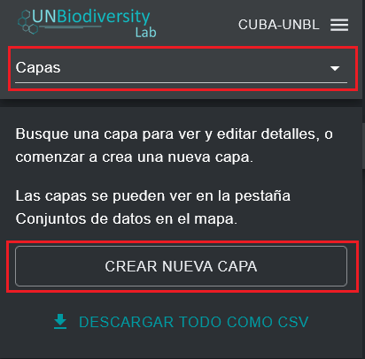

3.	En la página de nueva capa, complete la siguiente información:

	a.	*Título de la capa*: El nombre de su capa. Esto debe ser conciso (recomendamos que sea de menos de 100 caracteres) y descriptivo de sus datos.

	b.	*Capa slug*: Un slug es un identificador único para la capa dentro de su espacio de trabajo. No puede tener múltiples capas dentro de su espacio de trabajo con el mismo slug. Debe contener solo letras, dígitos y guiones ("-"). Puede usar el botón 'GENERATE SLUG NAME' para generar un identificador único basado en el título de capa proporcionado.

	c.	*Categoria de capa (opcional)*: Puede seleccionar una o más categorías para la capa de la lista de opciones en el menú desplegable. Una amplia gama de categorías socioeconómicas, basadas en la naturaleza y relacionadas con políticas del KMGBF están disponibles. Se puede seleccionar más de una categoría para la misma capa. Estas categorías corresponden a los filtros de categoría de conjunto de datos en la vista del mapa. Seleccionar una categoría significará que su capa aparecerá en la lista de conjuntos de datos filtrados cuando se aplique el filtro de categoría de conjunto de datos correspondiente.

	d.	*Buscar etiquetas (opcional)*: Puede especificar una o más etiquetas para su capa. Las etiquetas corresponden al filtro de etiquetas de conjunto de datos en la vista del mapa. Especificar una etiqueta para su capa significará que la capa aparecerá en la lista de capas filtradas cuando se aplique el filtro de etiqueta de conjunto de datos correspondiente en el mapa. A diferencia de las categorías de capa, las etiquetas pueden ser cualquier cadena de texto de su elección, lo que hace que esta característica sea útil si necesita diferenciar claramente las capas de su espacio de trabajo de los conjuntos de datos de la plataforma pública y poder aplicar filtros más efectivos al buscar sus conjuntos de datos en la vista del mapa. Por ejemplo, podría usar una etiqueta para identificar la meta en su estrategia y plan de acción nacional para la biodiversidad (EPANB) para la cual la capa de datos es relevante.

	e.	*Descripción (opcional)*: En el campo de descripción, puede especificar el texto que aparecerá en el cuadro emergente de información de la capa. Aquí, puede insertar la mayor parte de los metadatos de su capa, como una descripción general, cita del artículo científico/conjunto de datos, enlaces externos al artículo científico/conjunto de datos, especificaciones de licencia, etc.

	!!!Nota:
		Para capas individuales que son parte de una capa de grupo principal, el texto emergente de información de la capa siempre mostrará la descripción de la capa de grupo principal y por lo tanto el campo de descripción es redundante (vea ['¿Cómo creo capas agrupadas?'](#como-creo-capas-agrupadas)).

	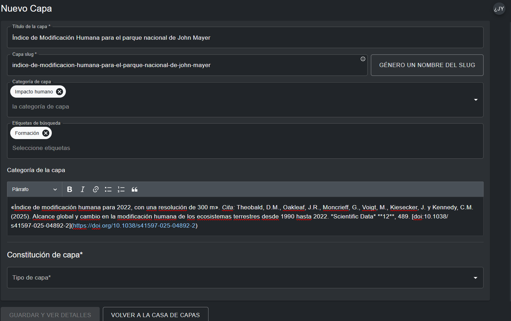

4.	Una vez que haya completado los metadatos relevantes para documentar esta nueva capa, ahora necesita especificar el formato o estándar de servicio web geoespacial de sus datos geoespaciales y configurar la capa en consecuencia. Las siguientes secciones detallan cómo configurar su capa basándose en el formato de sus datos geoespaciales.

## ¿Cómo cargo capas ráster en formato GeoTIFF?

Actualmente, puede cargar manualmente datos geoespaciales a su espacio de trabajo UNBL solo si están disponibles en formato ráster GeoTIFF. Una capa ráster constituye una cuadrícula de celdas (o píxeles) donde cada celda tiene un valor que representa información sobre un tema o fenómeno específico. Actualmente solo podemos aceptar GeoTIFFs con una sola banda. Si tiene un GeoTIFF con más de una banda, divídalo previamente en diferentes archivos. Las capas ráster GeoTIFF se agregan a su espacio de trabajo UNBL mediante una carga directa a un repositorio de datos SIG UNBL seguro y compatible con GDPR en Azure. Para obtener más información sobre la privacidad de los datos, consulte nuestra [hoja informativa sobre seguridad de los datos](data_security.es.md).

!!!Nota:
	Los datos geoespaciales en otros formatos de capas ráster y vectoriales pueden configurarse en UNBL vinculándose a un recurso externo. Vea ['¿Cómo configuro capas ráster usando servicios de teselas externos?'](#como-configuro-capas-raster-usando-servicios-de-teselas-externos-wmswmts) y ['¿Cómo configuro capas vectoriales usando servicios de teselas externos?'](#como-configuro-capas-vectoriales-usando-servicios-de-teselas-externos) para formatos de servicios Web OGC interoperables con UNBL y guías para vincularse a ellos.

Para cargar un archivo GeoTIFF:

1.	Navegue a la página de nueva capa y complete los metadatos relevantes (Vea ['¿Qué parámetros y metadatos debo completar al crear una capa?'](#que-parametros-y-metadatos-debo-completar-al-crear-una-capa)).

2.	En la sección 'Configuración de capa':

	a.	*Tipo de capa*: Seleccione 'raster'.

	b.	*Proveedero de capa*: Seleccione 'GeoTIFF File Upload'.

	c.	*GeoTIFF file*: Haga clic en el botón 'Choose File' para cargar una capa ráster GeoTIFF válida desde su sistema de archivos local. Los archivos cargados deben ser un ráster de banda única y deben ser de menos de 1000MB de tamaño. Se le notificará si selecciona un archivo inválido.

	d.	*Data type*: Especifique si el ráster contiene datos 'categorical' o 'continuous'. Los datos categóricos representan clases o categorías discretas donde cada valor de píxel representa un tipo o clase distinto (por ejemplo, clases de uso de suelo). Los conjuntos de datos continuos representan datos donde los valores pueden caer en cualquier lugar dentro de un rango de valores especificado (por ejemplo, temperatura media anual).

	e.	*Minimum/Maximum value*: Si su ráster contiene datos continuos, entonces debe proporcionar el rango de valores en los datos especificando valores mínimo y máximo del rango.

	f.	*Minimum/Maximum Niveles de Zoom (opcional)*: El rango de nivel de zoom predeterminado está configurado de 0 a 14. Opcionalmente puede especificar los niveles de zoom para la capa si el archivo ráster solo contiene datos en ciertos niveles de zoom. Note que UNBL soporta un nivel de zoom máximo de 14.

	g.	*Estilo de capa*: El estilo de capa determina cómo se muestra la capa en el mapa. Haciendo clic en 'ADD ADDITIONAL STYLING' puede especificar cualquier número de entradas de estilo de capa para coincidir con los valores en su ráster. Cada entrada de estilo de capa debe definir las siguientes propiedades:

	- *Valor* - el valor de píxel en los datos para el cual definir el estilo.

	- *Nombre* – el nombre de la entrada de estilo en la leyenda de la capa en el mapa.

	- *Color* – el color de los píxeles con el valor especificado en el mapa. Puede definir un color a través del selector de color manual, o ingresando un valor RGBA o hexadecimal. Opcionalmente, puede establecer la opacidad del color en un rango de 0 a 100%, donde 0% es completamente transparente y 100% es completamente opaco.

	También puede opcionalmente elegir si la etiqueta de nombre de una entrada de estilo está oculta en la leyenda de la capa en el mapa haciendo clic en el icono {style="display: inline; width: 1em; height: 2em; width: 2em;"} junto a la entrada de estilo. Para capas categóricas, las entradas de valor de estilo de capa deben mapear a los valores de cada categoría/clase dentro de la fuente de datos ráster. Para capas continuas, las entradas de valor de estilo de capa deben mapear al rango de valores dentro de su archivo ráster que desea renderizar en el mapa. Puede especificar cualquier punto a lo largo del rango de valores entre los valores mínimo y máximo -- se generará un degradado de colores entre cada uno de estos valores.

	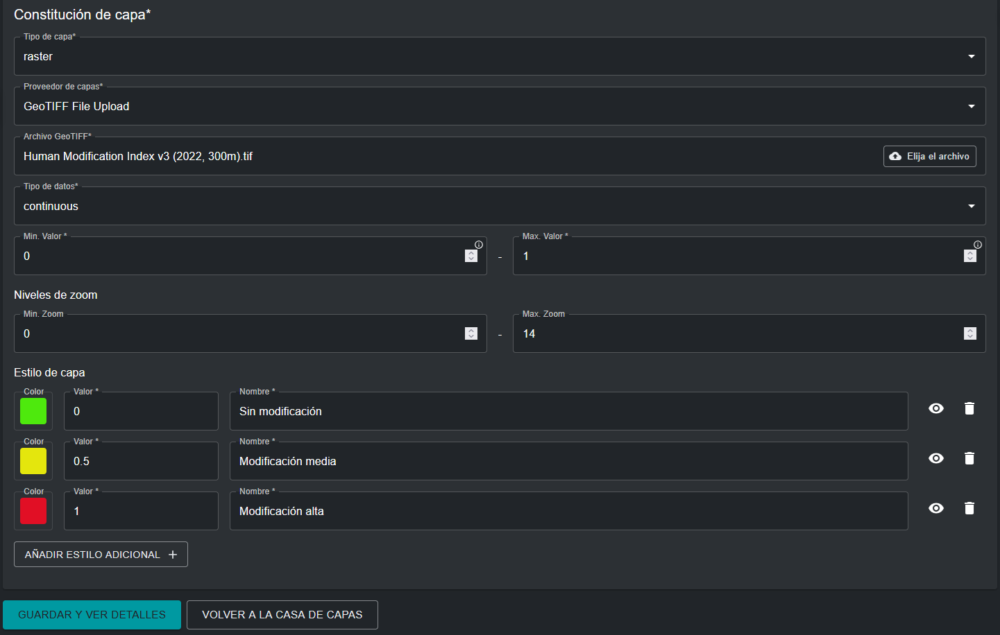

3.	Una vez que todos los metadatos y parámetros han sido especificados, el botón 'GUARDAR Y VER DETALLES' se iluminará en azul, siempre que toda la información ingresada sea válida. Haga clic en este botón para cargar su archivo GeoTIFF a su espacio de trabajo. El archivo se almacenará en un repositorio privado seguro y dedicado en Azure. Esto puede tomar algunos segundos dependiendo del tamaño del archivo y la velocidad de su conexión de banda ancha de internet, así que después de hacer clic en el botón debe esperar hasta ser redirigido a la página de edición de capa. Vea ['¿Cómo publico mi capa y la comparto con usuarios externos?'](#como-publico-mi-capa-y-la-comparto-con-usuarios-externos) y ['¿Cómo edito mis capas agregadas?'](#como-edito-mis-capas-agregadas) para los siguientes pasos.

## ¿Cómo configuro capas ráster usando servicios de teselas externos WMS/WMTS?

UNBL soporta la configuración de capas de imagen ráster a su espacio de trabajo vinculándose a proveedores de servicios de teselas externos. Para agregar datos geoespaciales a su espacio de trabajo usando este método:

1.	Navegue a la página de nueva capa y complete los metadatos relevantes (Vea ['¿Qué parámetros y metadatos debo completar al crear una capa?'](#que-parametros-y-metadatos-debo-completar-al-crear-una-capa)).

2.	En la sección 'Configuración de capa':

	a.	*Tipo de capa*: Seleccione 'raster'.

	b.	*Proveedero de capa*: Seleccione 'External Tile Service (WMS, WMTS, etc.)'.

	c.	*Tiles URL*: Aquí, puede conectarse a un servicio de teselas externo que utilice los protocolos Web Map Service (WMS), Web Map Tile Service (WMTS) o XYZ Tile Service. Para configurar capas usando estos proveedores, debe proporcionar una URL de tesela válida, que debe contener ya sea los marcadores de posición `{z}{x}{y}` o el marcador de posición `{bbox-epsg-3857}`.

	Por ejemplo, la URL WMS de ejemplo a continuación **no** funcionará:

	```
	https://wms.server.net/mapserv?request=getmap&service=wms&BBOX=-90,-180,90,360&crs=EPSG:4326&format=image/jpeg&layers=layer_latest&width=1200&height=600
	```

	ya que contiene un formato de parámetro de cuadro delimitador (BBOX) incorrecto. La URL puede ajustarse cambiando el parámetro `BBOX` para coincidir con el marcador de posición, así como el parámetro del sistema de referencia de coordenadas (`crs`) para reflejar el sistema de coordenadas Web Mercator (EPSG: 3857). Una URL configurable sería:

	```
	https://wms.server.net/mapserv?request=getmap&service=wms&BBOX={bbox-epsg-3857}&crs=EPSG:3857&format=image/jpeg&layers=layer_latest&width=1200&height=600
	```

	!!!Nota "Los siguientes marcadores de posición fueron ajustados para permitir la configuración de UNBL:"
		- `-90,-180,90,360` cambiado a `{bbox-epsg-3857}`
		- `EPSG:4326` cambiado a `EPSG:3857`

	d.	*Data type*: Especifique si la imagen ráster contiene datos 'categorical' o 'continuous'. Los datos categóricos representan clases o categorías discretas donde cada valor de píxel representa un tipo o clase distinto. Los conjuntos de datos continuos representan datos donde los valores pueden caer en cualquier lugar dentro de un rango de valores especificado.

	e.	*Minimum/Maximum zoom level (opcional)*: El rango de nivel de zoom predeterminado está configurado de 0 a 14. Opcionalmente puede especificar los niveles de zoom para la capa si la imagen ráster solo contiene datos en ciertos niveles de zoom. Note que UNBL soporta un nivel de zoom máximo de 14.

	f.	*Estilo de capa*: El estilo de capa determina cómo se muestra la leyenda de la imagen ráster en el mapa. Haciendo clic en 'ADD ADDITIONAL STYLING' puede especificar cualquier número de entradas de estilo de capa para coincidir con los valores en la imagen ráster. Cada entrada de estilo de capa debe definir las siguientes propiedades:

	- *Nombre* – el nombre de la entrada de estilo en la leyenda de la capa en el mapa.

	- *Color* – el color asociado con el nombre especificado en la leyenda de la capa. Puede seleccionar un color usando el selector de color, o especificando un valor de código de color RGBA o Hex.

	También puede opcionalmente elegir si la etiqueta de nombre de una entrada de estilo está oculta en la leyenda de la capa en el mapa haciendo clic en el icono {style="display: inline; width: 1em; height: 2em; width: 2em;"} junto a la entrada de estilo. Para imágenes ráster categóricas, las entradas de estilo de leyenda de capa deben representar los valores de cada categoría/clase dentro de la fuente de datos ráster. Para imágenes ráster continuas, las entradas de estilo de leyenda deben representar el rango de valores visualizados en la imagen ráster. Puede especificar cualquier punto a lo largo del rango de valores entre los valores mínimo y máximo - se generará un degradado de colores entre cada uno de estos valores.

	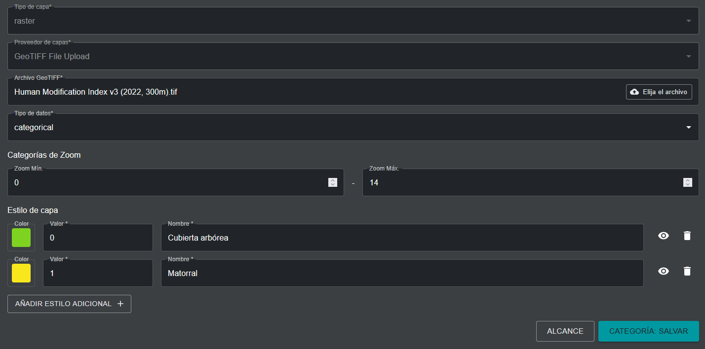

3. Una vez que todos los metadatos y propiedades de configuración han sido especificados, el botón 'SAVE AND VIEW DETAILS' se iluminará en azul, siempre que toda la información ingresada sea válida. Haga clic en este botón para configurar su imagen ráster a su espacio de trabajo. Vea ['¿Cómo publico mi capa y la comparto con usuarios externos?'](#como-publico-mi-capa-y-la-comparto-con-usuarios-externos) y ['¿Cómo edito mis capas agregadas?'](#como-edito-mis-capas-agregadas) para los siguientes pasos.

## ¿Cómo configuro capas ráster usando Google Earth Engine (GEE)?

Si desea mostrar activos GEE en su espacio de trabajo UNBL desde su propia cuenta o una cuenta pública, puede hacerlo configurando un activo ráster de banda única GEE. Actualmente, no soportamos la configuración de rásters multi-banda o datos vectoriales desde GEE. Para configurar activos ráster de banda única GEE:

1. Si está configurando un activo desde su proyecto Cloud personal, asegúrese de que la casilla 'Anyone can read' esté marcada para este activo.

	

	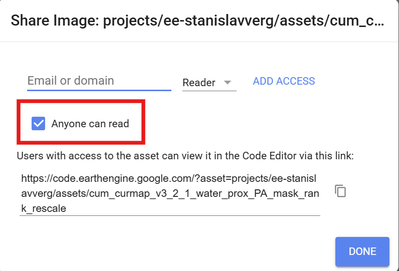

2. Navegue a la página de nueva capa en la interfaz de administración UNBL y complete los metadatos relevantes (Vea ['¿Qué parámetros y metadatos debo completar al crear una capa?'](#que-parametros-y-metadatos-debo-completar-al-crear-una-capa)).

3. En la sección *COnfiguraciónde capa*:

	a.	*Tipo de capa*: Seleccione 'raster'.

	b.	*Proveedero de capa*: Seleccione 'Google Earth Engine'.

	c.	*Asset Path*: Copie y pegue el ID de imagen de su activo GEE. Cualquier ID de imagen puede configurarse en UNBL, siempre que sea una imagen ráster de banda única. Puede ser un ID de imagen de su proyecto Cloud GEE personal, o cualquier otro proyecto Cloud GEE compartido o conjunto de datos GEE disponible públicamente, como uno del catálogo público [awesome-gee-community-catalog](https://gee-community-catalog.org/), que proporciona acceso a más de 4,000 activos GEE públicos.

	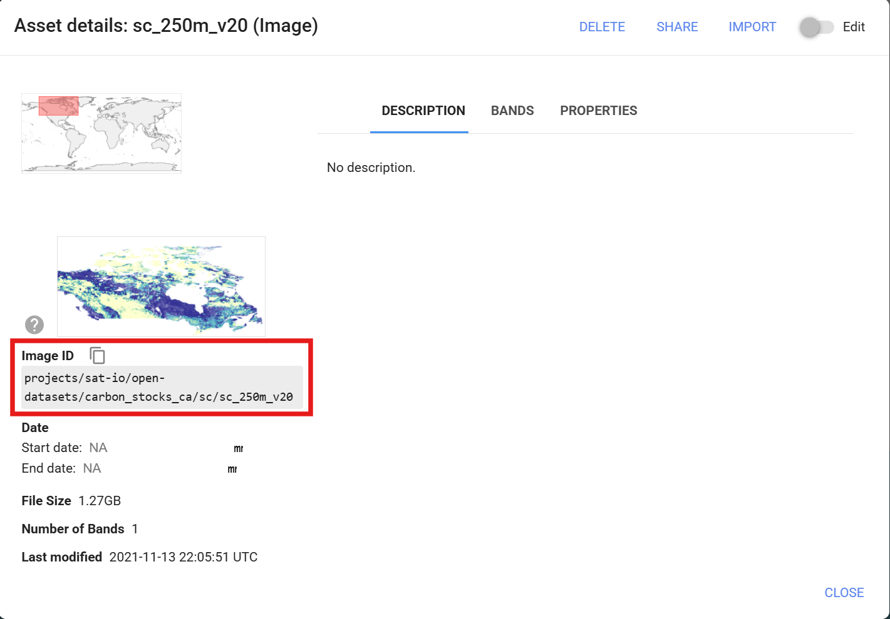

	d.	*Data type*: Especifique si la imagen ráster contiene datos 'categorical' o 'continuous'. Los datos categóricos representan clases o categorías discretas donde cada valor de píxel representa un tipo o clase distinto. Los conjuntos de datos continuos representan datos donde los valores pueden caer en cualquier lugar dentro de un rango de valores especificado.

	e.	*Minimum/Maximum zoom level (opcional)*: El rango de nivel de zoom predeterminado está configurado de 0 a 14. Opcionalmente puede especificar los niveles de zoom para la capa si la imagen ráster solo contiene datos en ciertos niveles de zoom. Note que UNBL soporta un nivel de zoom máximo de 14.

	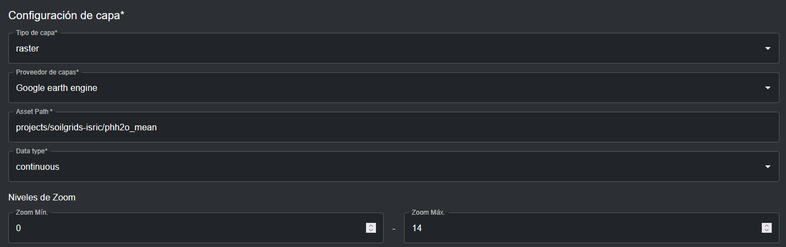

	f.	*Estilo de capa*: El estilo de capa determina cómo se muestra la leyenda del activo GEE en el mapa. Haciendo clic en 'ADD ADDITIONAL STYLING' puede especificar cualquier número de entradas de estilo de capa (también conocidas como *clases* o *umbrales*) para coincidir con los valores en la imagen ráster. Cada entrada de estilo de capa debe definir las siguientes propiedades:

	- *Valor* - el valor de píxel en los datos para el cual definir el estilo.

	- *Nombre* – el nombre de la clase o rango en la leyenda de la capa en el mapa.

	- *Color* – el color de los píxeles con el valor especificado en el mapa. Puede definir un color a través del selector de color manual, o ingresando un valor RGBA o hexadecimal. Opcionalmente, puede establecer la opacidad del color en un rango de 0 a 100%, donde 0% es completamente transparente y 100% es completamente opaco.

	También puede opcionalmente elegir si la etiqueta de nombre de una entrada de estilo está oculta en la leyenda de la capa en el mapa haciendo clic en el icono {style="display: inline; width: 1em; height: 2em; width: 2em;"} junto a la entrada de estilo. Para capas categóricas, las entradas de valor de estilo de capa deben mapear a los valores de cada categoría/clase dentro de la fuente de datos ráster. Para capas continuas, las entradas de valor de estilo de capa deben mapear al rango de valores dentro de su archivo ráster que desea renderizar en el mapa. Puede especificar cualquier punto a lo largo del rango de valores entre los valores mínimo y máximo -- se generará un degradado de colores entre cada uno de estos valores. Es importante notar que los valores de píxel mínimo y máximo, y por lo tanto el rango de valores, pueden derivarse directamente viendo la pestaña 'BANDS' en el cuadro de información 'Asset details' de su activo en GEE. El ejemplo de estilo de capa a continuación crea una paleta de colores continua para la concentración de stock de carbono.

	

	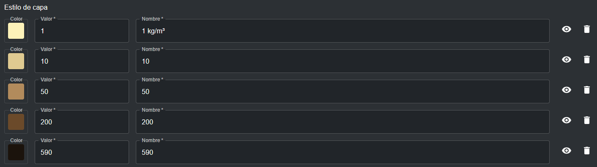

	Para capas ráster categóricas, cada valor de píxel especificado mapea exactamente a una clase o categoría discreta. El ejemplo de estilo de capa a continuación crea una paleta de colores discreta que mapea clases de cobertura de suelo.

	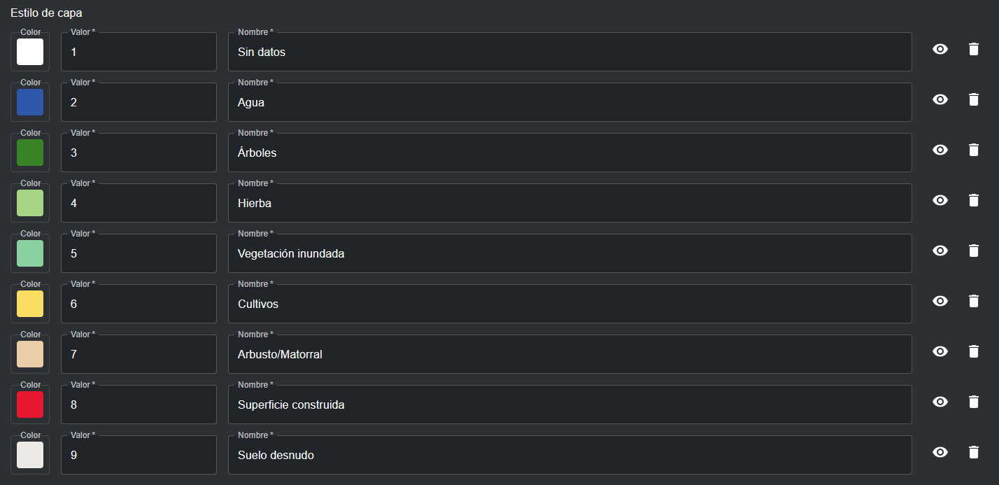

	g.	*Styled Layer Description (SLD)*: Haga clic en el botón 'GENERATE GEE SLD' para generar automáticamente un SLD para configurar el estilo de su activo GEE en UNBL, basado en los parámetros que estableció para el *Layer styling* en el paso f. Mientras que el estilo de capa determina el estilo de la leyenda de la capa, el SLD determinará el estilo de los píxeles reales en sus datos. Basándose en los ejemplos proporcionados en el paso f, la configuración SLD para un esquema de color continuo para la concentración de stock de carbono se vería así:

	```

	<RasterSymbolizer>
	<ColorMap type="ramp" extended="false">
		<ColorMapEntry color="#FFF1B8" quantity="1"/>
		<ColorMapEntry color="#E2C98F" quantity="10"/>
		<ColorMapEntry color="#B58A5A" quantity="50"/>
		<ColorMapEntry color="#6E4A28" quantity="200"/>
		<ColorMapEntry color="#1C130C" quantity="590"/>
	</ColorMap>
	</RasterSymbolizer>

	```

	Para el ráster categórico de cobertura de suelo, la configuración SLD se vería así:

	```

	<RasterSymbolizer>
	<ColorMap type="values" extended="false">
		<ColorMapEntry color="#FFFFFF" quantity="1"/>
		<ColorMapEntry color="#1A5BAB" quantity="2"/>
		<ColorMapEntry color="#358221" quantity="3"/>
		<ColorMapEntry color="#A7D282" quantity="4"/>
		<ColorMapEntry color="#87D19E" quantity="5"/>
		<ColorMapEntry color="#FFDB5C" quantity="6"/>
		<ColorMapEntry color="#EECFA8" quantity="7"/>
		<ColorMapEntry color="#ED022A" quantity="8"/>
		<ColorMapEntry color="#EDE9E4" quantity="9"/>
	</ColorMap>
	</RasterSymbolizer>


	```

	Donde cada color ColorMapEntry y cantidad de píxel asociada coincide exactamente con una fila de entrada de estilo de capa del paso f.

	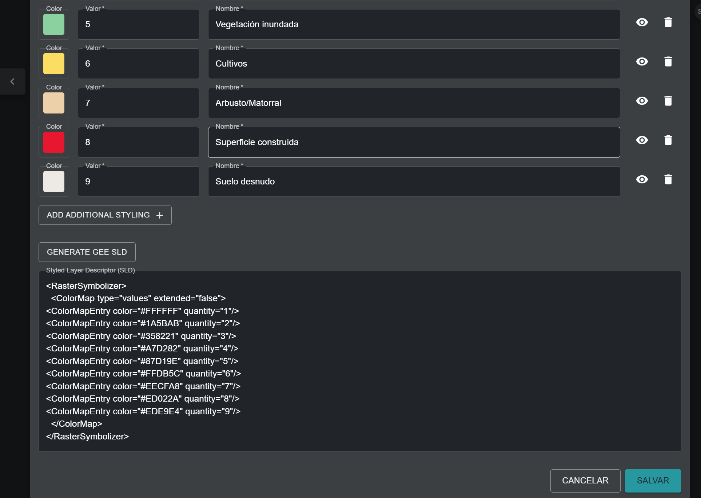

4. Una vez que todos los metadatos y propiedades de configuración han sido especificados, el botón 'SAVE AND VIEW DETAILS' se iluminará en azul, siempre que toda la información ingresada sea válida. Haga clic en este botón para configurar su imagen ráster a su espacio de trabajo. Vea ['¿Cómo publico mi capa y la comparto con usuarios externos?'](#como-publico-mi-capa-y-la-comparto-con-usuarios-externos) y ['¿Cómo edito mis capas agregadas?'](#como-edito-mis-capas-agregadas) para los siguientes pasos.

## ¿Cómo configuro capas ráster usando Spatiotemporal Asset Catalog (STAC)?

La función de configuración STAC está actualmente en pruebas y está sujeta a futuras actualizaciones. Si desea configurar una nueva capa proveniente de un Catálogo STAC externo en su espacio de trabajo UNBL, por favor contáctenos en <support@unbiodiversitylab.org> para que podamos entender el caso de uso de esta función.

## ¿Cómo configuro capas vectoriales usando servicios de teselas externos?

UNBL soporta la configuración de capas de teselas vectoriales a su espacio de trabajo vinculándose a proveedores de servicios de teselas externos. Las capas vectoriales son formas geométricas discretas, como puntos y polígonos. Para agregar datos geoespaciales a su espacio de trabajo usando este método:

1.	Navegue a la página de edición de capa y complete los metadatos relevantes (Vea ['¿Qué parámetros y metadatos debo completar al crear una capa?'](#que-parametros-y-metadatos-debo-completar-al-crear-una-capa)).

2. En la sección 'Configuración de capa' (todos los campos son obligatorios a menos que se especifique lo contrario):

	a.	*Tipo de capa*: Seleccione 'vector'.

	b.	*Proveedero de capa*: Seleccione 'External Tile Service (Mapbox, ESRI, pg_tileserv, Martin, etc.)'.

	c.	*Tiles URL*: Aquí, puede conectarse a un proveedor de servicios de teselas vectoriales externo que aloje sus datos geoespaciales, como Mapbox, Esri, pg_tileserv, Martin y otros. Para configurar capas usando estos proveedores, debe proporcionar una URL de tesela válida, que debe contener ya sea los marcadores de posición `{z}{x}{y}` o el marcador de posición `{bbox-epsg-3857}`. Por ejemplo, una URL de capa configurable para un conjunto de datos de cobertura forestal alojado en Martin se ve así:

	```

	https://example-tileserv.org/martin/forest_cover/{z}/{x}/{y}
	```

	d.	*Tipo de dato*: Especifique si las teselas vectoriales contienen datos 'categorical' o 'continuous'. Los datos categóricos representan clases o categorías discretas. Los conjuntos de datos continuos representan datos donde los valores pueden caer en cualquier lugar dentro de un rango de valores especificado. Aunque las teselas vectoriales pueden almacenar múltiples atributos de datos, solo puede elegir un atributo de datos para el estilo de leyenda de capa en UNBL. Debe especificar el tipo de datos basándose en la leyenda provisional de capa de su capa agregada en UNBL.

	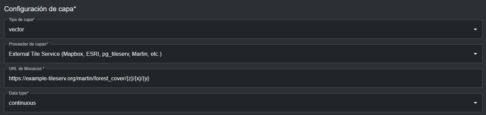

3.	La sección 'Render layers' especifica los atributos de datos de la fuente de datos vectoriales que deben mostrarse en el mapa. En esta sección:

	a.	*Source layer*: Especifique el nombre del conjunto de datos que está alojando en el servidor de teselas vectoriales. Por ejemplo, la capa fuente para la URL de ejemplo del paso 2c es `forest_cover`. Haga clic en el icono 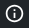{style="display: inline; width: 1em; height: 2em; width: 2em;"} para esta propiedad para ver documentación detallada sobre la referencia de capa fuente.

	b.	*Type*: Especifique el tipo de geometría que representa su conjunto de datos. Las opciones disponibles son *fill, line, symbol, circle, heatmap* y *fill-extrusion*. En la mayoría de los casos, el tipo de geometría será *fill* (polígonos con una rampa de color de relleno). Haga clic en el icono {style="display: inline; width: 1em; height: 2em; width: 2em;"} para esta propiedad para ver documentación detallada sobre las opciones de tipo de geometría.

	c.	*Paint (opcional)*: Aquí, puede especificar el estilo de capa para su conjunto de datos en UNBL usando una configuración de estilo .json. Haga clic en el icono {style="display: inline; width: 1em; height: 2em; width: 2em;"} para esta propiedad para ver documentación detallada para configurar el estilo de capa. Para los tipos de geometría más comunes de tipo *fill*, la configuración paint sigue una plantilla establecida. Para configurar el estilo de capa para conjuntos de datos categóricos, use la siguiente plantilla:

	```

	{
    "fill-opacity": 0.9,
    "fill-color": [
    "match",
    [ "get", "forest_cover_2023" ],
    "Mixed forest",
    "#7c549e",
    "Mangrove forest",
    "#e5bcf6",
    "Plantation forest",
    "#add911",
    "#ffffff"],
    "fill-outline-color": [
    "match",
    [ "get", " forest_cover_2023" ],
    "Mixed forest",
    "#7c549e",
    "Mangrove forest",
    "#e5bcf6",
    "Plantation forest",
    "#add911",
    "#ffffff" ]
    }
	```

	La misma plantilla, en formato de texto a continuación, resalta las cadenas que son variables configurables y necesitan cambiarse según su estilo de capa:

	{
	"fill-opacity": ==0.9==,
    "fill-color": [
    "match",
    [ "get", =="forest_cover_2023"==],
    =="Mixed forest",
    "#7c549e",
    "Mangrove forest",
    "#e5bcf6",
    "Plantation forest",
    "#add911",
    "#ffffff"==],
    "fill-outline-color": [
    "match",
    ["get", =="forest_cover_2023"==],
    =="Mixed forest",
    "#7c549e",
    "Mangrove forest",
    "#e5bcf6",
    "Plantation forest",
    "#add911",
    "#ffffff"==]
    }

	donde:

	- `fill-opacity` establece la opacidad del relleno del polígono, de 0 (completamente transparente) a 1 (completamente opaco).

	- `fill-color` especifica el atributo de datos que se usará para estilizar el relleno del polígono, así como el estilo en sí (en este caso, es el atributo `forest_cover_2023` del conjunto de datos fuente `forest_cover` de ejemplo mencionado anteriormente, y `match` especifica el estilo para categorías discretas de este atributo de datos). Cada siguiente par de cadena de texto configurable especifica una categoría discreta de su atributo de datos y el color que desea pintar esa categoría específica (en formato de código Hex), respectivamente.

	- `fill-outline-color` funciona igual que `fill-color`, pero especifica el color del límite lineal del polígono en lugar del relleno interior del polígono. De esta manera, puede especificar un color de límite diferente para los polígonos en comparación con el color de su relleno interior (note que este no es el caso del ejemplo anterior). Importante, puede especificar una cadena `"#ffffff"` al final de la última cadena de código hex para cualquiera de las propiedades de relleno para significar que cualquier categoría de datos que no esté explícitamente listada en la propiedad de estilo de relleno debe ser transparente.

	!!!Important
		Si no incluye la cadena `"#ffffff"` para estilo transparente para categorías de datos no incluidas, sus teselas vectoriales no se visualizarán si omite especificar exhaustivamente el estilo para **todas** las categorías de datos que están presentes en su atributo de datos en la propiedad de estilo de relleno. Sin embargo, no tiene que especificar un estilo transparente inclusivo si especifica un filtro para excluir categorías de datos seleccionadas en su atributo de datos de la consideración para el estilo de capa (paso 3d).

	Para configurar el estilo de capa para conjuntos de datos continuos, use la siguiente plantilla:

	```

	{
    "fill-opacity": 0.9,
    "fill-color": [
    "interpolate",
	[ "linear" ],
    [ "get", "canopy_height_2023" ],
    0,
	"#f5ebd5",
	5,
	"#eef5c9",
	10,
	"#dbe6a1",
	20,
	"#c5e897",
	30,
	"#9fe04a",
	50,
	"#689c24",
	75,
	"#518510",
	100,
	"#305207" ],
    "fill-outline-color": [
    "interpolate",
	[ "linear" ],
    [ "get", "canopy_height_2023" ],
    0,
	"#f5ebd5",
	5,
	"#eef5c9",
	10,
	"#dbe6a1",
	20,
	"#c5e897",
	30,
	"#9fe04a",
	50,
	"#689c24",
	75,
	"#518510",
	100,
	"#305207" ]
    }
	```

	La misma plantilla, en formato de texto a continuación, resalta las cadenas que son variables configurables y necesitan cambiarse según su estilo de capa:

	{
    "fill-opacity": ==0.9==,
    "fill-color": [
    "interpolate",
	[ "linear" ],
    [ "get", =="canopy_height_2023"== ],
    ==0,
	"#f5ebd5",
	5,
	"#eef5c9",
	10,
	"#dbe6a1",
	20,
	"#c5e897",
	30,
	"#9fe04a",
	50,
	"#689c24",
	75,
	"#518510",
	100,
	"#305207"== ],
    "fill-outline-color": [
    "interpolate",
	[ "linear" ],
    [ "get", =="canopy_height_2023"== ],
    ==0,
	"#f5ebd5",
	5,
	"#eef5c9",
	10,
	"#dbe6a1",
	20,
	"#c5e897",
	30,
	"#9fe04a",
	50,
	"#689c24",
	75,
	"#518510",
	100,
	"#305207"== ]
    }

	donde:

	- `fill-opacity` establece la opacidad del relleno del polígono, de 0 (completamente transparente) a 1 (completamente opaco).

	- `fill-color` especifica el atributo de datos que se usará para estilizar el relleno del polígono, así como el estilo en sí (en este caso, es el atributo `canopy_height_2023` del conjunto de datos fuente `forest_cover` de ejemplo mencionado anteriormente, e `interpolate` especifica el estilo para un rango continuo de valores para este atributo de datos). Cada siguiente par de variable configurable especifica un número que cae dentro del rango de valores de su atributo de datos y una cadena de texto con el color que desea pintar ese valor específico (en formato de código Hex), respectivamente. Para construir un esquema de color continuo para su atributo de datos, comience estilizando el valor mínimo y trabaje hacia arriba en intervalos razonables, basándose en la dispersión de sus datos, para alcanzar el valor máximo. Cualquier valor que caiga entre un intervalo especificado se estilizará usando un color graduado que es más oscuro que el color de valor especificado más pequeño, y más claro que el color de valor especificado más grande en el intervalo especificado.

	- `fill-outline-color` funciona igual que `fill-color`, pero especifica el color del límite lineal del polígono en lugar del relleno interior del polígono. De esta manera, puede especificar un color de límite diferente para los polígonos en comparación con el color de su relleno interior (note que este no es el caso del ejemplo anterior).

	d.	*Filter (opcional)*: Opcionalmente puede especificar un subconjunto de categorías de datos, o un rango específico de valores, que debe usarse para estilizar el mapa. Cualquier categoría de datos o rango de valores que caiga fuera del filtro especificado no se considerará en el estilo de capa. Haga clic en el icono {style="display: inline; width: 1em; height: 2em; width: 2em;"} para esta propiedad para ver documentación detallada para configurar opciones de filtro. Como ejemplo, si quisiera filtrar la categoría "Mixed forest" del atributo de datos `forest_cover_2023`, usaría la siguiente plantilla:

	```

	["!=", ["get", "forest_cover_2023"], "Mixed forest"]
	```

	donde `!=` especifica una expresión de exclusión condicional.

	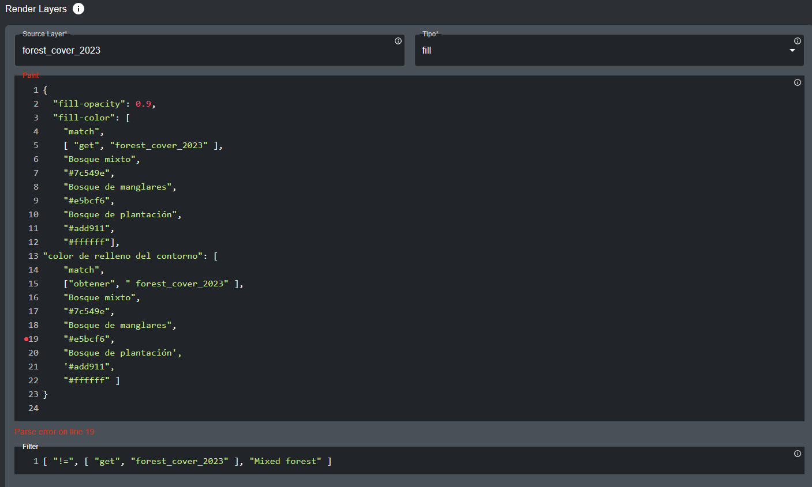

	e.	*ADD LAYER CONFIG (opcional)*: En algunos casos, puede desear configurar el estilo para más de un atributo de datos en su conjunto de datos vectorial. Haciendo clic en este botón, puede especificar más expresiones de estilo. Note que cualquier atributo de datos, categoría de datos o rango de valores que se superponga entre expresiones de estilo o esté contenido dentro de los mismos polígonos en sus datos y no se filtre en consecuencia, llevará a una visualización de capa confusa.

4.	La sección 'Interaction config' especifica los atributos de datos en el conjunto de datos vectorial que deben mostrarse en el popup al hacer clic en los polígonos de la capa vectorial en el mapa. Haga clic en 'ADD ADDITIONAL OPTION' para especificar un atributo de datos que debe mostrarse en el popup. Esta es una sección opcional – puede dejarse en blanco si no es necesaria. Para cada entrada de Interaction config:

	a.	*Column*: El nombre del atributo de datos que se mostrará (sensible a mayúsculas/minúsculas). Por ejemplo, para la capa fuente `forest_cover`, el atributo de datos podría ser `forest_cover_2023` o `canopy_height_2023`.

	b.	*Type*: Elija tipo *string*, *date* o *number*, dependiendo del formato de su atributo de datos.

	c.	*Format (opcional)*: Si su atributo de datos es de tipo *date* o *number*, puede especificar el formato aquí (ej. `dd/mm/yyyy` para fecha).

	d.	*Property (opcional)*: Aquí, puede especificar la etiqueta del atributo de datos mostrada en la tabla popup.

	e.	*Prefix (opcional)*: Puede especificar un prefijo que se mostrará delante del valor/categoría del atributo de datos.
	Note que esto se mostrará después de la etiqueta de propiedad.

	f.	*Suffix (opcional)*: Puede especificar un sufijo que se mostrará después del valor/categoría del atributo de datos (ej. unidades).

	g.	Haga clic en el icono 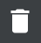{style="display: inline; width: 1em; height: 2em; width: 2em;"} para eliminar una entrada de Interaction config.

	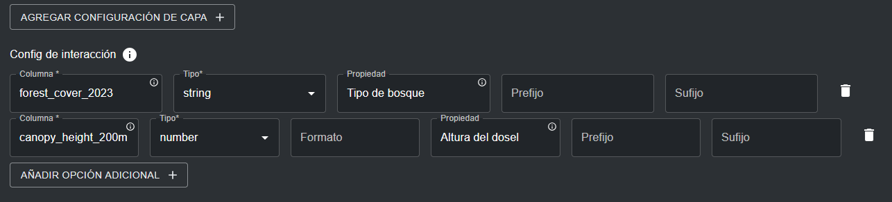

	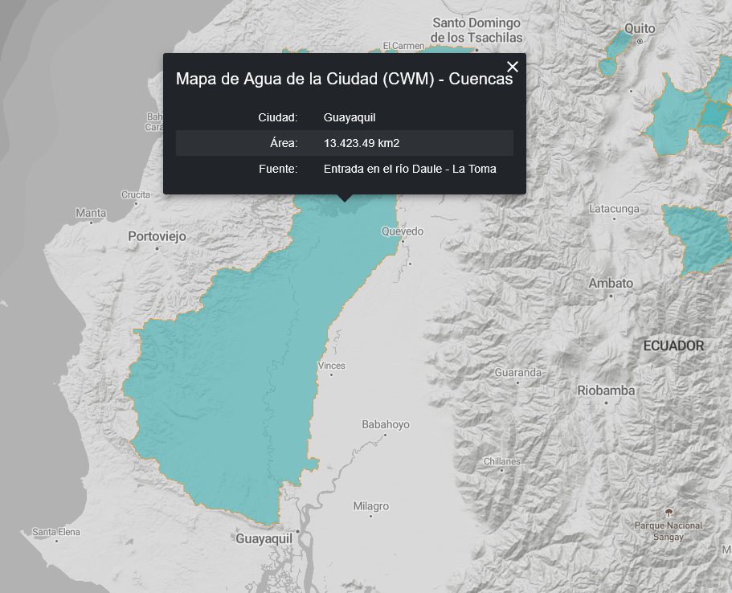

5.	Especifique los niveles de zoom para sus teselas vectoriales. El rango de nivel de zoom predeterminado está configurado de 0 a 20. Opcionalmente puede especificar los niveles de zoom para la capa si las teselas vectoriales solo son visibles a una resolución más pequeña/más grande. Note que UNBL soporta un nivel de zoom máximo de 20 para teselas vectoriales.

6.	Especifique el estilo de leyenda para su capa de teselas vectoriales en la sección 'Legend Config'. En esta sección (todos los campos son obligatorios a menos que se especifique lo contrario):

	a.	Haciendo clic en 'ADD ADDITIONAL STYLING' puede especificar cualquier número de entradas de estilo de capa para coincidir con las categorías de datos/rango de valores en su capa de teselas vectoriales. Cada entrada de estilo de capa debe definir las siguientes propiedades:

	- *Name* – el nombre de la entrada de estilo en la leyenda de la capa en el mapa.

	- *Color* – el color asociado con el nombre especificado en la leyenda de la capa. Puede seleccionar un color usando el selector de color, o especificando un valor de código de color RGBA o Hex.

	También puede opcionalmente elegir si la etiqueta de nombre de una entrada de estilo está oculta en la leyenda de la capa en el mapa haciendo clic en el icono {style="display: inline; width: 1em; height: 2em; width: 2em;"} junto a la entrada de estilo. Para datos categóricos, las entradas de estilo de leyenda de capa deben representar las categorías discretas y su estilo de color asociado que especificó en la sección 'Render layers'. Para datos continuos, las entradas de estilo de leyenda deben representar el rango de valores y su degradado de color asociado que especificó en la sección 'Render layers'.

	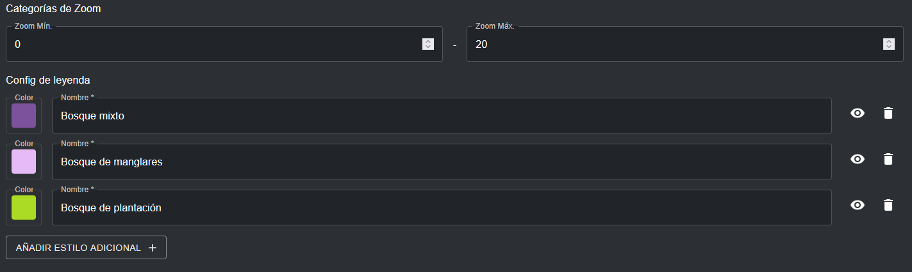

	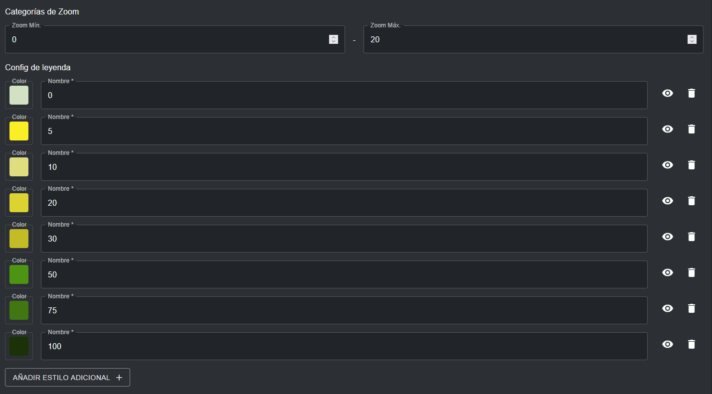

7.	Una vez que todos los metadatos y propiedades de configuración han sido especificados, el botón 'SAVE AND VIEW DETAILS' se iluminará en azul, siempre que toda la información ingresada sea válida. Haga clic en este botón para configurar su capa de teselas vectoriales a su espacio de trabajo. Vea ['¿Cómo publico mi capa y la comparto con usuarios externos?'](#como-publico-mi-capa-y-la-comparto-con-usuarios-externos) y ['¿Cómo edito mis capas agregadas?'](#como-edito-mis-capas-agregadas) para los siguientes pasos.

## ¿Cómo publico mi capa y la comparto con usuarios externos?

Para hacer cualquiera de sus capas agregadas descubrible y visible para todos los usuarios de su espacio de trabajo (vea ['¿Cómo visualizo conjuntos de datos dentro de mi espacio de trabajo?'](2_viewing.es.md#como-visualizo-conjuntos-de-datos-dentro-de-mi-espacio-de-trabajo)), así como opcionalmente hacer su capa visible para usuarios fuera de su espacio de trabajo, realice los siguientes pasos:

1.	Navegue a la página de edición de capa para la capa de su elección. Al agregar una capa a su espacio de trabajo, será automáticamente llevado a esta página. Alternativamente, haga clic en el botón 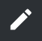{style="display: inline; width: 1em; height: 2em; width: 2em;"} en la lista de capas disponible después de navegar a la página 'Capas' en su interfaz de administración.

	

2.	Para que su conjunto de datos sea accesible en la vista del mapa UNBL, debe publicar el conjunto de datos haciendo clic en el botón de de activación 'Publicado'. Los conjuntos de datos no publicados permanecen en la interfaz de administración hasta que esté listo para publicarlos en la vista del mapa UNBL.

3.	Si su conjunto de datos está publicado, aparecerá un botón de activación con una opción para 'Allow external access via link'. Esta es una alternancia opcional que, si se habilita, hace su capa accesible para cualquiera con la URL de la vista del mapa, incluso usuarios fuera de su espacio de trabajo. Para compartir la URL de su capa, copie el enlace que aparece o haga clic en el icono 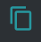{style="display: inline; width: 1em; height: 2em; width: 2em;"} para copiar el enlace automáticamente a su portapapeles.

4.	Haga clic en el botón de activación 'Primario' para marcar su capa como una capa independiente y hacerla descubrible en la barra de búsqueda 'DATASETS' en UNBL. Para que las capas de su espacio de trabajo sean descubribles y visibles en UNBL, siempre debe publicarlas y marcarlas como primarias. La única excepción para publicar una capa y no marcarla como primaria es cuando está creando capas agrupadas (Vea ['¿Cómo creo capas agrupadas?'](#como-creo-capas-agrupadas)).

	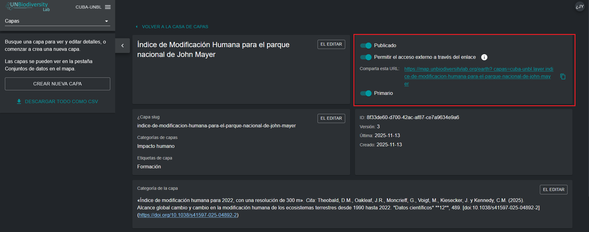

## ¿Cómo edito mis capas agregadas?

Puede que desee regresar y editar sus capas agregadas para cambiar cualquiera de los metadatos asociados, probar si su capa se visualiza en UNBL, y editar su configuración de capa en consecuencia si su capa no se visualiza. Para hacer esto:

1.	Navegue a la página de edición de capa para la capa de su elección. Al agregar una capa a su espacio de trabajo, será automáticamente llevado a esta página. Alternativamente, haga clic en el botón {style="display: inline; width: 1em; height: 2em; width: 2em;"} en la lista de capas disponible después de navegar a la página 'Layers' en su interfaz de administración.

	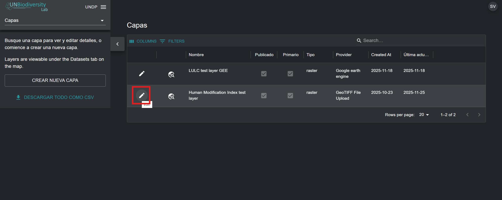

2.	Para probar si su capa se visualiza correctamente en la vista del mapa UNBL, haga clic en el botón 'TEST LAYER' en la esquina inferior derecha de la página de edición de capa. Aparecerá una marca verde dentro del botón si la capa ha sido correctamente cargada y/o configurada. De lo contrario, aparecerá una cruz roja con un mensaje de error diagnosticando el problema.

	!!!Nota
		Si está cargando un conjunto de datos regional (extensión no global), es posible que la prueba reporte una falla incluso si la capa está funcionando, ya que la prueba puede solicitar teselas de muestra que caigan fuera de la extensión areal de su conjunto de datos. La mejor práctica es verificar el diagnóstico de prueba de capa verificando manualmente si su capa se visualiza en la vista del mapa UNBL.

	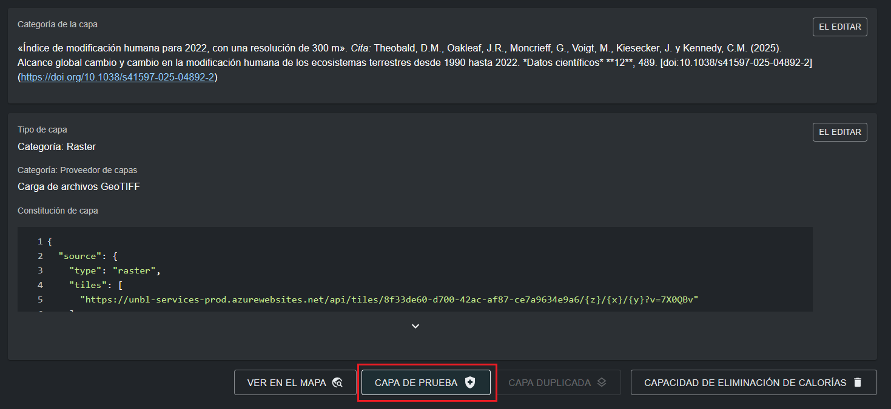

3.	Si desea navegar directamente a su capa en la vista del mapa UNBL, haga clic en el botón 'VIEW ON MAP'. Si desea eliminar su capa de su espacio de trabajo, haga clic en el botón 'ELIMINAR CAPA'.

4.	Haga clic en el botón 'EDITAR' para cualquiera de las secciones de metadatos/configuración de capa para editar información y parámetros de esa sección.

	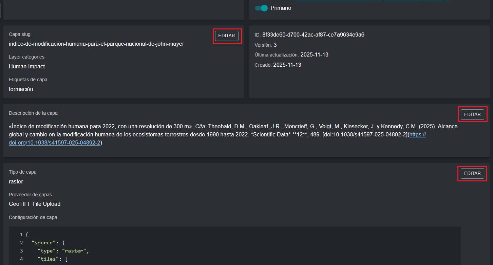

## ¿Cómo creo capas agrupadas?

Cualquier capa que agregue a su espacio de trabajo UNBL puede agruparse junto para organizar datos multi-año o multi-categoría. Cada año o categoría es similar a una banda ráster individual. Las capas agrupadas se crean en una nueva capa separada (denominada *capa principal* en UNBL) de las capas componentes. Por ejemplo, un ráster de cobertura de suelo que abarca tres años requeriría cuatro capas a crear: cada año como su propia capa, así como una cuarta capa principal desde la cual todas serán accesibles. En este caso, cada capa individual de año/categoría debe publicarse y **no** marcarse como primaria para ser descubrible en la vista del mapa exclusivamente a través de una capa agrupada. La capa agrupada/principal es una capa de visualización adicional con una configuración de capa fija que referencia todas las capas individuales de años/categorías. Se publica y se marca como primaria. Cuando la capa agrupada se visualiza en UNBL, aparece una única leyenda de capa desde la cual puede seleccionar cualquiera de sus capas componentes incluidas para visualizarse en la vista del mapa.

!!!Nota
	Si las capas individuales de años/categorías que está vinculando a través de una capa agrupada también están marcadas como primarias, además de estar publicadas, estas capas serán descubribles como entradas individuales en la barra de búsqueda 'DATASETS', duplicando así las entradas con la capa agrupada publicada.

Para configurar una capa agrupada:

1.	Publique todas las capas componentes a incluir en la capa agrupada, y **no** las marque como primarias. La función de URL pública funciona de la misma manera que para las capas independientes (vea ['¿Cómo publico mi capa y la comparto con usuarios externos?'](#como-publico-mi-capa-y-la-comparto-con-usuarios-externos)).

2.	Cree una capa separada usando el botón 'CREAR NUEVA CAPA' en la página 'Capas' de la interfaz de administración de su espacio de trabajo. Esta será su capa agrupada designada.

3.	Ingrese un título de capa, slug de capa, categoría de capa, etiqueta de búsqueda y una descripción de capa que sea representativa del conjunto de datos representado por su colección de capas individuales agrupadas. Note que la descripción de capa para las capas componentes es redundante – solo necesita completar la descripción de capa para la capa agrupada que contiene sus capas componentes. Para más información sobre cómo completar metadatos para capas, vea ['¿Qué parámetros y metadatos debo completar al crear una capa?'](#que-parametros-y-metadatos-debo-completar-al-crear-una-capa).

4.	*Tipo de capa*: Seleccione 'group'.

5.	*Capas agrupadas*: Del menú desplegable, seleccione todas las capas componentes que desea incluir en su capa agrupada. Las capas disponibles para inclusión son todas las capas agregadas en su espacio de trabajo.

6.	*Layer selector*: Del menú desplegable, seleccione ya sea 'Dropdown' o 'Radio Button'. Estas opciones influyen en cómo aparece la interfaz de usuario del selector de capa en la leyenda de la capa agrupada en UNBL. La opción dropdown se recomienda para capas agrupadas con más de tres capas componentes. La opción radio button se recomienda para capas agrupadas con tres o menos capas componentes, o cuando las capas agrupadas representan los mismos datos con diferente estilo.

	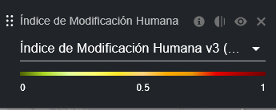

	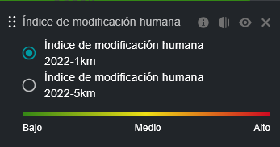

7.	Haga clic en el botón 'GUARDAR Y VER DETALLES' para agregar la capa agrupada a su espacio de trabajo.
