# Adding Your Own Geospatial Data to Your Workspace

UNBL workspaces support the upload of geospatial raster data in the following file format:

- GeoTIFF (Georeferenced Tagged Image File Format)

UNBL workspaces also support the connection to external   geospatial data through any of the following external tile service providers:

- WMS (Web Map Service)

- WMTS (Web Map Tile Service)

- Google Earth Engine (GEE)

- Spatiotemporal Asset Catalog (STAC)

- XYZ Tile Service

- Mapbox

- Esri ArcGIS API Map Service 
 
- Vector Tile Services (served as pg_tileserv or Martin)

Geospatial data can be uploaded and/or linked to within your workspace, thereby giving all your workspace members the ability to view your data on UNBL without them needing any prior GIS experience. UNBL security ensures that datasets within your workspace are **only** visible to members of your workspace. However, if you want datasets within your workspace to be viewable by anyone outside of your workspace, you can enable this using a public layer URL option. Only people with access to this URL will be able to view your layer.

Importantly, any datasets in your workspace can also be viewed in tandem with global datasets published on UNBL’s public platform.

!!!Note
	The terms *dataset* and *layer* are used intermittently henceforth. A dataset refers to a collection of spatial data consisting of one or more layers. On UNBL, a single upload or configuration of geospatial data is realized through *‘creating a layer’*. Multiple layer entries can be combined and visualized on UNBL as a dataset. Single layers can also be visualized independently on UNBL.

## What parameters and metadata do I fill in when creating a layer?

To begin creating a layer and fill in relevant metadata for the layer:

1.	Open the ‘Home’ dropdown menu in your workspace admin interface and click on ‘Layers’.

2.	Click the ‘CREATE NEW LAYER’ button.

	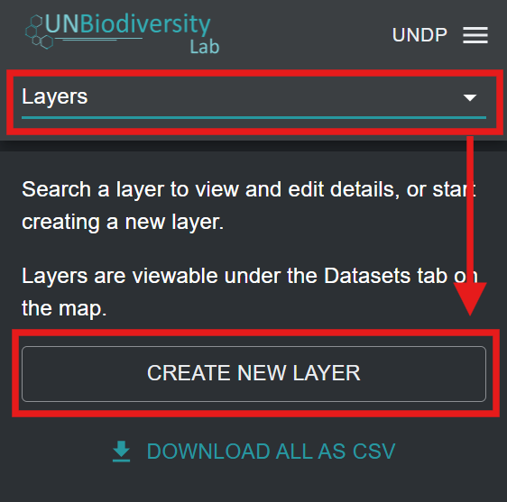
	
3.	In the new layer page, fill in the following information:

	a.	*Layer title*: The name of your layer. This should be concise (we recommend that it is less than 100 characters in length) and descriptive of your data.
	
	b.	*Layer slug*: A slug is a unique identifier for the layer within your workspace. You cannot have multiple layers within your workspace with the same slug. It should contain only letters, digits, and hyphens (“-”). You can use the ‘GENERATE SLUG NAME’ button to generate a unique identifier based on the supplied layer title.
	
	c.	*Layer category (optional)*: You can select one or more categories for the layer from the list of options in the dropdown menu. A wide range of socioeconomic, nature-based, and KMGBF policy-related categories are available. More than one category can be selected for the same layer. These categories correspond to the dataset category filters in the map view. Selecting a category will mean that your layer will appear in the list of filtered datasets when the corresponding dataset category filter is applied.
	
	d.	*Tag (optional)*: You can specify one or more tags for your layer. Tags correspond to the dataset tags filter in the map view. Specifying a tag for your layer will mean that the layer will appear in the list of filtered layers when the corresponding dataset tag filter is applied in the map. Unlike layer categories, tags can be any text string of your choice, making this feature useful if you need to clearly differentiate your workspace layers from public platform datasets and be able to apply more effective filters when searching for your datasets in the map view. For example, you could use a tag to identify the target in your national biodiversity strategy and action plan (NBSAP) for which the data layer is relevant.
	
	e.	*Layer description (optional)*: In the description field, you can specify the text that will appear in the layer information pop-up box. Here, you can insert the bulk of your layer metadata, such as a general description, citation for the scientific paper/dataset, external links to the scientific paper/dataset, license specifications, etc. 
	
	!!!Note
		For individual layers that are part of a parent group layer, the layer information pop-up text will always display the description of the parent group layer and so the description field is redundant (see [‘How do I create group layers?’](#how-do-i-create-group-layers)).

	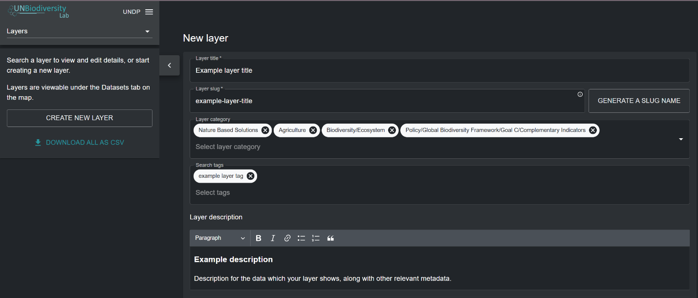
	
4.	Once you have filled in the relevant metadata to document this new layer, you now need to specify the format or geospatial webservice standard of your geospatial data and set up the layer configuration accordingly. The forthcoming sections detail how to configure your layer based on the format of your geospatial data.

## How do I upload raster layers in GeoTIFF format?

Currently, you can manually upload geospatial data to your 
UNBL workspace only if it is available in a raster GeoTIFF 
format. A raster layer constitutes a grid of cells (or pixels)
 where each cell has a value representing information about a 
specific topic or phenomenon. We can currently accept only 
GeoTIFFs with one single band. If you have a GeoTIFF with more
 than one band, split it upfront into different files. GeoTIFF
 raster layers are added to your UNBL workspace through a 
direct upload to a secure, GDPR-compliant UNBL GIS data 
repository on Azure. For further information, please see our 
[overview sheet on data security](data_security.md).
  

!!!Note
	Geospatial data in other raster and vector layer formats can be configured on UNBL through linking to an external resource. See [‘How do I configure raster layers using external tile services?’](#how-do-i-configure-raster-layers-using-wmswmts-external-tile-services) and [‘How do I configure vector layers using external tile services?’](#how-do-i-configure-vector-layers-using-external-tile-services) for available UNBL-interoperable OGC Web Service formats and guides on linking to them. 

To upload a GeoTIFF file:

1.	Navigate to the new layer page and fill in relevant metadata (See [‘What parameters and metadata do I fill in when creating a layer?’](#what-parameters-and-metadata-do-i-fill-in-when-creating-a-layer)).
 
2.	In the 'Layer Config' section:

	a.	*Layer type*: Select ‘raster’.
	
	b.	*Layer provider*: Select ‘GeoTIFF File Upload’.
	
	c.	*GeoTIFF file*: Click the ‘Choose File’ button to upload a valid GeoTIFF raster layer from your local file system. Uploaded files should be a single-band raster and should be less than 1000MB in size. You will be notified if you select an invalid file.
	
	d.	*Data type*: Specify whether the raster contains ‘categorical’ or ‘continuous’ data. Categorical data represents discrete classes or categories where each pixel value represents a distinct type or class (for instance, Land Use Land Cover classes). Continuous datasets represent data where values can fall anywhere within a specified range of values (for instance, yearly mean temperature).
	
	e.	*Minimum/Maximum value*: If your raster contains continuous data, then you must supply the range of values in the data by specifying minimum and maximum values of the range.
	
	f.	*Minimum/Maximum zoom level (optional)*: The default zoom level range is set to 0 to 14. You can optionally specify the zoom levels for the layer if the raster file only contains data at certain zoom levels. Note that UNBL supports a maximum zoom level of 14.  
	
	g.	*Layer styling*: The layer styling determines how the layer is displayed on the map. By clicking on ‘ADD ADDITIONAL STYLING’ you can specify any number of layer styling entries to match the values in your raster. Each layer styling entry should define the following properties: 
	
	- *Value* - the pixel value in the data to define the styling for. 
	
	- *Name* – the name of the styling entry in the layer legend on the map.
	
	- *Color* – the color of pixels with the specified value on the map. You can define a color through the manual color picker, or by entering a RGBA or Hexadecimal value. Optionally, you can set the opacity of the color in a range from 0 to 100%, where 0% is fully transparent and 100% is fully opaque.
		
	You can also optionally choose whether a styling entry’s name label is hidden in the layer legend on the map by clicking the {style="display: inline; width: 1em; height: 2em; width: 2em;"} icon next to the styling entry. For categorical layers, layer styling value entries must map to the values of each category/class within the raster data source. For continuous layers, layer styling value entries must map to the range of values within your raster file that you want rendered on the map. You can specify any points along the range of values between the minimum and maximum values -- a gradient of colors between each of these values will be generated.
	
	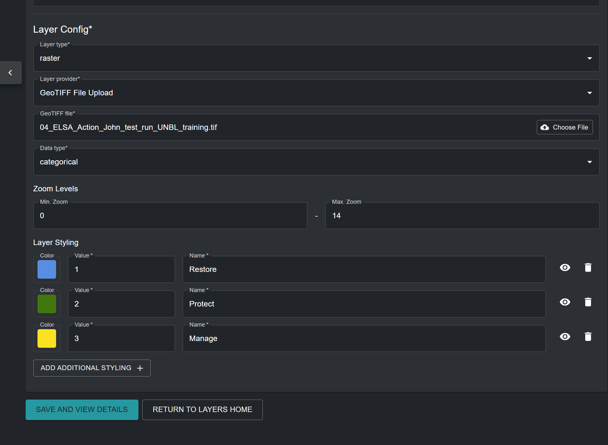
	
3.	Once all metadata and parameters have been specified, the ‘SAVE AND VIEW DETAILS’ button will light up blue, provided that all the entered information is valid. Click on this button to upload your GeoTIFF file to your workspace. The file will be stored in a safe and dedicated private repository on Azure. This may take a few seconds depending on the size of the file and the speed of your upload internet broadband, so after clicking the button you should wait until you are redirected to the edit layer page. See [‘How do I publish my layer and share it with external users?’](#how-do-i-publish-my-layer-and-share-it-with-external-users) and [‘How do I edit my added layers?’](#how-do-i-edit-my-added-layers) for next steps.

## How do I configure raster layers using WMS/WMTS external tile services ?

UNBL supports the configuration of raster image layers to your workspace by linking to external tile service providers. To add geospatial data to your workspace using this method:

1.	Navigate to the new layer page and fill in relevant metadata (See [‘What parameters and metadata do I fill in when creating a layer?’](#what-parameters-and-metadata-do-i-fill-in-when-creating-a-layer)). 

2.	In the 'Layer Config' section:

	a.	*Layer type*: Select ‘raster’.
	
	b.	*Layer provider*: Select ‘External Tile Service (WMS, WMTS, etc.)’.
	
	c.	*Tiles URL*: Here, you can connect to an external tile service that uses the Web Map Service (WMS), Web Map Tile Service (WMTS), or XYZ Tile Service protocols. To configure layers using these providers, you must supply a valid tile URL, which must contain either the placeholders `{z}{x}{y}` or the placeholder `{bbox-epsg-3857}`. 
	
	For example, the sample WMS URL below will **not** work:

	```	
	https://wms.server.net/mapserv?request=getmap&service=wms&BBOX=-90,-180,90,360&crs=EPSG:4326&format=image/jpeg&layers=layer_latest&width=1200&height=600
	```

	as it contains an incorrect bounding box (BBOX) parameter format. The URL can be adjusted by changing the `BBOX` parameter to match the placeholder, as well as the coordinate reference system parameter (`crs`) to reflect the Web Mercator coordinate system (EPSG: 3857). A configurable URL would be:
	
	```	
	https://wms.server.net/mapserv?request=getmap&service=wms&BBOX={bbox-epsg-3857}&crs=EPSG:3857&format=image/jpeg&layers=layer_latest&width=1200&height=600
	```
	
	!!!Note "The following placeholders were adjusted to enable UNBL configuration:"
		- `-90,-180,90,360` changed to `{bbox-epsg-3857}`
		- `EPSG:4326` changed to `EPSG:3857`

	d.	*Data type*: Specify whether the raster image contains ‘categorical’ or ‘continuous’ data. Categorical data represents discrete classes or categories where each pixel value represents a distinct type or class. Continuous datasets represent data where values can fall anywhere within a specified range of values.
	
	e.	*Minimum/Maximum zoom level (optional)*: The default zoom level range is set to 0 to 14. You can optionally specify the zoom levels for the layer if the raster image only contains data at certain zoom levels. Note that UNBL supports a maximum zoom level of 14.
	
	f.	*Layer styling*: The layer styling determines how the legend for the raster image is displayed on the map. By clicking on ‘ADD ADDITIONAL STYLING’ you can specify any number of layer styling entries to match the values in the raster image. Each layer styling entry should define the following properties: 
	
	- *Name* – the name of the styling entry in the layer legend on the map.
	
	- *Color* – the color associated with the specified name in the layer legend. You can select a color by using the color picker, or by specifying a RGBA or Hex color code value.
	
	You can also optionally choose whether a styling entry’s name label is hidden in the layer legend on the map by clicking the {style="display: inline; width: 1em; height: 2em; width: 2em;"} icon next to the styling entry. For categorical raster images, the legend layer styling entries should represent the values of each category/class within the raster data source. For continuous raster images, legend styling entries should represent the range of values visualized in the raster image. You can specify any points along the range of values between the minimum and maximum values - a gradient of colors between each of these values will be generated.
	
	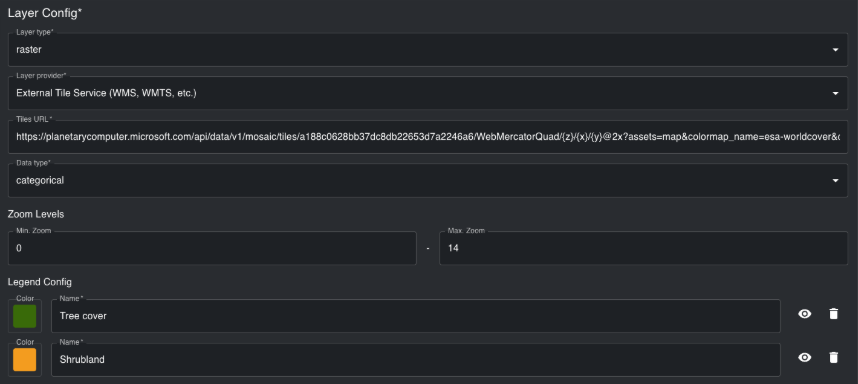
	
3. Once all metadata and configuration properties have been specified, the ‘SAVE AND VIEW DETAILS’ button will light up blue, provided that all the entered information is valid. Click on this button to configure your raster image to your workspace. See [‘How do I publish my layer and share it with external users?’](#how-do-i-publish-my-layer-and-share-it-with-external-users) and [‘How do I edit my added layers?’](#how-do-i-edit-my-added-layers) for next steps.

## How do I configure raster layers using Google Earth Engine (GEE)? 

If you want to display GEE assets in your UNBL workspace from your own account or a public account, then you can do so by configuring a GEE single-band raster asset. Currently, we do not support configuration of multi-band rasters or vector data from GEE. To configure GEE single-band raster assets:

1. If you are configuring an asset from your personal Cloud Project, ensure that the ‘Anyone can read’ box is checked for this asset.

	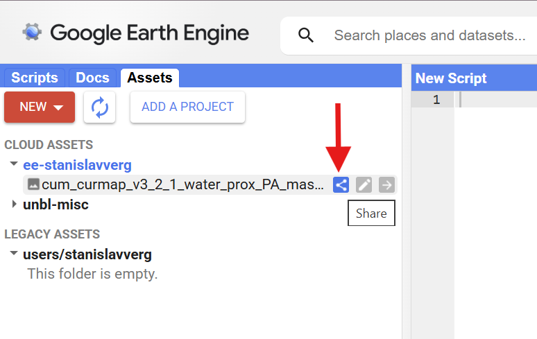
	
	
	
2. Navigate to the new layer page in the UNBL admin interface and fill in relevant metadata (See [‘What parameters and metadata do I fill in when creating a layer?’](#what-parameters-and-metadata-do-i-fill-in-when-creating-a-layer)).

3. In the *Layer Config* section:

	a.	*Layer type*: Select ‘raster’.

	b.	*Layer provider*: Select ‘Google Earth Engine’.
	
	c.	*Asset Path*: Copy and paste the image ID of your GEE asset Any image ID can be configured on UNBL, provided that it is a single raster band image. It can be an image ID of your personal GEE Cloud Project, or any other shared GEE Cloud Project or publicly available GEE dataset, such as one from the public catalogue [awesome-gee-community-catalog](https://gee-community-catalog.org/), which provides access to over 4,000 public GEE assets. 
	
	
	
	d.	*Data type*: Specify whether the raster image contains ‘categorical’ or ‘continuous’ data. Categorical data represents discrete classes or categories where each pixel value represents a distinct type or class. Continuous datasets represent data where values can fall anywhere within a specified range of values.

	e.	*Minimum/Maximum zoom level (optional)*: The default zoom level range is set to 0 to 14. You can optionally specify the zoom levels for the layer if the raster image only contains data at certain zoom levels. Note that UNBL supports a maximum zoom level of 14.
	
	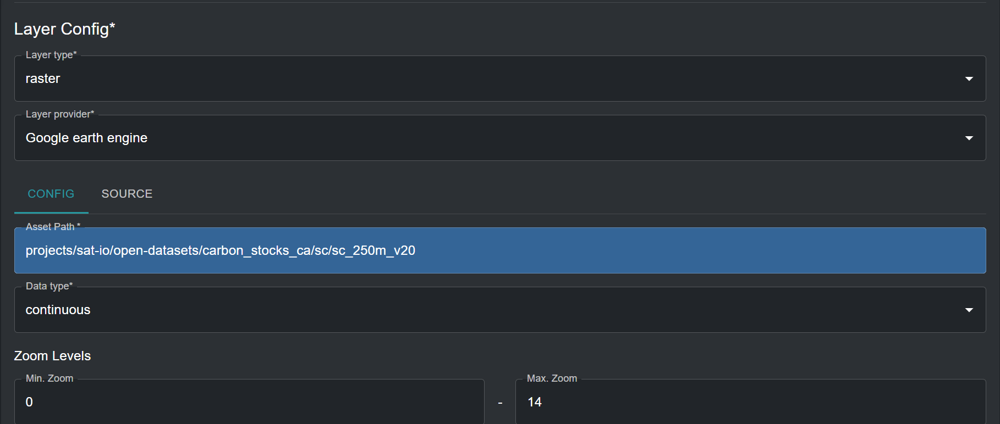
	
	f.	*Layer styling*: The layer styling determines how the legend for the GEE asset is displayed on the map. By clicking on ‘ADD ADDITIONAL STYLING’ you can specify any number of layer styling entries (also known as *classes* or *thresholds*) to match the values in the raster image. Each layer styling entry should define the following properties:

	- *Value* - the pixel value in the data to define the styling for.

	- *Name* – the name of the class or range in the layer legend on the map.
	
	- *Color* – the color of pixels with the specified value on the map. You can define a color through the manual color picker, or by entering a RGBA or Hexadecimal value. Optionally, you can set the opacity of the color in a range from 0 to 100%, where 0% is fully transparent and 100% is fully opaque.
	
	You can also optionally choose whether a styling entry’s name label is hidden in the layer legend on the map by clicking the {style="display: inline; width: 1em; height: 2em; width: 2em;"} icon next to the styling entry. For categorical layers, layer styling value entries must map to the values of each category/class within the raster data source. For continuous layers, layer styling value entries must map to the range of values within your raster file that you want rendered on the map. You can specify any points along the range of values between the minimum and maximum values -- a gradient of colors between each of these values will be generated. It is important to note that the minimum and maximum pixel values, and therefore the range of values, can be derived directly from viewing the ‘BANDS’ tab in the ‘Asset details’ information box of your asset on GEE. The example layer styling below creates a continuous color palette for carbon stock concentration.
	
	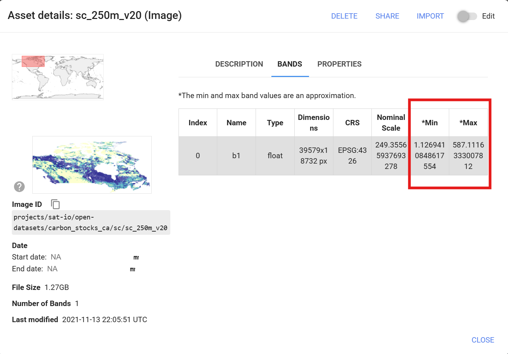
	
	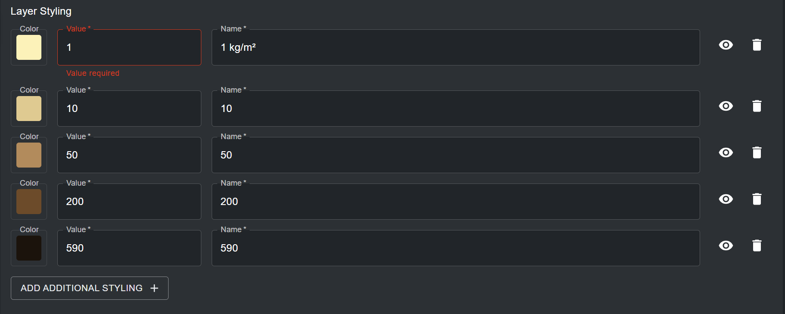
	
	For categorical raster layers, each specified pixel value maps to exactly one discrete class or category. The example layer styling below creates a discrete color palette that maps land cover classes.
	
	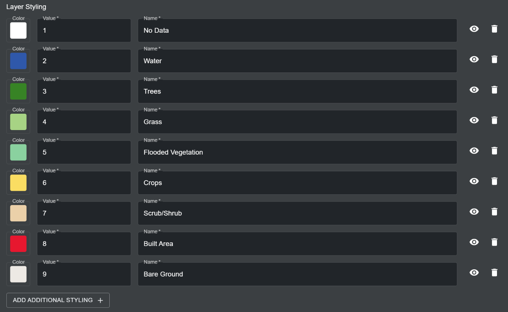
	
	g.	*Styled Layer Description (SLD)*: Click on the ‘GENERATE GEE SLD’ button to automatically generate a SLD for configuring your GEE asset style on UNBL, based on the parameters you set for the *Layer styling* in step f. While layer styling determines the style of the layer legend, the SLD will determine the style of the actual pixels in your data. Based on the examples provided in step f, the SLD configuration for a continuous color scheme for carbon stock concentration would look like this:
	
	```
	
	<RasterSymbolizer>
	<ColorMap type="ramp" extended="false">
		<ColorMapEntry color="#FFF1B8" quantity="1"/>
		<ColorMapEntry color="#E2C98F" quantity="10"/>
		<ColorMapEntry color="#B58A5A" quantity="50"/>
		<ColorMapEntry color="#6E4A28" quantity="200"/>
		<ColorMapEntry color="#1C130C" quantity="590"/>
	</ColorMap>
	</RasterSymbolizer>

	```

	For the categorical land cover land use raster, the SLD configuration would look like this:

	```
	
	<RasterSymbolizer>
	<ColorMap type="values" extended="false">
		<ColorMapEntry color="#FFFFFF" quantity="1"/>
		<ColorMapEntry color="#1A5BAB" quantity="2"/>
		<ColorMapEntry color="#358221" quantity="3"/>
		<ColorMapEntry color="#A7D282" quantity="4"/>
		<ColorMapEntry color="#87D19E" quantity="5"/>
		<ColorMapEntry color="#FFDB5C" quantity="6"/>
		<ColorMapEntry color="#EECFA8" quantity="7"/>
		<ColorMapEntry color="#ED022A" quantity="8"/>
		<ColorMapEntry color="#EDE9E4" quantity="9"/>
	</ColorMap>
	</RasterSymbolizer>


	```
	
	Where each ColorMapEntry color and associated pixel quantity row matches exactly to a layer styling entry row from step f.
	
	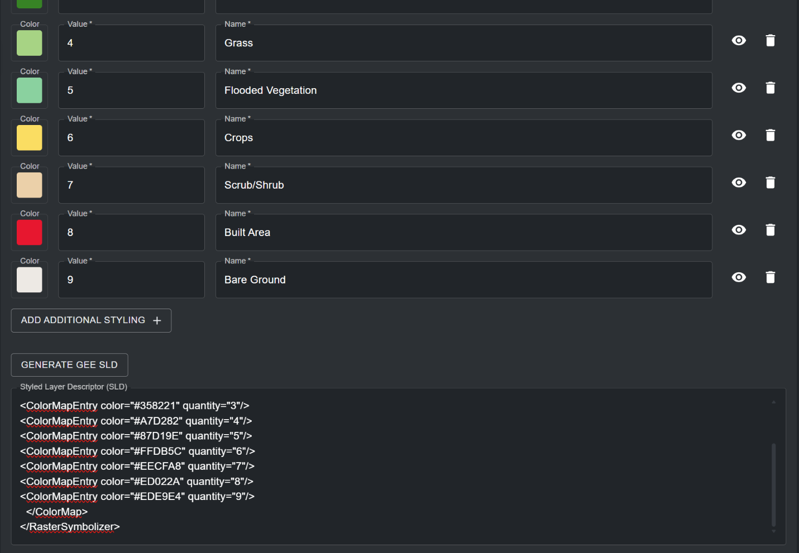
	
4. Once all metadata and configuration properties have been specified, the ‘SAVE AND VIEW DETAILS’ button will light up blue, provided that all the entered information is valid. Click on this button to configure your raster image to your workspace. See [‘How do I publish my layer and share it with external users?’](#how-do-i-publish-my-layer-and-share-it-with-external-users) and [‘How do I edit my added layers?’](#how-do-i-edit-my-added-layers) for next steps.

## How do I configure raster layers using Spatiotemporal Asset Catalog (STAC)?

The STAC configuration feature is currently in testing and is subject to future updates. If you want to configure a new layer coming from an external STAC Catalogue in your UNBL workspace, please contact us at <support@unbiodiversitylab.org> so that we can understand the use case for this feature. 

## How do I configure vector layers using external tile services?

UNBL supports the configuration of vector tile layers to your workspace by linking to external tile service providers. Vector layers are discrete geometric shapes, such as points and polygons. To add geospatial data to your workspace using this method:

1.	Navigate to the layer edit page and fill in relevant metadata (See [‘What parameters and metadata do I fill in when creating a layer?’](#what-parameters-and-metadata-do-i-fill-in-when-creating-a-layer)). 

2. In the 'Layer Config' section (all fields are mandatory unless specified otherwise):

	a.	*Layer type*: Select ‘vector’.
	
	b.	*Layer provider*: Select ‘External Tile Service (Mapbox, ESRI, pg_tileserv, Martin, etc.)’.
	
	c.	*Tiles URL*: Here, you can connect to an external vector tile service provider that hosts your geospatial data, such as Mapbox, Esri, pg_tileserv, Martin, and others. To configure layers using these providers, you must supply a valid tile URL, which must contain either the placeholders `{z}{x}{y}` or the placeholder `{bbox-epsg-3857}`. For example, a configurable layer URL for a forest cover dataset hosted on Martin looks like this:
	
	```
	
	https://example-tileserv.org/martin/forest_cover/{z}/{x}/{y}
	```
	
	d.	*Data type*: Specify whether the vector tiles contain ‘categorical’ or ‘continuous’ data. Categorical data represents discrete classes or categories. Continuous datasets represent data where values can fall anywhere within a specified range of values. While vector tiles can store multiple data attributes, you can only choose one data attribute for layer legend styling on UNBL. You should specify the data type based on the provisional layer legend of your added layer on UNBL. 
	
	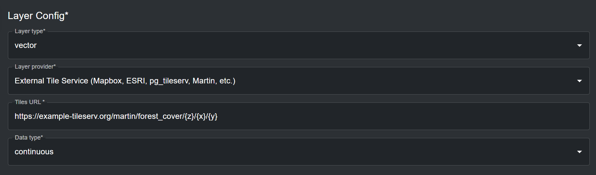
	
3.	The  ‘Render layers’ section specifies the data attributes from the vector data source that should be displayed on the map. In this section:

	a.	*Source layer*: Specify the name of the dataset which you are hosting on the vector tile server. For example, the source layer for the example URL from step 2c is `forest_cover`. Click on the {style="display: inline; width: 1em; height: 2em; width: 2em;"} icon for this property to view detailed documentation on source layer referencing.
	
	b.	*Type*: Specify the geometry type your dataset represents. Available options are *fill, line, symbol, circle, heatmap* and *fill-extrusion*. In the majority of cases, the geometry type will be *fill* (polygons with a color fill ramp). Click on the {style="display: inline; width: 1em; height: 2em; width: 2em;"} icon for this property to view detailed documentation on geometry type options.
	
	c.	*Paint (optional)*: Here, you can specify the layer styling for your dataset on UNBL using a .json style configuration . Click on the {style="display: inline; width: 1em; height: 2em; width: 2em;"} icon for this property to view detailed documentation for configuring layer styling. For the most common geometry types of type *fill*, the paint configuration follows a set template. For configuring layer styling for categorical datasets, use the following template:
	
	```
	
	{
    "fill-opacity": 0.9,
    "fill-color": [
    "match",
    [ "get", "forest_cover_2023" ],
    "Mixed forest",
    "#7c549e",
    "Mangrove forest",
    "#e5bcf6",
    "Plantation forest",
    "#add911",
    "#ffffff"], 
    "fill-outline-color": [ 
    "match", 
    [ "get", " forest_cover_2023" ], 
    "Mixed forest",
    "#7c549e",
    "Mangrove forest",
    "#e5bcf6",
    "Plantation forest",
    "#add911",
    "#ffffff" ]
    }
	```
	
	The same template, in text format below, highlights strings which are configurable variables and need to be changed based on your layer styling:
	
	{
	"fill-opacity": ==0.9==,
    "fill-color": [
    "match",
    [ "get", =="forest_cover_2023"==],
    =="Mixed forest",
    "#7c549e",
    "Mangrove forest",
    "#e5bcf6",
    "Plantation forest",
    "#add911",
    "#ffffff"==], 
    "fill-outline-color": [ 
    "match", 
    ["get", =="forest_cover_2023"==], 
    =="Mixed forest",
    "#7c549e",
    "Mangrove forest",
    "#e5bcf6",
    "Plantation forest",
    "#add911",
    "#ffffff"==]
    }

	where:
	
	- `fill-opacity` sets the opacity of the polygon fill, from 0 (fully transparent) to 1 (fully opaque).
	
	- `fill-color` specifies the data attribute which will be used to style the polygon fill, as well as the styling itself (in this instance, it is the `forest_cover_2023` attribute of the `forest_cover` example source dataset mentioned earlier, and `match` specifies styling for discrete categories for this data attribute). Each next configurable text string pair specifies a discrete category of your data attribute and the color you want to paint that specific category (in Hex code format), respectively.

	- `fill-outline-color` functions the same as `fill-color`, but specifies the color of the linear boundary of the polygon instead of the inner polygon fill. This way, you can specify a different color boundary for polygons compared to the color of their inner fill (note that this is not the case for the above example). Importantly, you can specify a `“#ffffff”` string at the end of the last hex code string for either of the fill properties to signify that any data categories which are not explicitly listed in the fill styling property should be transparent.

	!!!Important
		If you do not include the `“#ffffff”` string for transparent styling for non-included data categories, your vector tiles will fail to visualize if you fail to exhaustively specify styling for **all** data categories that are present in your data attribute in the fill styling property. However, you do not have to specify inclusive transparent styling if you specify a filter to exclude selected data categories in your data attribute from consideration for layer styling (step 3d).
		
	For configuring layer styling for continuous datasets, use the following template:
	
	```
	
	{
    "fill-opacity": 0.9,
    "fill-color": [
    "interpolate",
	[ "linear" ],
    [ "get", "canopy_height_2023" ],
    0, 
	"#f5ebd5", 
	5, 
	"#eef5c9", 
	10, 
	"#dbe6a1", 
	20, 
	"#c5e897", 
	30, 
	"#9fe04a", 
	50, 
	"#689c24", 
	75, 
	"#518510", 
	100, 
	"#305207" ], 
    "fill-outline-color": [
    "interpolate",
	[ "linear" ],
    [ "get", "canopy_height_2023" ],
    0, 
	"#f5ebd5", 
	5, 
	"#eef5c9", 
	10, 
	"#dbe6a1", 
	20, 
	"#c5e897", 
	30, 
	"#9fe04a", 
	50, 
	"#689c24", 
	75, 
	"#518510", 
	100, 
	"#305207" ]
    }
	```
	
	The same template, in text format below, highlights strings which are configurable variables and need to be changed based on your layer styling:
	
	{
    "fill-opacity": ==0.9==,
    "fill-color": [
    "interpolate",
	[ "linear" ],
    [ "get", =="canopy_height_2023"== ],
    ==0, 
	"#f5ebd5", 
	5, 
	"#eef5c9", 
	10, 
	"#dbe6a1", 
	20, 
	"#c5e897", 
	30, 
	"#9fe04a", 
	50, 
	"#689c24", 
	75, 
	"#518510", 
	100, 
	"#305207"== ], 
    "fill-outline-color": [
    "interpolate",
	[ "linear" ],
    [ "get", =="canopy_height_2023"== ],
    ==0, 
	"#f5ebd5", 
	5, 
	"#eef5c9", 
	10, 
	"#dbe6a1", 
	20, 
	"#c5e897", 
	30, 
	"#9fe04a", 
	50, 
	"#689c24", 
	75, 
	"#518510", 
	100, 
	"#305207"== ]
    }
	
	where:
	
	- `fill-opacity` sets the opacity of the polygon fill, from 0 (fully transparent) to 1 (fully opaque). 
	
	- `fill-color` specifies the data attribute which will be used to style the polygon fill, as well as the styling itself (in this instance, it is the `canopy_height_2023` attribute of the `forest_cover` example source dataset mentioned earlier, and `interpolate` specifies styling for a continuous range of values for this data attribute). Each next configurable variable pair specifies a number that falls within the range of values in your data attribute and a text string with the color you want to paint that specific value (in Hex code format), respectively. To build a continuous color scheme for your data attribute, start by styling the minimum value and work upwards in reasonable intervals, based on the spread of your data, to reach the maximum value. Any values falling between a specified interval will be styled using a graduated color that is darker than the smaller value specified color, and lighter than the larger value specified color in the specified interval.  
	
	- `fill-outline-color` functions the same as `fill-color`, but specifies the color of the linear boundary of the polygon instead of the inner polygon fill. This way, you can specify a different color boundary for polygons compared to the color of their inner fill (note that this is not the case for the above example).
	
	d.	*Filter (optional)*: You can optionally specify a subset of data categories, or specific range of values, which should be used for styling the map. Any data categories or range of values falling outside of the specified filter will not be considered in the layer styling. Click on the {style="display: inline; width: 1em; height: 2em; width: 2em;"} icon for this property to view detailed documentation for configuring filter options. As an example, if you wanted to filter out the “Mixed forest” category from the `forest_cover_2023` data attribute, you would use the following template:
	
	```
	
	["!=", ["get", "forest_cover_2023"], "Mixed forest"]
	```
	
	where `!=` specifies a conditional exclusion expression.
	
	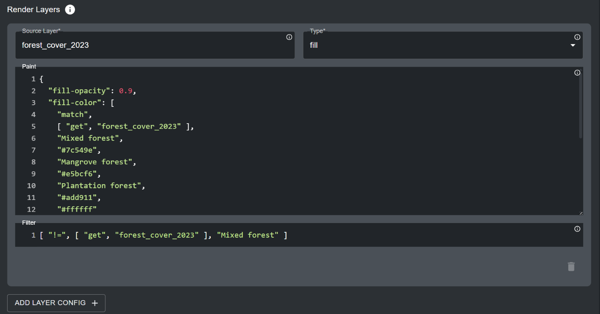
	
	e.	*ADD LAYER CONFIG (optional)*: In some cases, you may wish to configure styling for more than one data attribute in your vector dataset. By clicking on this button, you can specify further styling expressions. Note that any data attributes, data categories or value ranges that overlap between styling expressions or are contained within the same polygons in your data and are not filtered out accordingly, will lead to a confusing layer visualization. 
	
4.	The 'Interaction config' section specifies the data attributes in the vector dataset that should be displayed in the popup when clicking on the vector layer's polygons on the map. Click on ‘ADD ADDITIONAL OPTION’ to specify a data attribute that should be displayed in the popup. This is an optional section – it can be left blank if unneeded. For each Interaction config entry:

	a.	*Column*: The name of the data attribute which will be displayed (case sensitive). For example, for the `forest_cover` source layer, the data attribute could be `forest_cover_2023` or `canopy_height_2023`.
	
	b.	*Type*: Choose *string*, *date* or *number* type, depending on the format of your data attribute.
	
	c.	*Format (optional)*: If your data attribute is of *date* or *number* type, you can specify the formatting here (e.g. `dd/mm/yyyy` for date).
	
	d.	*Property (optional)*: Here, you can specify the label of the data attribute displayed in the popup table.
	
	e.	*Prefix (optional)*: You can specify a prefix that will be displayed in front of the data attribute’s value/category.
	Note that this will be displayed after the property label.
	
	f.	*Suffix (optional)*: You can specify a suffix that will be displayed after the data attribute’s value/category (e.g. units).
	
	g.	Click on the {style="display: inline; width: 1em; height: 2em; width: 2em;"} icon to remove an Interaction config entry.
	
	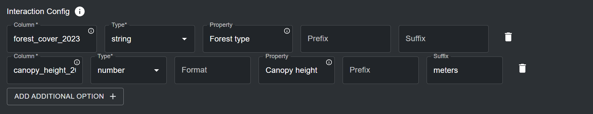
	
	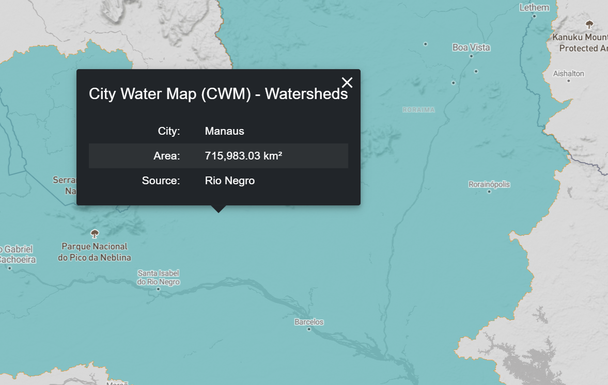
	
5.	Specify the zoom levels for your vector tiles. The default zoom level range is set to 0 to 20. You can optionally specify the zoom levels for the layer if the vector tiles are only viewable at a smaller/larger resolution. Note that UNBL supports a maximum zoom level of 20 for vector tiles. 

6.	Specify the legend styling for your vector tile layer in the 'Legend Config' section. In this section (all fields are mandatory unless specified otherwise):

	a.	By clicking on ‘ADD ADDITIONAL STYLING’ you can specify any number of layer styling entries to match the data categories/range of values in your vector tile layer. Each layer styling entry should define the following properties: 

	- *Name* – the name of the styling entry in the layer legend on the map.

	- *Color* – the color associated with the specified name in the layer legend. You can select a color by using the color picker, or by specifying a RGBA or Hex color code value.

	You can also optionally choose whether a styling entry’s name label is hidden in the layer legend on the map by clicking the {style="display: inline; width: 1em; height: 2em; width: 2em;"} icon next to the styling entry. For categorical data, the legend layer styling entries should represent the discrete categories and their associated color styling which you specified in the 'Render layers' section. For continuous data, legend styling entries should represent the range of values and their associated color gradient which you specified in the 'Render layers' section.
	
	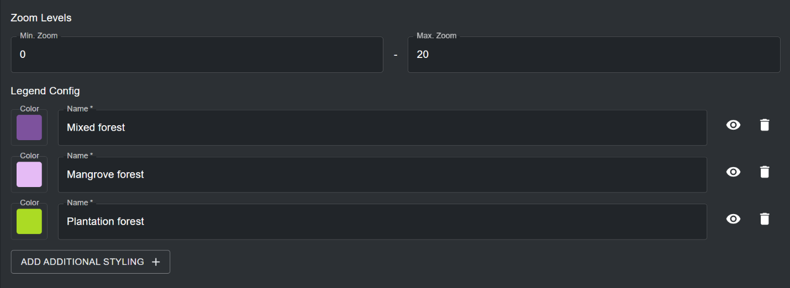
	
	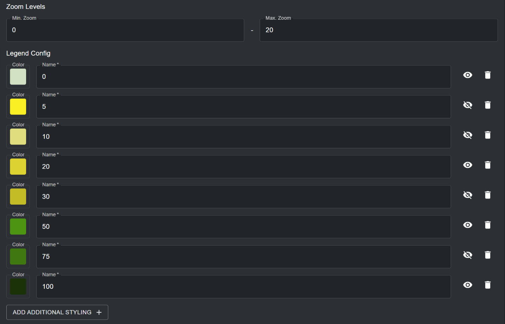
	
7.	Once all metadata and configuration properties have been specified, the ‘SAVE AND VIEW DETAILS’ button will light up blue, provided that all the entered information is valid. Click on this button to configure your vector tile layer to your workspace. See [‘How do I publish my layer and share it with external users?’](#how-do-i-publish-my-layer-and-share-it-with-external-users) and [‘How do I edit my added layers?’](#how-do-i-edit-my-added-layers) for next steps.

## How do I publish my layer and share it with external users?

To make any of your added layers discoverable and viewable to all users of your workspace (see [‘How do I view datasets within my workspace?’](2_viewing.md#how-do-i-view-datasets-within-my-workspace), as well as optionally make your layer viewable to users outside of your workspace, undertake the following steps:

1.	Navigate to the edit layer page for your layer of choice. Upon adding a layer to your workspace, you will be automatically taken to this page. Alternatively, click on the {style="display: inline; width: 1em; height: 2em; width: 2em;"} button in the layer list available after navigating to the ‘Layers’ page in your admin interface.

	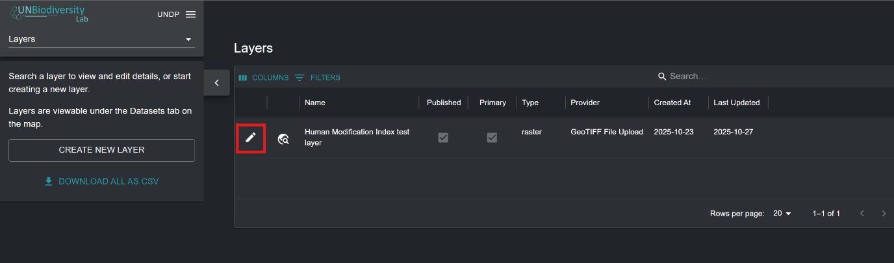
	
2.	For your dataset to be accessible in the UNBL map view, you must publish the dataset by clicking the ‘Published’ toggle button. Unpublished datasets remain in the admin interface until you are ready to publish them to the UNBL map view. 
  
3.	If your dataset is published, a toggle button will appear with an option to ‘Allow external access via link’. This is an optional toggle that, if enabled, makes your layer accessible to anyone with the map view URL, even users outside your workspace. To share your layer URL, copy the link that appears or click on the {style="display: inline; width: 1em; height: 2em; width: 2em;"} icon to copy the link automatically to your clipboard.

4.	Click on the ‘Primary’ toggle button to mark your layer as a standalone layer and make it discoverable in the ‘DATASETS’ search bar on UNBL. For your workspace layers to be discoverable and viewable on UNBL, you should always publish and mark them as primary. The only exception to publishing a layer and not marking it as primary is when you are creating group layers (See [‘How do I create group layers?’](#how-do-i-create-group-layers)).

	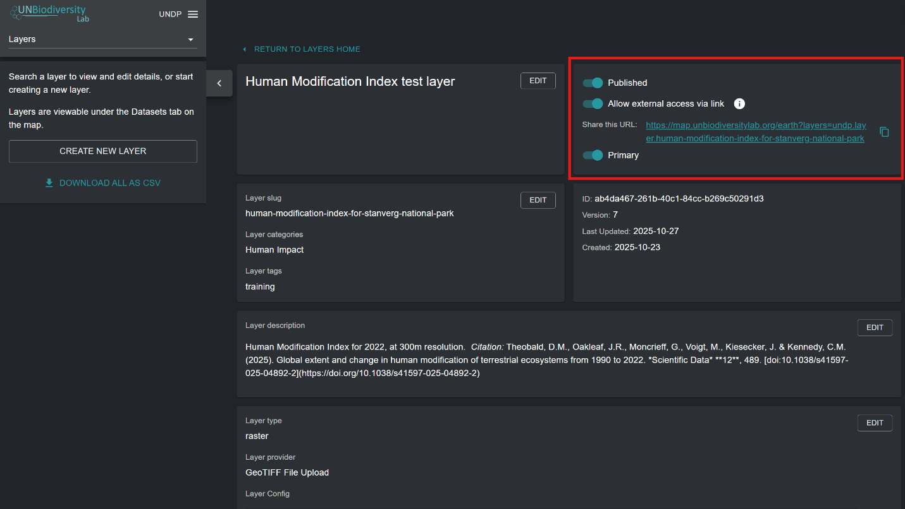
	
## How do I edit my added layers?

You may want to go back and edit your added layers to change any of the associated metadata, test if your layer is visualizing on UNBL,  and edit your layer configuration accordingly if your layer is not visualizing. To do this:

1.	Navigate to the edit layer page for your layer of choice. Upon adding a layer to your workspace, you will be automatically taken to this page. Alternatively, click on the {style="display: inline; width: 1em; height: 2em; width: 2em;"} button in the layer list available after navigating to the ‘Layers’ page in your admin interface.

	
	
2.	To test if your layer is visualizing properly in the UNBL map view, click on the ‘TEST LAYER’ button in the bottom right corner of the edit layer page. A green tick will appear inside the button if the layer has been correctly uploaded and/or configured. Otherwise, a red cross will appear with an error message diagnosing the problem.

	!!!Note
		If you are uploading a regional dataset (non-global extent), it is possible that the test may report a failure even if the layer is working, as the test may request sample tiles that fall outside of your dataset’s areal extent. It is best practice to double check the test layer diagnosis by verifying manually whether your layer is visualizing in the UNBL map view.

	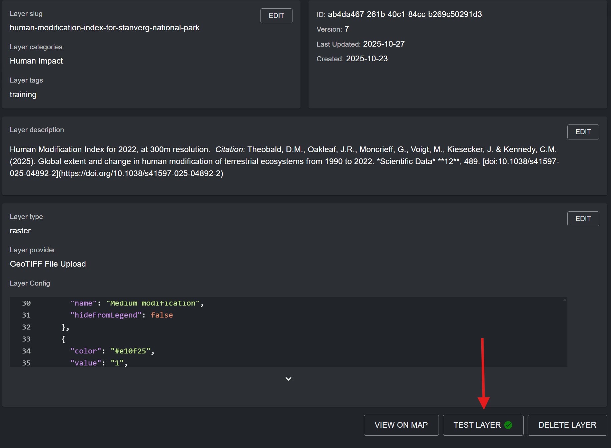
	
3.	If you want to navigate directly to your layer in the UNBL map view, click on the ‘VIEW ON MAP’ button. If you want to delete your layer from your workspace, click on the ‘DELETE LAYER’ button.

4.	Click on the ‘EDIT’ button for any of the layer metadata/configuration sections to edit information and parameters for that section.

	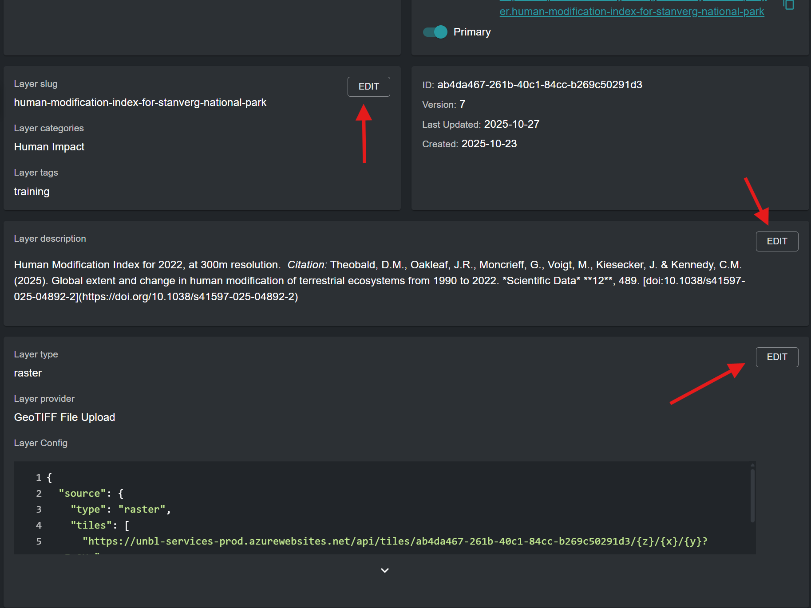
	
## How do I create group layers?

Any layers that you add to your UNBL workspace can be grouped together to organize multi-year or multi-categorical data. Each year or category is akin to an individual raster band. Group layers are created in a new, separate layer (termed *parent layer* on UNBL) to the component layers. For example, a land cover raster spanning three years would require four layers to be made: each year as its own layer, as well as a fourth parent layer they will all be accessible from. In this case, each individual year/category layer must be published and **not** marked as primary to be discoverable in the map view exclusively through a group layer. The group/parent layer is an additional display layer with a fixed layer configuration which references all individual year/category layers. It is published and marked as primary. When the group layer is viewed on UNBL, a single layer legend appears from which you can select any one of your included component layers to be visualized in the map view.

!!!Note
	If individual year/category layers which you are linking through a group layer are also marked as primary, in addition to being published, these layers will be discoverable as individual entries in the ‘DATASETS’ search bar, thereby duplicating entries with the published group layer.

To set up a group layer:

1.	Publish all component layers to be included in the group layer, and do **not** mark them as primary. The public URL feature works in the same way as for standalone layers (see [‘How do I publish my layer and share it with external users?’](#how-do-i-publish-my-layer-and-share-it-with-external-users)).

2.	Create a separate layer using the ‘CREATE NEW LAYER’ button in the ‘Layers’ page of the admin interface for your workspace. This will be your designated group layer.

3.	Enter a layer title, layer slug, layer category, search tag, and a layer description which is representative of the dataset represented by your collection of grouped individual layers. Note that the layer description for component layers is redundant – you only need to fill in the layer description for the group layer which contains your component layers. For more information on filling in metadata for layers, see [‘What parameters and metadata do I fill in when creating a layer?’](#what-parameters-and-metadata-do-i-fill-in-when-creating-a-layer).
 
4.	*Layer type*: Select ‘group’.

5.	*Grouped layers*: From the dropdown menu, select all component layers which you want to include in your group layer. Available layers for inclusion are all added layers in your workspace.

6.	*Layer selector*: From the dropdown menu, select either ‘Dropdown’ or ‘Radio Button’. These options influence how the layer selector UI appears in the layer legend of the group layer on UNBL. The dropdown option is recommended for group layers with more than three component layers. The radio button option is recommended for group layers with three or less component layers, or when group layers represent the same data with different styling. 

	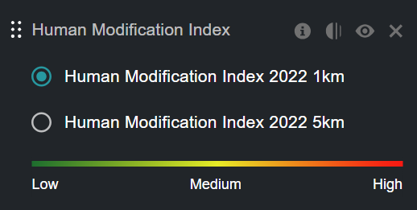
	
	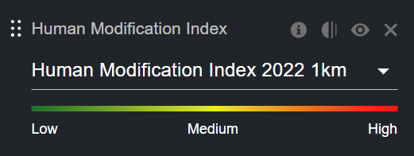
	
7.	Click the ‘SAVE AND VIEW DETAILS BUTTON’ to add the group layer to your workspace. 


	
	


