# Добавление собственных геопространственных данных в ваше рабочее пространство

Рабочие пространства UNBL поддерживают загрузку геопространственных растровых данных в следующем формате файлов:

- GeoTIFF (Георефернцированный формат файла изображения с тегами)

Рабочие пространства UNBL также поддерживают подключение к внешним геопространственным данным через любого из следующих поставщиков внешних тайловых сервисов:

- WMS (Web Map Service)

- WMTS (Web Map Tile Service)

- Google Earth Engine (GEE)

- Spatiotemporal Asset Catalog (STAC)

- XYZ Tile Service

- Mapbox

- Esri ArcGIS API Map Service

- Сервисы векторных тайлов (обслуживаемые как pg_tileserv или Martin)

Геопространственные данные могут быть загружены и/или связаны в вашем рабочем пространстве, тем самым предоставляя всем участникам вашего рабочего пространства возможность просматривать ваши данные в UNBL без необходимости предшествующего опыта работы с ГИС. Безопасность UNBL гарантирует, что наборы данных в вашем рабочем пространстве видны **только** участникам вашего рабочего пространства. Однако, если вы хотите, чтобы наборы данных в вашем рабочем пространстве были видны кому-либо за пределами вашего рабочего пространства, вы можете подстроить это с помощью опции публичного URL слоя. Все люди с доступом к этому URL смогут просматривать ваш слой. Для получения более подробной информации о конфиденциальности данных, пожалуйста, ознакомьтесь с нашим [обзорным документом по безопасности данных](data_security.ru.md).

Важно отметить, что любые наборы данных в вашем рабочем пространстве также могут просматриваться вместе с глобальными наборами данных, опубликованными на публичной платформе UNBL.

!!!Note "Примечание"
	Термины *набор данных* и *слой* используются взаимозаменяемо далее. Набор данных относится к коллекции пространственных данных, состоящей из одного или нескольких слоёв. В UNBL единичная загрузка или конфигурация геопространственных данных реализуется через *«создание слоя»*. Несколько записей слоёв могут быть объединены и визуализированы в UNBL как набор данных. Отдельные слои также могут визуализироваться независимо в UNBL.

## Какие параметры и метаданные мне заполнять при создании слоя? {#kakie-parametry-i-metadannye-ya-zapolnyayu-pri-sozdanii-sloya}

Чтобы начать создание слоя и заполнить соответствующие метаданные для слоя:

1.	Откройте выпадающее меню «Главная страница» в административном интерфейсе вашего рабочего пространства и нажмите «Слои».

2.	Нажмите кнопку «СОЗДАТЬ НОВЫЙ СЛОЙ».

	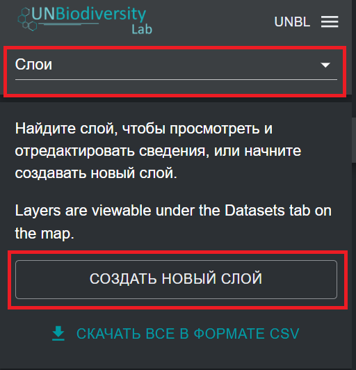

3.	В странице нового слоя заполните следующую информацию:

	a.	*Название слоя*: Название вашего слоя. Оно должно быть кратким (мы рекомендуем менее 100 символов) и описательным для ваших данных.

	b.	*Слаг слоя*: Слаг — это уникальный идентификатор слоя в вашем рабочем пространстве. У вас не может быть нескольких слоёв в вашем рабочем пространстве с одинаковым слагом. Он должен содержать только буквы, цифры и дефисы («-»). Вы можете использовать кнопку «СГЕНЕРИРОВАТЬ НАИМЕНОВАНИЕ СЛАГА» для генерации уникального идентификатора на основе предоставленного названия слоя.

	c.	*Категория слоя (опционально)*: Вы можете выбрать одну или нескольких категорий для слоя из списка опций в выпадающем меню. Доступен широкий спектр социально-экономических категорий, категорий на основе природы и связанных с политикой ГПБ. Для одного слоя можно выбрать более чем одну категорию. Эти категории соответствуют фильтрам категорий наборов данных в виде карты. Выбор категории будет означать, что ваш слой появится в списке отфильтрованных наборов данных при применении соответствующего фильтра категории набора данных.

	d.	*Тег (опционально)*: Вы можете указать один или несколько тегов для вашего слоя. Теги соответствуют фильтру тегов наборов данных в виде карты. Указание тега для вашего слоя будет означать, что слой появится в списке отфильтрованных слоёв при применении соответствующего фильтра тега набора данных на карте. В отличии от категорий слоёв, теги могут быть любой текстовой строкой на ваш выбор, что делает эту функцию полезной, если вам нужно чётко отличить слои вашего рабочего пространства от наборов данных на публичной платформе и иметь возможность применять более эффективные фильтры при поиске ваших наборов данных в виде карты. Например, вы можете использовать тег для идентификации цели в вашей национальной стратегии и плане действий по сохранению биоразнообразия (НСПДБ), для которой слой данных является релевантным.

	e.	*Описание слоя (опционально)*: В поле описания вы можете указать текст, который будет отображаться во всплывающем окне информации о слое. Здесь вы можете вставить основную часть метаданных вашего слоя, такую как общее описание, ссылка на научную статью/набор данных, внешние ссылки на научную статью/набор данных, спецификации лицензии и т.д.

	!!!Note "Примечание"
		Для отдельных слоёв, которые являются частью родительского группового слоя, всплывающий текст информации о слое всегда будет отображать описание родительского группового слоя, и поэтому поле описания является избыточным (см. [«Как мне создавать групповые слои?»](#kak-sozdavat-gruppovye-sloi)).

	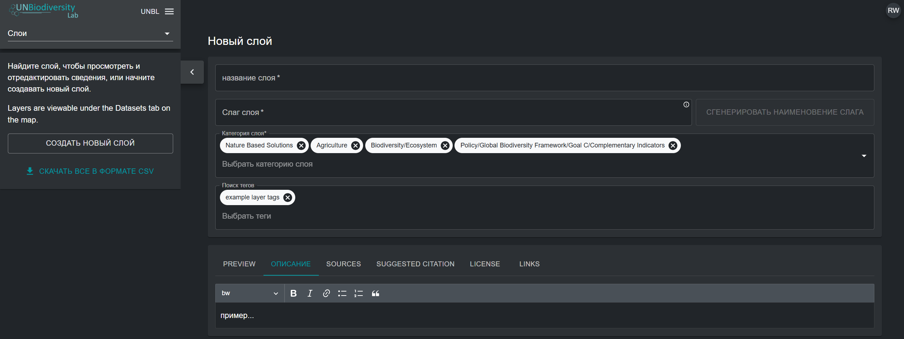

4.	После заполнения соответствующих метаданных для документирования этого нового слоя вам теперь нужно указать формат или стандарт геопространственного веб-сервиса ваших геопространственных данных и соответственно настроить конфигурацию слоя. В следующих разделах подробно описано, как настроить ваш слой в зависимости от формата ваших геопространственных данных.

## Как загрузить растровые слои в формате GeoTIFF? {#kak-zagruzit-rastrovye-sloi-v-formate-geotiff}

В настоящее время вы можете вручную загружать геопространственные данные в ваше рабочее пространство UNBL только если они доступны в растровом формате GeoTIFF. Растровый слой представляет собой сетку ячеек (или пикселей), где каждая ячейка имеет значение, представляющее информацию о конкретной теме или явлении. В настоящее время мы можем принимать только GeoTIFF с одним полосой. Если у вас есть GeoTIFF с более чем одним полосой, разделите его заранее на разные файлы. Растровые слои GeoTIFF добавляются в ваше рабочее пространство UNBL путём прямой загрузки в защищённый репозиторий данных ГИС UNBL, соответствующий GDPR, на Azure. Для получения более подробной информации о конфиденциальности данных, пожалуйста, ознакомьтесь с нашим [обзорным документом по безопасности данных](data_security.ru.md).

!!!Note "Примечание"
	Геопространственные данные в других форматах растровых и векторных слоёв могут быть настроены в UNBL путём подключения к внешнему ресурсу. См. [«Как настроить растровые слои с использованием внешних тайловых сервисов?»](#kak-nastroit-raster-wms-wmts) и [«Как настроить векторные слои с использованием внешних тайловых сервисов?»](#kak-nastroit-vektornye-sloi-s-ispolzovaniem-vneshnix-tajlovyx-servisov) для совместимых с UNBL форматов веб-сервисов OGC и руководств по подключению к ним.

Для загрузки файла GeoTIFF:

1.	Перейдите на страницу нового слоя и заполните соответствующие метаданные (см. [«Какие параметры и метаданные мне заполнять при создании слоя?»](#kakie-parametry-i-metadannye-ya-zapolnyayu-pri-sozdanii-sloya)).

2.	В разделе «Конфигурация слоя»:

	a.	*Тип слоя*: Выберите «raster».

	b.	*Провайдер слоя*: Выберите «GeoTIFF File Upload».

	c.	*GeoTIFF file*: Нажмите кнопку «Выбрать файл», чтобы загрузить действительный растровый слой GeoTIFF из вашей локальной файловой системы. Загружаемые файлы должны быть однобендовым растром и должны быть размером менее чем 1000 МБ. Вы будете уведомлены, если выберете недействительный файл.

	d.	*Тип данных*: Укажите, содержит ли растр данные «categorical» или «continuous». Категориальные данные представляют дискретные классы или категории, где каждое значение пикселя представляет отдельный тип или класс (например, классы землепользования). Непрерывные наборы данных представляют данные, где значения могут находиться в любом месте указанного диапазона значений (например, среднегодовая температура).

	e.	*Минимальное/максимальное значение*: Если ваш растр содержит непрерывные данные, вы должны указать диапазон значений в данных, указав минимальное и максимальное значения диапазона.

	f.	*Минимальный/максимальный уровень масштабирования (опционально)*: Диапазон уровня масштабирования по умолчанию установлен от 0 до 14. Вы можете опционально указать уровни масштабирования для слоя, если растровый файл содержит данные только на определённых уровнях масштабирования. Обратите внимание, что UNBL поддерживает максимальный уровень масштабирования 14.

	g.	*Стиль слоя*: Стиль слоя определяет, как слой отображается на карте. Нажав «ДОБАВИТЬ ДОПОЛНИТЕЛЬНЫЙ СТИЛЬ», вы можете указать любое количество записей стиля слоя для соответствия значениям в вашем растре. Каждая запись стиля слоя должна определять следующие свойства:

	- *Значение* — значение пикселя в данных, для которого определяется стиль.

	- *Имя* — название записи стиля в легенде слоя на карте.

	- *Цвет* — цвет пикселей с указанным значением на карте. Вы можете определить цвет через ручной выбор цвета или ввод значения RGBA или шестнадцатеричного значения. Опционально вы можете установить непрозрачность цвета в диапазоне от 0 до 100%, где 0% — полностью прозрачный, а 100% — полностью непрозрачный.

	Вы также можете опционально выбрать, скрыта ли метка названия записи стиля в легенде слоя на карте, нажав на значок {style="display: inline; width: 1em; height: 2em; width: 2em;"} рядом с записью стиля. Для категориальных слоёв записи значений стиля слоя должны соответствовать значениям каждой категории/класса в источнике растровых данных. Для непрерывных слоёв записи значений стиля слоя должны соответствовать диапазону значений в вашем растровом файле, который вы хотите отобразить на карте. Вы можете указать любые точки вдоль диапазона значений между минимальным и максимальным значениями — будет сгенерирован градиент цветов между каждым из этих значений.

	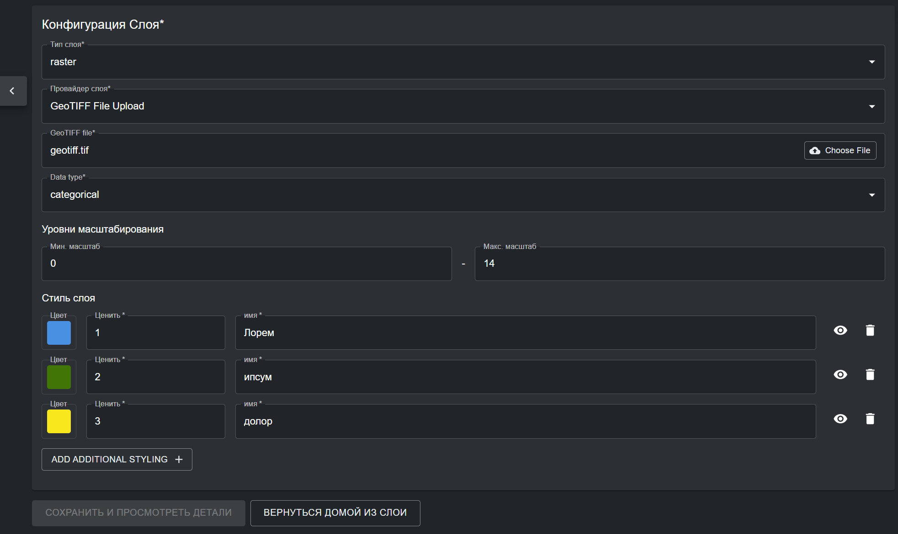

3.	После указания всех метаданных и параметров кнопка «СОХРАНИТЬ И ПРОСМОТРЕТЬ ДЕТАЛИ» загорится синим, при условии, что вся введённая информация действительна. Нажмите эту кнопку, чтобы загрузить ваш файл GeoTIFF в ваше рабочее пространство. Файл будет храниться в безопасном выделенном частном репозитории на Azure. Это может занять несколько секунд в зависимости от размера файла и скорости вашего широкополосного интернет-соединения, поэтому после нажатия кнопки вы должны подождать, пока вас не перенаправят на страницу редактирования слоя. См. [«Как мне опубликовать мой слой и поделиться им с внешними пользователями?»](#kak-opublikovat-moj-sloj-i-podelitsya-im-s-vneshnimi-polzovatelyami) и [«Как мне редактировать мои добавленные слои?»](#kak-redaktirovat-moi-dobavlennye-sloi) для следующих шагов.

## Как настроить растровые слои с использованием внешних тайловых сервисов WMS/WMTS? {#kak-nastroit-raster-wms-wmts}

UNBL поддерживает настройку слоёв растровых изображений в вашем рабочем пространстве путём подключения к поставщикам внешних тайловых сервисов. Для добавления геопространственных данных в ваше рабочее пространство с помощью этого метода:

1.	Перейдите на страницу нового слоя и заполните соответствующие метаданные (см. [«Какие параметры и метаданные мне заполнять при создании слоя?»](#kakie-parametry-i-metadannye-ya-zapolnyayu-pri-sozdanii-sloya)).

2.	В разделе «Конфигурация слоя»:

	a.	*Тип слоя*: Выберите «raster».

	b.	*Провайдер слоя*: Выберите «External Tile Service (WMS, WMTS, etc.)».

	c.	*URL тайлов*: Здесь вы можете подключиться к внешнему тайловому сервису, который использует протоколы Web Map Service (WMS), Web Map Tile Service (WMTS) или XYZ Tile Service. Для настройки слоёв с использованием этих поставщиков вы должны предоставить действительный URL тайла, который должен содержать либо заполнители `{z}{x}{y}`, либо заполнитель `{bbox-epsg-3857}`.

	Например, пример URL WMS ниже **не** будет работать:

	```
	https://wms.server.net/mapserv?request=getmap&service=wms&BBOX=-90,-180,90,360&crs=EPSG:4326&format=image/jpeg&layers=layer_latest&width=1200&height=600
	```

	так как он содержит неправильный формат параметра ограничивающей рамки (BBOX). URL можно скорректировать, изменив параметр `BBOX` для соответствия заполнителю, а также параметр системы координат (`crs`) для отражения системы координат Web Mercator (EPSG: 3857). Настраиваемый URL будет:

	```
	https://wms.server.net/mapserv?request=getmap&service=wms&BBOX={bbox-epsg-3857}&crs=EPSG:3857&format=image/jpeg&layers=layer_latest&width=1200&height=600
	```

	!!!Note "Следующие заполнители были скорректированы для обеспечения конфигурации UNBL:"
		- `-90,-180,90,360` изменён на `{bbox-epsg-3857}`
		- `EPSG:4326` изменён на `EPSG:3857`

	d.	*Тип данных*: Укажите, содержит ли растровое изображение данные «categorical» или «continuous». Категориальные данные представляют дискретные классы или категории, где каждое значение пикселя представляет отдельный тип или класс. Непрерывные наборы данных представляют данные, где значения могут находиться в любом месте указанного диапазона значений.

	e.	*Минимальный/максимальный уровень масштабирования (опционально)*: Диапазон уровня масштабирования по умолчанию установлен от 0 до 14. Вы можете опционально указать уровни масштабирования для слоя, если растровое изображение содержит данные только на определённых уровнях масштабирования. Обратите внимание, что UNBL поддерживает максимальный уровень масштабирования 14.

	f.	*Стиль слоя*: Стиль слоя определяет, как легенда растрового изображения отображается на карте. Нажав «ДОБАВИТЬ ДОПОЛНИТЕЛЬНЫЙ СТИЛЬ», вы можете указать любое количество записей стиля слоя для соответствия значениям в растровом изображении. Каждая запись стиля слоя должна определять следующие свойства:

	- *Имя* — название записи стиля в легенде слоя на карте.

	- *Color* — цвет, связанный с указанным названием в легенде слоя. Вы можете выбрать цвет с помощью селектора цвета или указав значение кода цвета RGBA или Hex.

	Вы также можете опционально выбрать, скрыта ли метка названия записи стиля в легенде слоя на карте, нажав на значок {style="display: inline; width: 1em; height: 2em; width: 2em;"} рядом с записью стиля. Для категориальных растровых изображений записи стиля легенды слоя должны представлять значения каждой категории/класса в источнике растровых данных. Для непрерывных растровых изображений записи стиля легенды должны представлять диапазон значений, визуализированных в растровом изображении. Вы можете указать любые точки вдоль диапазона значений между минимальными и максимальными значениями — будет сгенерирован градиент цветов между каждым из этих значений.

	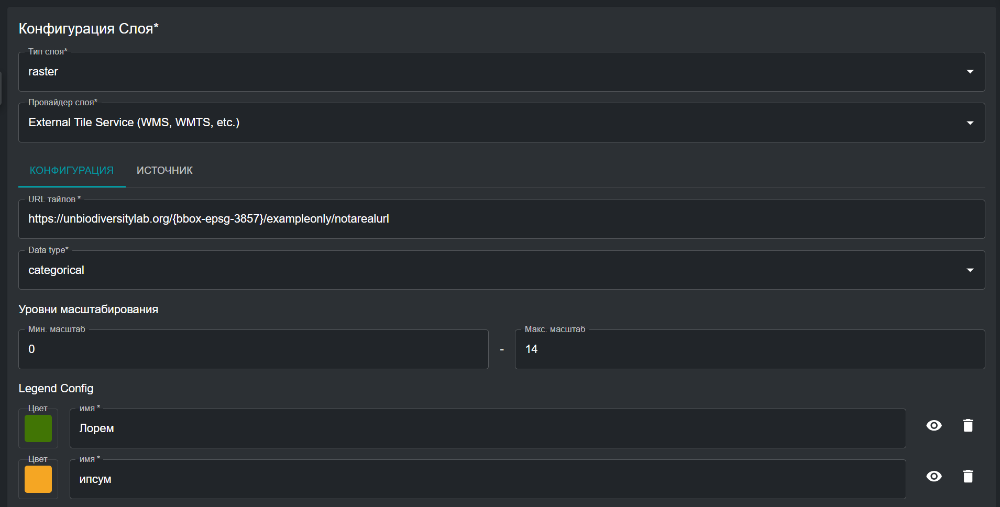

3. После указания всех метаданных и свойств конфигурации кнопка «СОХРАНИТЬ И ПРОСМОТРЕТЬ ДЕТАЛИ» загорится синим, при условии, что вся введённая информация действительна. Нажмите эту кнопку, чтобы настроить ваше растровое изображение в вашем рабочем пространстве. См. [«Как мне опубликовать мой слой и поделиться им с внешними пользователями?»](#kak-opublikovat-moj-sloj-i-podelitsya-im-s-vneshnimi-polzovatelyami) и [«Как мне редактировать мои добавленные слои?»](#kak-redaktirovat-moi-dobavlennye-sloi) для следующих шагов.

## Как настроить растровые слои с использованием Google Earth Engine (GEE)? {#kak-nastroit-google-earth-engine}

Если вы хотите отображать ресурсы GEE в вашем рабочем пространстве UNBL из вашего аккаунта или публичного аккаунта GEE, вы можете сделать это, настроив однополосный растровый ресурс GEE. В настоящее время мы не поддерживаем настройку многополосных растров или векторных данных из GEE. Для настройки однополосных растровых ресурсов GEE:

1. Если вы настраиваете ресурс из вашего личного облачного проекта, убедитесь, что флажок «Anyone can read» установлен для этого ресурса.

	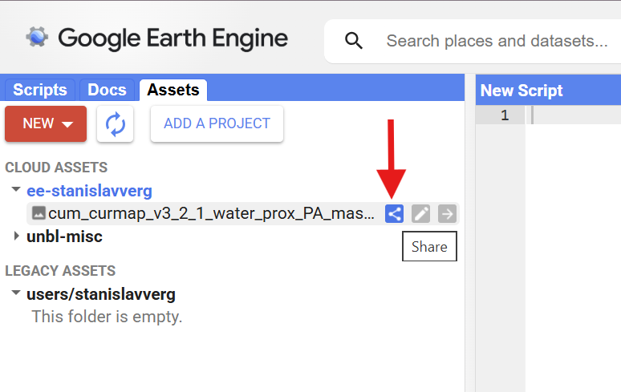

	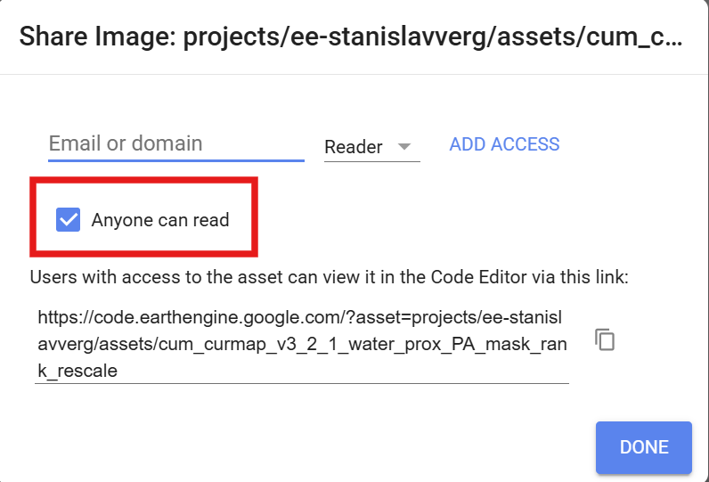

2. Перейдите на страницу нового слоя в административном интерфейсе UNBL и заполните соответствующие метаданные (см. [«Какие параметры и метаданные мне заполнять при создании слоя?»](#kakie-parametry-i-metadannye-ya-zapolnyayu-pri-sozdanii-sloya)).

3. В разделе *Конфигурация слоя*:

	a.	*Тип слоя*: Выберите «raster».

	b.	*Провайдер слоя*: Выберите «Google earth engine».

	c.	*Asset Path/Схема ресурса*: Скопируйте и вставьте ID изображения вашего ресурса GEE. Любой ID изображения может быть настроен в UNBL при условии, что это однополосное растровое изображение. Это может быть ID изображения вашего личного облачного проекта GEE или любого другого общего облачного проекта GEE или публично доступного набора данных GEE, такого как из публичного каталога [awesome-gee-community-catalog](https://gee-community-catalog.org/), который предоставляет доступ к более чем 4000 публичных ресурсов GEE.

	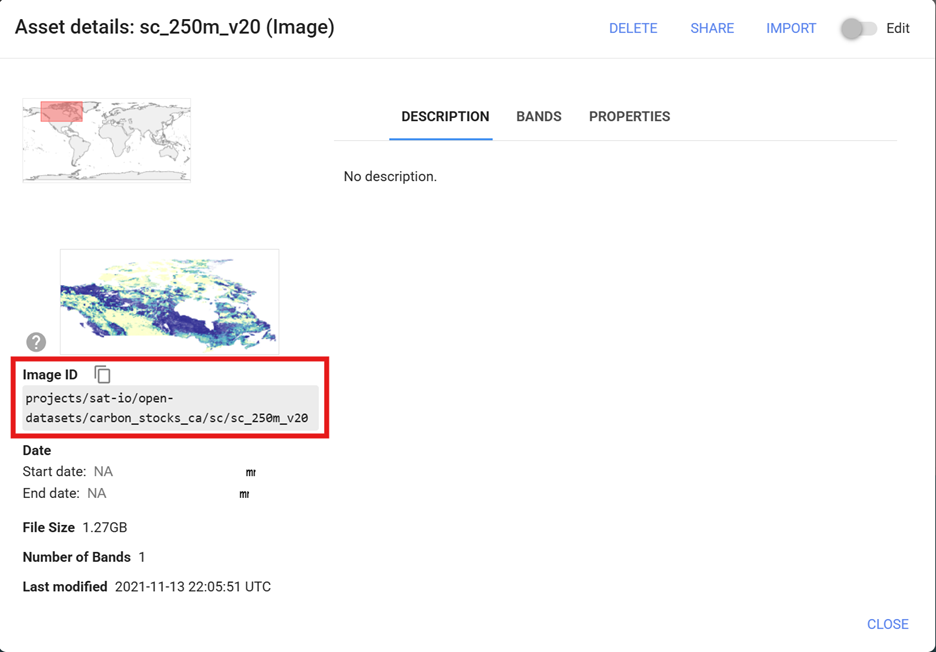

	d.	*Тип данных*: Укажите, содержит ли растровое изображение данные «categorical» или «continuous» типа. Категориальные данные представляют дискретные классы или категории, где каждое значение пикселя представляет отдельный тип или класс. Непрерывные наборы данных представляют данные, где значения могут находиться в любом месте указанного диапазона значений.

	e.	*Минимальный/максимальный уровень масштабирования (опционально)*: Диапазон уровня масштабирования по умолчанию установлен от 0 до 14. Вы можете опционально указать уровни масштабирования для слоя, если растровое изображение содержит данные только на определённых уровнях масштабирования. Обратите внимание, что UNBL поддерживает максимальный уровень масштабирования 14.

	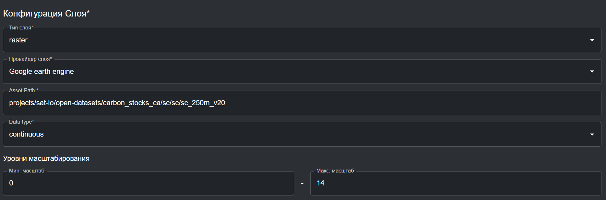

	f.	*Стиль слоя*: Стиль слоя определяет, как легенда ресурса GEE отображается на карте. Нажав «ДОБАВИТЬ ДОПОЛНИТЕЛЬНЫЙ СТИЛЬ», вы можете указать любое количество записей стиля слоя (также известных как *классы*) для соответствия значениям в растровом изображении. Каждая запись стиля слоя должна определять следующие свойства:

	- *Значение* — значение пикселя в данных, для которого определяется стиль.

	- *Имя* — название класса или диапазона в легенде слоя на карте.

	- *Цвет* — цвет пикселей с указанным значением на карте. Вы можете определить цвет через ручной выбор цвета или ввод значения RGBA или hex значения. Опционально вы можете установить непрозрачность цвета в диапазоне от 0 до 100%, где 0% — полностью прозрачный, а 100% — полностью непрозрачный.

	Вы также можете опционально выбрать, скрыта ли метка названия записи стиля в легенде слоя на карте, нажав на значок {style="display: inline; width: 1em; height: 2em; width: 2em;"} рядом с записью стиля. Для категориальных слоёв записи значений стиля слоя должны соответствовать значениям каждой категории/класса в источнике растровых данных. Для непрерывных слоёв записи значений стиля слоя должны соответствовать диапазону значений в вашем растровом файле, который вы хотите отобразить на карте. Вы можете указать любые точки вдоль диапазона значений между минимальными и максимальными значениями — будет сгенерирован градиент цветов между каждым из этих значений. Важно отметить, что минимальное и максимальное значения пикселей, а следовательно, диапазон значений, можно получить непосредственно, просматривая вкладку «BANDS» в информационном окне «Asset details» вашего ресурса в GEE. Пример стиля слоя ниже создаёт непрерывную цветовую палитру для концентрации запасов углерода.

	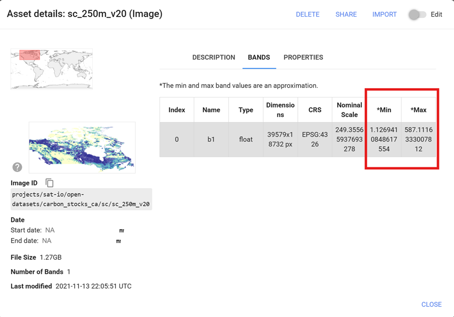

	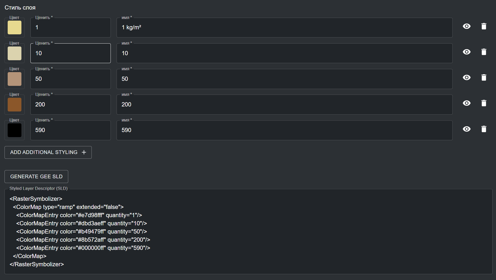

	Для категориальных растровых слоёв каждое указанное значение пикселя соответствует ровно одному дискретному классу или категории. Пример стиля слоя ниже создаёт дискретную цветовую палитру, которая отображает классы земельного покрова.

	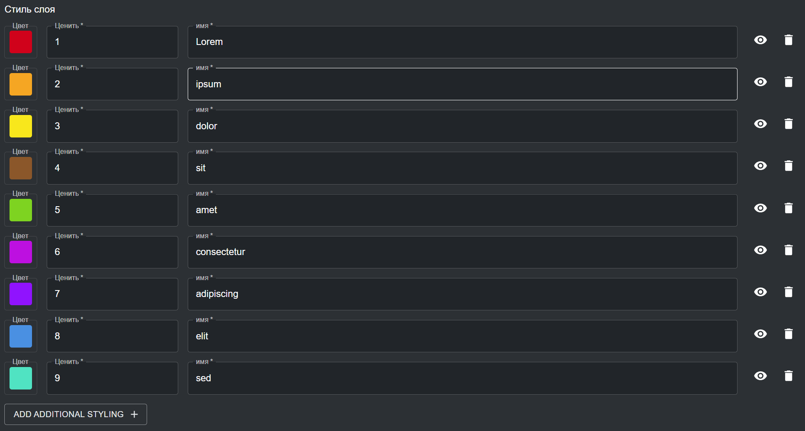

	g.	*Styled Layer Description (SLD)*: Нажмите кнопку «СГЕНЕРИРОВАТЬ GEE SLD» для автоматической генерации SLD для настройки стиля вашего ресурса GEE в UNBL, на основе параметров, которые вы установили для *Стиль слоя* на шаге f. В то время как стиль слоя определяет стиль легенды слоя, SLD будет определять стиль фактических пикселей в ваших данных. На основе примеров, приведённых на шаге f, конфигурация SLD для непрерывной цветовой схемы для концентрации запасов углерода будет выглядеть так:

	```

	<RasterSymbolizer>
	<ColorMap type="ramp" extended="false">
		<ColorMapEntry color="#FFF1B8" quantity="1"/>
		<ColorMapEntry color="#E2C98F" quantity="10"/>
		<ColorMapEntry color="#B58A5A" quantity="50"/>
		<ColorMapEntry color="#6E4A28" quantity="200"/>
		<ColorMapEntry color="#1C130C" quantity="590"/>
	</ColorMap>
	</RasterSymbolizer>

	```

	Для категориального растра земельного покрова конфигурация SLD будет выглядеть так:

	```

	<RasterSymbolizer>
	<ColorMap type="values" extended="false">
		<ColorMapEntry color="#FFFFFF" quantity="1"/>
		<ColorMapEntry color="#1A5BAB" quantity="2"/>
		<ColorMapEntry color="#358221" quantity="3"/>
		<ColorMapEntry color="#A7D282" quantity="4"/>
		<ColorMapEntry color="#87D19E" quantity="5"/>
		<ColorMapEntry color="#FFDB5C" quantity="6"/>
		<ColorMapEntry color="#EECFA8" quantity="7"/>
		<ColorMapEntry color="#ED022A" quantity="8"/>
		<ColorMapEntry color="#EDE9E4" quantity="9"/>
	</ColorMap>
	</RasterSymbolizer>


	```

	Где каждый цвет ColorMapEntry и связанное значение пикселья точно соответствует строке записи стиля слоя из шага f.

	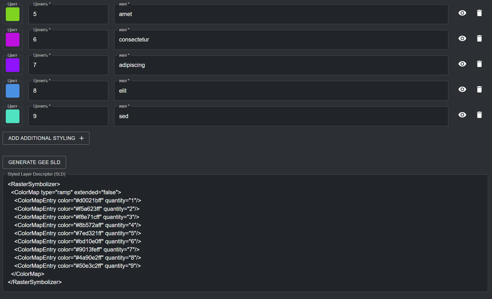

4. После указания всех метаданных и свойств конфигурации кнопка «СОХРАНИТЬ И ПРОСМОТРЕТЬ ДЕТАЛИ» загорится синим, при условии, что вся введённая информация действительна. Нажмите эту кнопку, чтобы настроить ваше растровое изображение в вашем рабочем пространстве. См. [«Как мне опубликовать мой слой и поделиться им с внешними пользователями?»](#kak-opublikovat-moj-sloj-i-podelitsya-im-s-vneshnimi-polzovatelyami) и [«Как мне редактировать мои добавленные слои?»](#kak-redaktirovat-moi-dobavlennye-sloi) для следующих шагов.

## Как настроить растровые слои с использованием Spatiotemporal Asset Catalog (STAC)? {#kak-nastroit-stac}

Функция настройки STAC в настоящее время находится в тестировании и подлежит будущим обновлениям. Если вы хотите настроить новый слой из внешнего каталога STAC в вашем рабочем пространстве UNBL, пожалуйста, свяжитесь с нами по адресу <support@unbiodiversitylab.org>, чтобы мы могли понять вариант использования этой функции.

## Как настроить векторные слои с использованием внешних тайловых сервисов? {#kak-nastroit-vektornye-sloi-s-ispolzovaniem-vneshnix-tajlovyx-servisov}

UNBL поддерживает настройку слоёв векторных тайлов в вашем рабочем пространстве путём подключения к поставщикам внешних тайловых сервисов. Векторные слои — это дискретные геометрические формы, такие как точки и полигоны. Для добавления геопространственных данных в ваше рабочее пространство с помощью этого метода:

1.	Перейдите на страницу редактирования слоя и заполните соответствующие метаданные (см. [«Какие параметры и метаданные мне заполнять при создании слоя?»](#kakie-parametry-i-metadannye-ya-zapolnyayu-pri-sozdanii-sloya)).

2. В разделе «Конфигурация слоя» (все поля обязательны, если не указано иное):

	a.	*Тип слоя*: Выберите «vector».

	b.	*Провайдер слоя*: Выберите «External Tile Service (Mapbox, ESRI, pg_tileserv, Martin, etc.)».

	c.	*URL тайлов*: Здесь вы можете подключиться к поставщику внешнего сервиса векторных тайлов, который размещает ваши геопространственные данные, такому как Mapbox, Esri, pg_tileserv, Martin и другие. Для настройки слоёв с использованием этих поставщиков вы должны предоставить действительный URL тайла, который должен содержать либо заполнители `{z}{x}{y}`, либо заполнитель `{bbox-epsg-3857}`. Например, настраиваемый URL слоя для набора данных о лесном покрове, размещённого на Martin, выглядит так:

	```

	https://example-tileserv.org/martin/forest_cover/{z}/{x}/{y}
	```

	d.	*Тип данных*: Укажите, содержат ли векторные тайлы данные «categorical» или «continuous» типа. Категориальные данные представляют дискретные классы или категории. Непрерывные наборы данных представляют данные, где значения могут находиться в любом месте указанного диапазона значений. Хотя векторные тайлы могут хранить несколько атрибутов данных, вы можете выбрать только один атрибут данных для стиля легенды слоя в UNBL. Вы должны указать тип данных на основе предварительной легенды вашего добавленного слоя в UNBL.

	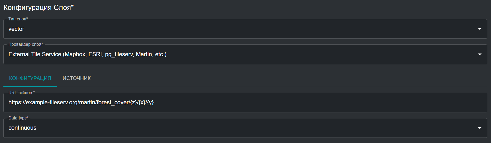

3.	Раздел «Рендеринг слоев» указывает атрибуты данных из источника векторных данных, которые должны отображаться на карте. В этом разделе:

	a.	*Источник слоя*: Укажите название набора данных, который вы размещаете на сервере векторных тайлов. Например, исходный слой для примера URL из шага 2c — это `forest_cover`. Нажмите на значок {style="display: inline; width: 1em; height: 2em; width: 2em;"} для этого свойства, чтобы просмотреть подробную документацию по ссылке на исходный слой.

	b.	*Тип*: Укажите тип геометрии, который представляет ваш набор данных. Доступные опции: *fill, line, symbol, circle, heatmap* и *fill-extrusion*. В большинстве случаев тип геометрии будет *fill* (полигоны с цветовой рампой заливки). Нажмите на значок {style="display: inline; width: 1em; height: 2em; width: 2em;"} для этого свойства, чтобы просмотреть подробную документацию по опциям типа геометрии.

	c.	*Краска (опционально)*: Здесь вы можете указать стиль слоя для вашего набора данных в UNBL с помощью конфигурации стиля .json. Нажмите на значок {style="display: inline; width: 1em; height: 2em; width: 2em;"} для этого свойства, чтобы просмотреть подробную документацию по настройке стиля слоя. Для наиболее распространённых типов геометрии типа *fill* конфигурация paint следует установленному шаблону. Для настройки стиля слоя для категориальных наборов данных используйте следующий шаблон:

	```

	{
    "fill-opacity": 0.9,
    "fill-color": [
    "match",
    [ "get", "forest_cover_2023" ],
    "Mixed forest",
    "#7c549e",
    "Mangrove forest",
    "#e5bcf6",
    "Plantation forest",
    "#add911",
    "#ffffff"],
    "fill-outline-color": [
    "match",
    [ "get", " forest_cover_2023" ],
    "Mixed forest",
    "#7c549e",
    "Mangrove forest",
    "#e5bcf6",
    "Plantation forest",
    "#add911",
    "#ffffff" ]
    }
	```

	Тот же шаблон в текстовом формате ниже выделяет строки, которые являются настраиваемыми переменными и должны быть изменены в соответствии с вашим стилем слоя:

	{
	"fill-opacity": ==0.9==,
    "fill-color": [
    "match",
    [ "get", =="forest_cover_2023"==],
    =="Mixed forest",
    "#7c549e",
    "Mangrove forest",
    "#e5bcf6",
    "Plantation forest",
    "#add911",
    "#ffffff"==],
    "fill-outline-color": [
    "match",
    ["get", =="forest_cover_2023"==],
    =="Mixed forest",
    "#7c549e",
    "Mangrove forest",
    "#e5bcf6",
    "Plantation forest",
    "#add911",
    "#ffffff"==]
    }

	где:

	- `fill-opacity` устанавливает непрозрачность заливки полигона от 0 (полностью прозрачный) до 1 (полностью непрозрачный).

	- `fill-color` указывает атрибут данных, который будет использоваться для стилизации заливки полигона, а также сам стиль (в данном случае это атрибут `forest_cover_2023` примера исходного набора данных `forest_cover`, упомянутого ранее, и `match` указывает стиль для дискретных категорий этого атрибута данных). Каждая следующая пара настраиваемых текстовых строк указывает дискретную категорию вашего атрибута данных и цвет, которым вы хотите окрасить эту конкретную категорию (в формате Hex-кода), соответственно.

	- `fill-outline-color` функционирует так же, как `fill-color`, но указывает цвет линейной границы полигона вместо внутренней заливки полигона. Таким образом, вы можете указать другой цвет границы для полигонов по сравнению с цветом их внутренней заливки (обратите внимание, что это не относится к примеру выше). Важно, что вы можете указать строку `"#ffffff"` в конце последней строки hex-кода для любого из свойств заливки, чтобы обозначить, что любые категории данных, которые явно не указаны в свойстве стиля заливки, должны быть прозрачными.

	!!!Important "Важно"
		Если вы не включите строку `"#ffffff"` для прозрачного стиля для невключённых категорий данных, ваши векторные тайлы не смогут визуализироваться, если вы не укажете исчерпывающе стиль для **всех** категорий данных, присутствующих в вашем атрибуте данных, в свойстве стиля заливки. Однако вам не нужно указывать инклюзивный прозрачный стиль, если вы указываете фильтр для исключения выбранных категорий данных в вашем атрибуте данных из рассмотрения для стиля слоя (шаг 3d).

	Для настройки стиля слоя для непрерывных наборов данных используйте следующий шаблон:

	```

	{
    "fill-opacity": 0.9,
    "fill-color": [
    "interpolate",
	[ "linear" ],
    [ "get", "canopy_height_2023" ],
    0,
	"#f5ebd5",
	5,
	"#eef5c9",
	10,
	"#dbe6a1",
	20,
	"#c5e897",
	30,
	"#9fe04a",
	50,
	"#689c24",
	75,
	"#518510",
	100,
	"#305207" ],
    "fill-outline-color": [
    "interpolate",
	[ "linear" ],
    [ "get", "canopy_height_2023" ],
    0,
	"#f5ebd5",
	5,
	"#eef5c9",
	10,
	"#dbe6a1",
	20,
	"#c5e897",
	30,
	"#9fe04a",
	50,
	"#689c24",
	75,
	"#518510",
	100,
	"#305207" ]
    }
	```

	d.	*Фильтр (опционально)*: Вы можете опционально указать подмножество категорий данных или конкретный диапазон значений, который должен использоваться для стилизации карты. Любые категории данных или диапазоны значений, выходящие за пределы указанного фильтра, не будут рассматриваться в стиле слоя. Нажмите на значок {style="display: inline; width: 1em; height: 2em; width: 2em;"} для этого свойства, чтобы просмотреть подробную документацию по настройке опций фильтра. Например, если вы хотите отфильтровать категорию "Mixed forest" из атрибута данных `forest_cover_2023`, вы бы использовали следующий шаблон:

	```

	["!=", ["get", "forest_cover_2023"], "Mixed forest"]
	```

	где `!=` указывает условное выражение исключения.

	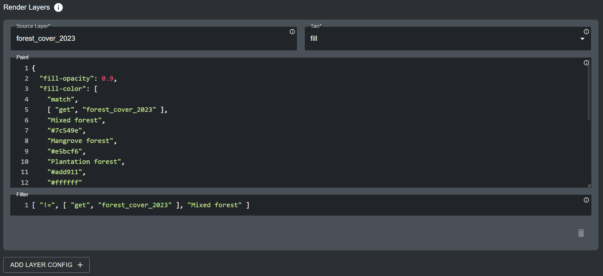

	e.	*ДОБАВИТЬ КОНФИГУРАЦИЮ СЛОЯ (опционально)*: В некоторых случаях вы можете захотеть настроить стиль для более чем одного атрибута данных в вашем векторном наборе данных. Нажав эту кнопку, вы можете указать дополнительные выражения стиля. Обратите внимание, что любые атрибуты данных, категории данных или диапазоны значений, которые перекрываются между выражениями стиля или содержатся в одних и тех же полигонах в ваших данных и не отфильтрованы соответственно, приведут к путанице в визуализации слоя.

4.	Раздел «Конфигурация интерактивного интерфейса» указывает атрибуты данных в векторном наборе данных, которые должны отображаться во всплывающем окне при нажатии на полигоны векторного слоя на карте. Нажмите «ДОБАВИТЬ ДОПОЛНИТЕЛЬНУЮ ОПЦИЮ», чтобы указать атрибут данных, который должен отображаться во всплывающем окне. Это опциональный раздел — его можно оставить пустым, если он не нужен. Для каждой записи Конфигурации интерактивного интерфейса:

	a.	*Колонка*: Название атрибута данных, который будет отображаться (с учётом регистра). Например, для исходного слоя `forest_cover` атрибут данных может быть `forest_cover_2023` или `canopy_height_2023`.

	b.	*Тип*: Выберите тип *string*, *date* или *number* в зависимости от формата вашего атрибута данных.

	c.	*Формат (опционально)*: Если ваш атрибут данных имеет тип *date* или *number*, вы можете указать форматирование здесь (например, `dd/mm/yyyy` для даты).

	d.	*Property (опционально)*: Здесь вы можете указать метку атрибута данных, отображаемую в таблице всплывающего окна.

	e.	*Префикс (опционально)*: Вы можете указать префикс, который будет отображаться перед значением/категорией атрибута данных.
	Обратите внимание, что это будет отображаться после метки свойства.

	f.	*Суффикс (опционально)*: Вы можете указать суффикс, который будет отображаться после значения/категории атрибута данных (например, единицы измерения).

	g.	Нажмите на значок {style="display: inline; width: 1em; height: 2em; width: 2em;"}, чтобы удалить запись Конфигурации интерактивного интерфейса.

	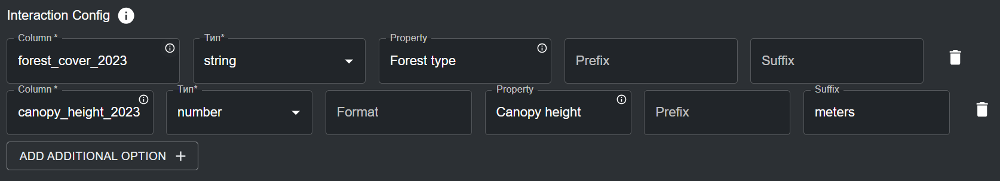

	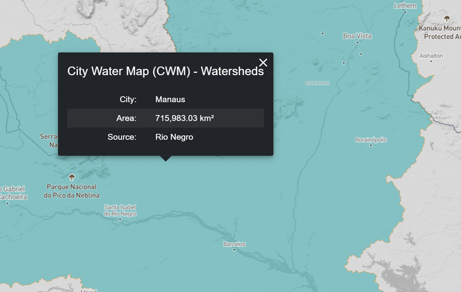

5.	Укажите уровни масштабирования для ваших векторных тайлов. Диапазон уровня масштабирования по умолчанию установлен от 0 до 20. Вы можете опционально указать уровни масштабирования для слоя, если векторные тайлы видны только при меньшем/большем разрешении. Обратите внимание, что UNBL поддерживает максимальный уровень масштабирования 20 для векторных тайлов.

6.	Укажите стиль легенды для вашего слоя векторных тайлов в разделе «Конфигурация легенды». В этом разделе (все поля обязательны, если не указано иное):

	a.	Нажав «ДОБАВИТЬ ДОПОЛНИТЕЛЬНЫЙ СТИЛЬ», вы можете указать любое количество записей стиля слоя для соответствия категориям данных/диапазону значений в вашем слое векторных тайлов. Каждая запись стиля слоя должна определять следующие свойства:

	- *Имя* — название записи стиля в легенде слоя на карте.

	- *Цвет* — цвет, связанный с указанным названием в легенде слоя. Вы можете выбрать цвет с помощью селектора цвета или указав значение кода цвета RGBA или Hex.

	Вы также можете опционально выбрать, скрыта ли метка названия записи стиля в легенде слоя на карте, нажав на значок {style="display: inline; width: 1em; height: 2em; width: 2em;"} рядом с записью стиля. Для категориальных данных записи стиля легенды слоя должны представлять дискретные категории и связанный с ними стиль цвета, который вы указали в разделе «Рендеринг слоев». Для непрерывных данных записи стиля легенды должны представлять диапазон значений и связанный с ними цветовой градиент, который вы указали в разделе «Рендеринг слоев».

	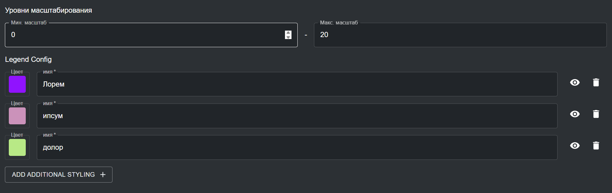

	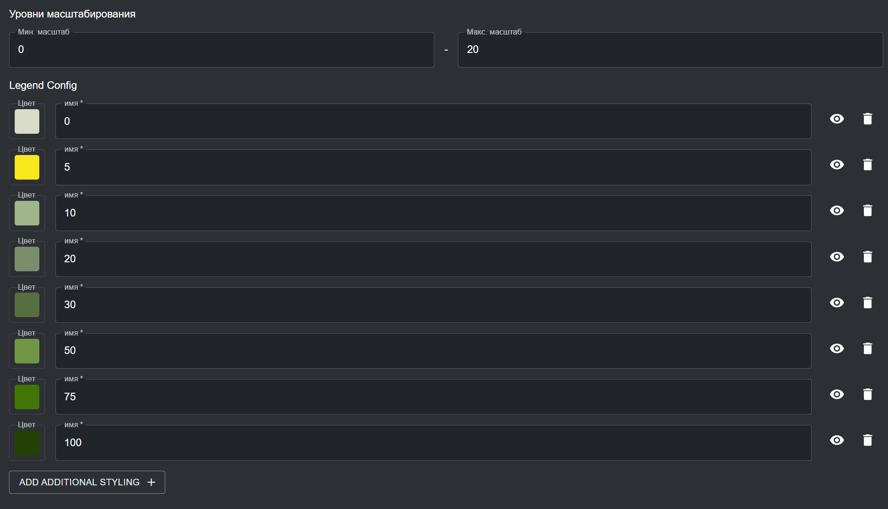

7.	После указания всех метаданных и свойств конфигурации кнопка «СОХРАНИТЬ И ПРОСМОТРЕТЬ ДЕТАЛИ» загорится синим, при условии, что вся введённая информация действительна. Нажмите эту кнопку, чтобы настроить ваш слой векторных тайлов в вашем рабочем пространстве. См. [«Как мне опубликовать мой слой и поделиться им с внешними пользователями?»](#kak-opublikovat-moj-sloj-i-podelitsya-im-s-vneshnimi-polzovatelyami) и [«Как мне редактировать мои добавленные слои?»](#kak-redaktirovat-moi-dobavlennye-sloi) для следующих шагов.

## Как мне опубликовать мой слой и поделиться им с внешними пользователями? {#kak-opublikovat-moj-sloj-i-podelitsya-im-s-vneshnimi-polzovatelyami}

Чтобы сделать любой из ваших добавленных слоёв обнаруживаемым и видимым для всех пользователей вашего рабочего пространства (см. [«Как мне просматривать наборы данных в моём рабочем пространстве?»](2_viewing.ru.md#kak-prosmatrivat-nabory-dannyx-v-moem-rabochem-prostranstve)), а также опционально сделать ваш слой видимым для пользователей за пределами вашего рабочего пространства, выполните следующие шаги:

1.	Перейдите на страницу редактирования слоя для выбранного вами слоя. При добавлении слоя в ваше рабочее пространство вы будете автоматически перенаправлены на эту страницу. В качестве альтернативы нажмите кнопку {style="display: inline; width: 1em; height: 2em; width: 2em;"} в списке слоёв, доступном после перехода на страницу «Слои» в вашем административном интерфейсе.

	

2.	Чтобы ваш набор данных был доступен в виде карты UNBL, вы должны опубликовать набор данных, нажав кнопку переключения «Опубликовать». Неопубликованные наборы данных остаются в административном интерфейсе, пока вы не будете готовы опубликовать их в виде карты UNBL.

3.	Если ваш набор данных опубликован, появится кнопка переключения с опцией «Разрешить внешний доступ по ссылке». Это опциональный переключатель, который, если включён, делает ваш слой доступным для любого, у кого есть URL вида карты, даже для пользователей за пределами вашего рабочего пространства. Чтобы поделиться URLом вашего слоя, скопируйте появившуюся ссылку или нажмите на значок {style="display: inline; width: 1em; height: 2em; width: 2em;"}, чтобы автоматически скопировать ссылку.

4.	Нажмите кнопку переключения «Первичный», чтобы пометить ваш слой как автономный слой и сделать его обнаруживаемым в строке поиска «НАБОРЫ ДАННЫХ» в UNBL. Чтобы слои вашего рабочего пространства были обнаруживаемы и видимы в UNBL, вы всегда должны публиковать их и помечать как первичные. Единственное исключение для публикации слоя и не пометки его как первичного — это когда вы создаёте групповые слои (см. [«Как мне создавать групповые слои?»](#kak-sozdavat-gruppovye-sloi)).

	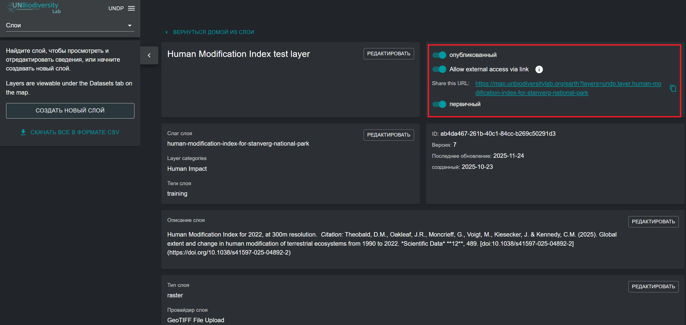

## Как мне редактировать мои добавленные слои? {#kak-redaktirovat-moi-dobavlennye-sloi}

Возможно, вы захотите вернуться и отредактировать ваши добавленные слои, чтобы изменить любые связанные метаданные, проверить, визуализируется ли ваш слой в UNBL, и соответственно отредактировать конфигурацию слоя, если ваш слой не визуализируется. Для этого:

1.	Перейдите на страницу редактирования слоя для выбранного вами слоя. При добавлении слоя в ваше рабочее пространство вы будете автоматически перенаправлены на эту страницу. В качестве альтернативы нажмите кнопку {style="display: inline; width: 1em; height: 2em; width: 2em;"} в списке слоёв, доступном после перехода на страницу «Слои» в вашем административном интерфейсе.

	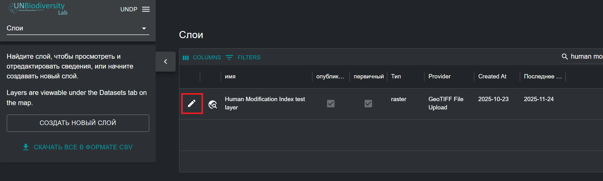

2.	Чтобы проверить, правильно ли визуализируется ваш слой в виде карты UNBL, нажмите кнопку «ПРОТЕСТИРОВАТЬ СЛОЙ» в правом нижнем углу страницы редактирования слоя. Зелёная галочка появится внутри кнопки, если слой был правильно загружен и/или настроен. В противном случае появится красный крестик с сообщением об ошибке, диагностирующим проблему.

	!!!Note "Примечание"
		Если вы загружаете региональный набор данных (не глобального охвата), возможно, что тест может сообщить о неудаче, даже если слой работает, так как тест может запросить образцы тайлов, которые выходят за пределы пространственного охвата вашего набора данных. Лучшей практикой является перепроверка диагностики теста слоя путём ручной верификации, визуализируется ли ваш слой в виде карты UNBL.

	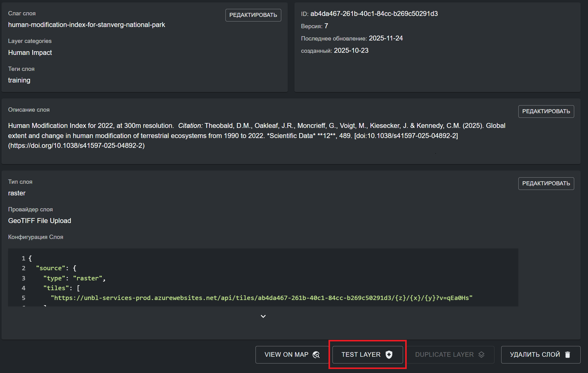

3.	Если вы хотите перейти непосредственно к вашему слою в виде карты UNBL, нажмите кнопку «ПРОСМОТРЕТЬ НА КАРТЕ». Если вы хотите удалить ваш слой из вашего рабочего пространства, нажмите кнопку «УДАЛИТЬ СЛОЙ».

4.	Нажмите кнопку «РЕДАКТИРОВАТЬ» для любого из разделов метаданных/конфигурации слоя, чтобы редактировать информацию и параметры для этого раздела.

	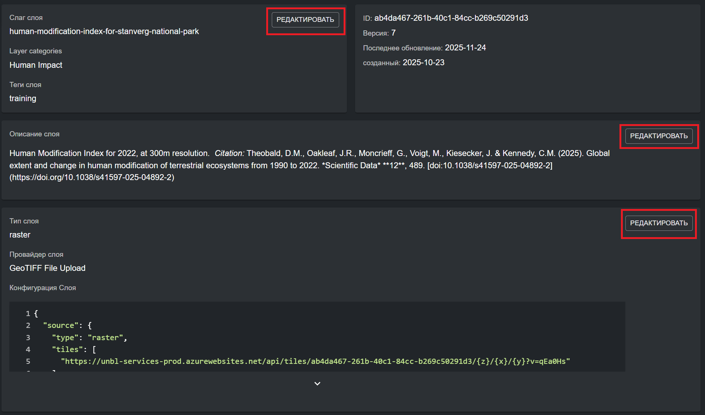

## Как мне создавать групповые слои? {#kak-sozdavat-gruppovye-sloi}

Любые слои, которые вы добавляете в ваше рабочее пространство UNBL, могут быть сгруппированы вместе для организации многолетних или многокатегорийных данных. Каждый год или категория аналогичны отдельной растровой полосе. Групповые слои создаются в новом, отдельном слое (называемом *родительским слоем* в UNBL) от составных слоёв. Например, растр земельного покрова, охватывающий три года, потребует создания четырёх слоёв: каждый год как свой собственный слой, а также четвёртый родительский слой, из которого все они будут доступны. В этом случае каждый отдельный слой года/категории должен быть опубликован и **не** помечен как первичный, чтобы быть обнаруживаемым в виде карты исключительно через групповой слой. Групповой/родительский слой — это дополнительный слой отображения с фиксированной конфигурацией слоя, которая ссылается на все отдельные слои годов/категорий. Он публикуется и помечается как первичный. Когда групповой слой просматривается в UNBL, появляется единственная легенда слоя, из которой вы можете выбрать любой из включённых составных слоёв для визуализации в виде карты.

!!!Note "Примечание"
	Если отдельные слои годов/категорий, которые вы связываете через групповой слой, также помечены как первичные, в дополнение к публикации, эти слои будут обнаруживаемы как отдельные записи в строке поиска «НАБОРЫ ДАННЫХ», тем самым дублируя записи с опубликованным групповым слоем.

Для настройки группового слоя:

1.	Опубликуйте все составные слои, которые будут включены в групповой слой, и **не** помечайте их как первичные. Функция публичного URL работает так же, как и для автономных слоёв (см. [«Как мне опубликовать мой слой и поделиться им с внешними пользователями?»](#kak-opublikovat-moj-sloj-i-podelitsya-im-s-vneshnimi-polzovatelyami)).

2.	Создайте отдельный слой, используя кнопку «СОЗДАТЬ НОВЫЙ СЛОЙ» на странице «Слои» в  административном интерфейсе вашего рабочего пространства. Это будет ваш назначенный групповой слой.

3.	Введите название слоя, слаг слоя, категорию слоя, поисковый тег и описание слоя, которые являются репрезентативными для набора данных, представленного вашей коллекцией сгруппированных отдельных слоёв. Обратите внимание, что описание слоя для составных слоёв является избыточным — вам нужно заполнить только описание слоя для группового слоя, который содержит ваши составные слои. Для получения дополнительной информации о заполнении метаданных для слоёв см. [«Какие параметры и метаданные мне заполнять при создании слоя?»](#kakie-parametry-i-metadannye-ya-zapolnyayu-pri-sozdanii-sloya).

4.	*Тип слоя*: Выберите «group».

5.	*Сгруппированные слои*: Из выпадающего меню выберите все составные слои, которые вы хотите включить в ваш групповой слой. Доступные для включения слои — это все добавленные слои в вашем рабочем пространстве.

6.	*Layer selector*: Из выпадающего меню выберите либо «Dropdown», либо «Radio Button». Эти опции влияют на то, как пользовательский интерфейс селектора слоёв появляется в легенде группового слоя в UNBL. Опция *dropdown* рекомендуется для групповых слоёв с более чем тремя составными слоями. Опция *radio button* рекомендуется для групповых слоёв с тремя или менее составными слоями, или когда групповые слои представляют одни и те же данные с разным стилем.

	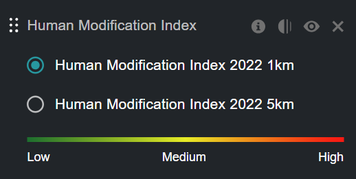

	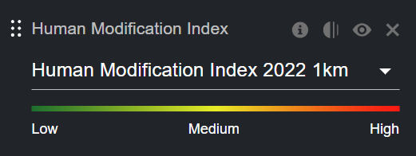

7.	Нажмите кнопку «СОХРАНИТЬ И ПРОСМОТРЕТЬ ДЕТАЛИ», чтобы добавить групповой слой в ваше рабочее пространство.
