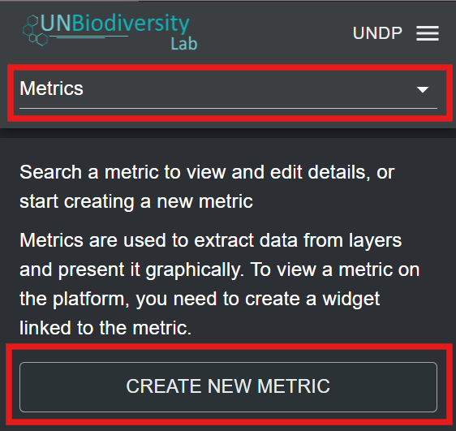
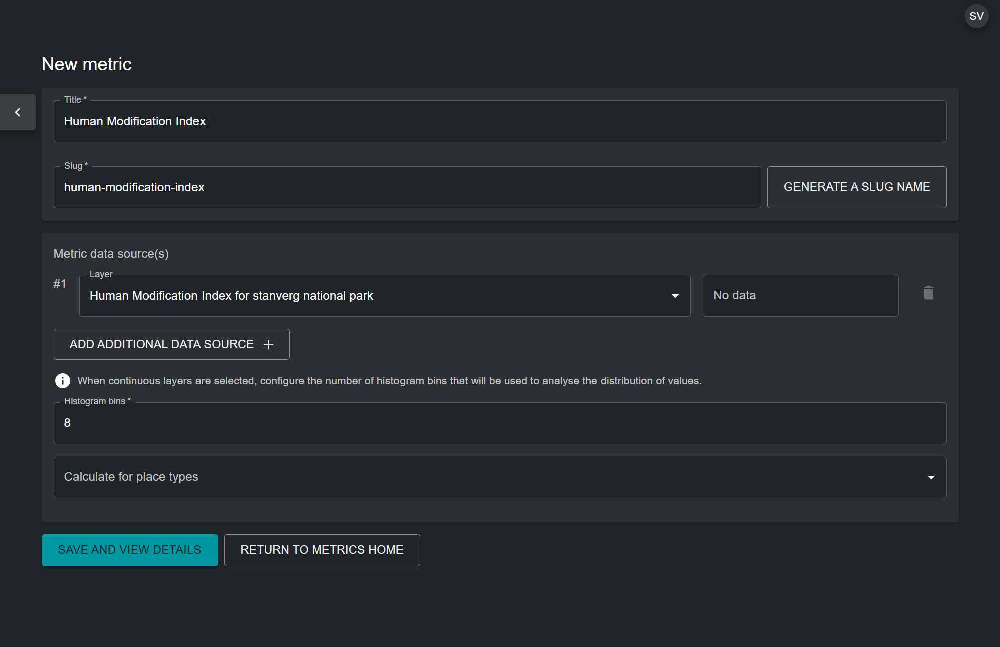
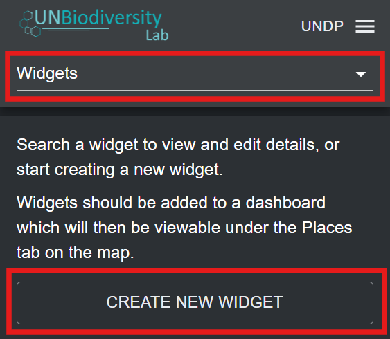
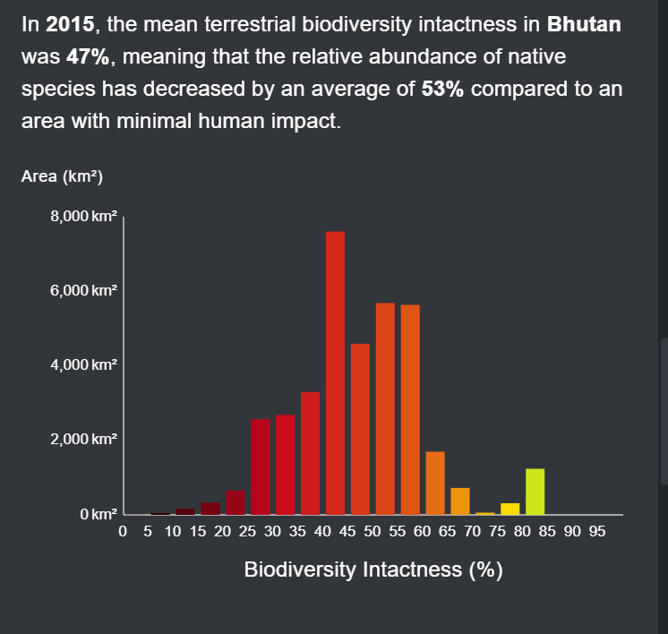
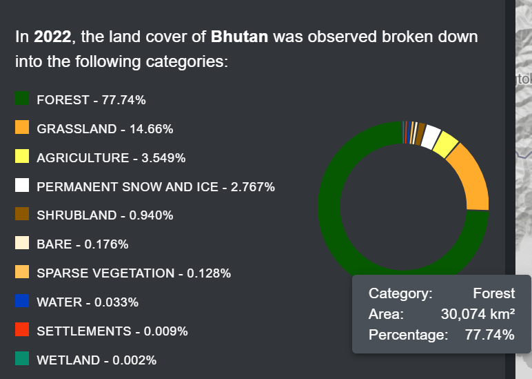
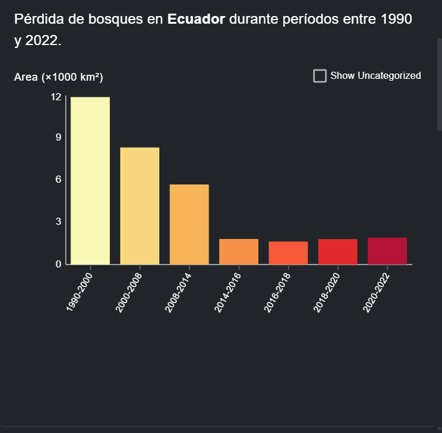
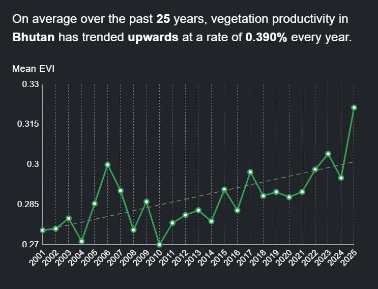
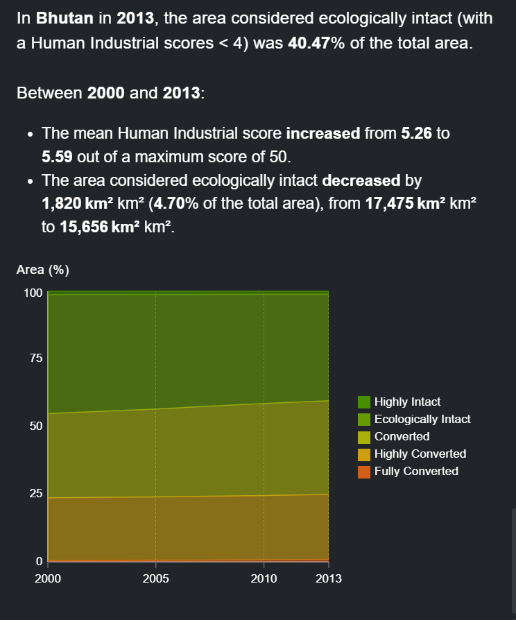
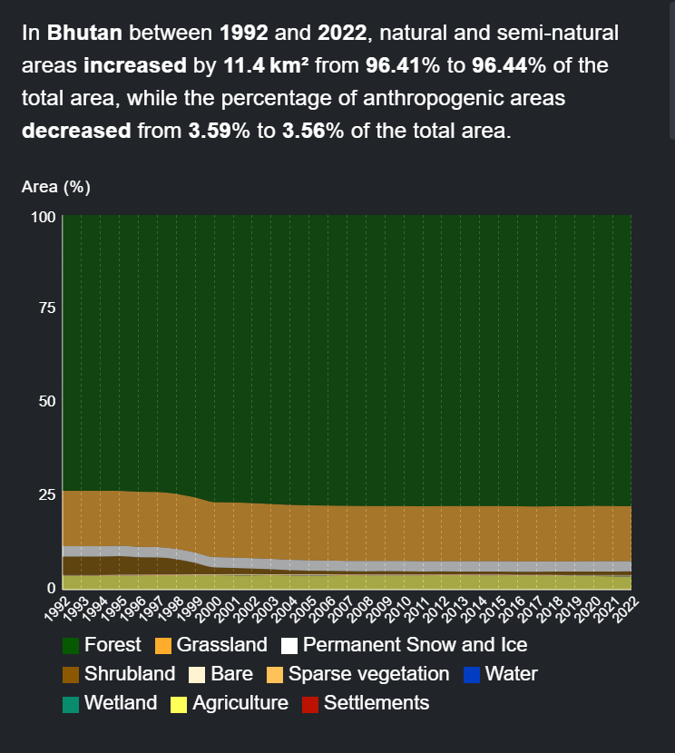

# Adding Your Own Custom Metrics to Your Workspace

The UNBL public platform currently offers nine dynamic metrics by default (see [‘What dynamic metrics are available for my country?’](../unbl-public-platform/8_dynamic_metrics1.md)).

UNBL workspaces provide users with the ability to configure their own custom metrics to run on-the-fly calculations and display zonal statistics for users' own areas of interest, derived from their own uploaded geospatial data layers.

The configuration of a custom metric in a workspace follows 5 major steps. Each major step is described in turn within this section.

## Step 1: Upload a place

Metrics are displayed on UNBL through the selection of a particular place that defines the area of interest which zonal statistics are calculated for. Therefore, it is necessary to upload a place to your workspace which you would like to view the custom metric for. For detailed steps on uploading a place to your workspace, see [‘How do I add places?’](5_add_places.md).

## Step 2: Upload a raster layer in GeoTIFF format

To create a custom metric, it is necessary to upload a geospatial data layer which you would like to view zonal statistics for. UNBL workspaces only support metric calculations using layers uploaded to the workspace through the 'GeoTIFF File Upload' option. For detailed steps on uploading a layer to your workspace using this option, see [‘How do I upload raster layers in GeoTIFF format?’](6_add_data.md/#how-do-i-upload-raster-layers-in-geotiff-format).

For a custom metric to function properly on UNBL, it is necessary to note the following technical pre-requisites for uploaded GeoTIFF layers:

- GeoTIFFs can represent any form of continuous or categorical data, but pixel values should be integer or float types;

- It is recommended that for categorical data, GeoTIFFs store no more than 15 discrete integer classes; a higher number of classes impedes on the legibility of metric charts;

- Zonal statistics for your custom metric can only be calculated for GeoTIFF layers which have data coverage in the place you have uploaded. If you select a place in the UNBL map view whose spatial extent does not overlap at all with the spatial extent of the uploaded GeoTIFF layer which you configured the custom metric for, the metric will return an empty data chart.

- It is possible to configure a time series metric which shows changes over time for several GeoTIFF layers; in these cases, all GeoTIFF layers must have the same spatial extent, resolution, attribute values, and must overlap correctly.

Users wishing to configure custom metrics for vector polygon data must first convert it to a raster GeoTIFF format using rasterization techniques. Examples of rasterization techniques can be found through [QGIS](https://docs.qgis.org/3.44/en/docs/user_manual/processing_algs/gdal/vectorconversion.html#rasterize-vector-to-raster), [PyGIS](https://pygis.io/docs/e_raster_rasterize.html), and [rdrr.io](https://rdrr.io/cran/terra/man/rasterize.html) online documentation. To minimize errors in metric calculations that may be introduced through the process of rasterizing vector data, consider:

- If vector data only contains text attribute names, a new integer field must be added prior to rasterization and a unique number assigned to each class for categorical data; this integer field should be used to assign pixel values during rasterization

- Use a consistent grid/snap extent across all vector layers when rasterizing to ensure pixel alignment for time series metrics;

- Convert vector data to a consistent projected coordinate reference system such as WGS84 (EPSG: 4326) prior to rasterization;

- Overlapping polygons should be resolved through pixel burn priority during rasterization - e.g., last-painted or highest-value-wins approaches;

- Choose an appropriate raster resolution that considers trade-offs between minimizing edge errors through the conversion of polygon boundaries to pixels, and minimizing file size (layers uploaded to your UNBL workspace using the 'GeoTIFF File Upload' option cannot be larger than 1000MB). 
	
## Step 3: Create a metric

Creating a metric involves choosing which GeoTIFF layers in the workspace should be used to calculate zonal statistics for the metric. To create a metric:

1.	Click on the ‘Home’ button in the admin page for your workspace to expand the dropdown menu. Select ‘Metrics’.

2.	Click on the ‘CREATE NEW METRIC’ button that appears.

	
	
3.	In the new metric page, fill in the following information:

	a) *Title*: The name of your metric. This should describe what the dataset you are configuring the metric for shows. It can be the same as the uploaded GeoTIFF layer which you are configuring the metric for.
	
	b) *Metric slug*: A slug is a unique identifier for the metric within your workspace. You cannot have multiple metrics within your workspace with the same slug. It should contain only letters, digits, and hyphens (“-”). You can use the ‘GENERATE SLUG NAME’ button to generate a unique identifier based on the supplied metric title.
	
	c) *Metric data source(s)*: Choose a GeoTIFF layer uploaded to your workspace from the drop-down list. For custom metrics showing change over time, you have the option to select multiple GeoTIFF layers using the 'ADD ADDITIONAL DATA SOURCE' button. Select this option only if you have a series of GeoTIFF layers with a consistent attribute schema, spatial overlap, and resolution.
	
	d) *Histogram bins*: This option appears as a mandatory field if you selected a GeoTIFF layer with a continuous data category. The metric will use a histogram to compute zonal statistics for continuous data layers. Therefore, it is necessary to specify the number of bins that the computed histogram for the continuous data layer will have. Bins are also known as intervals. They divide the range of numerical data stored in the GeoTIFF layer into groups of equal width. Choose a number that creates an adequate number of data intervals for the range and spread of your data. In most cases, between 5 and 20 bins is optimal, but it depends on the specific data range.
	
	e) *Calculate for place types (optional)*: You can optionally select the type of place your custom metric should display statistics for. This is useful, for example, for a metric showing coastal eutrophication which only covers places in the marine category. However, if the data layer for the metric is not designed to be confined to a specific area, this field should be left empty.
	
	f)	Once all parameters have been specified, the ‘SAVE AND VIEW DETAILS’ button will light up blue, provided that all the entered information is valid. Click on this button to configure the metric to your workspace.
	
	

4. In the edit metric page that appears, toggle the 'Published' button on to publish the metric.
	
## Step 4: Create a widget

Once the custom metric has been configured, it is necessary to create a widget for the configured metric. The widget configures how the metric data will be visualized, and what information it will show, in the UNBL map view. To create a widget:

1.	Click on the ‘Home’ button in the admin page for your workspace to expand the dropdown menu. Select ‘Widgets’.

2.	Click on the ‘CREATE NEW WIDGET’ button that appears.

	
	
3. In the new widget page, fill in the following information:

	a) *Title*: Ideally, the widget name should be the same as the name of the metric configured in Step 3. This clearly associates the widget to its metric.
	
	b) *Widget slug*: A slug is a unique identifier for the widget within your workspace. It should contain only letters, digits, and hyphens (“-”). You can use the ‘GENERATE SLUG NAME’ button to generate a unique identifier based on the supplied metric title. Ideally, the widget slug should match the metric slug from Step 3.
	
	c) *Description (optional)*: Create a short description for your widget. This should be a general description of the data your metric is showing on UNBL. This field is optional, so it does not need to be filled in. 
	
	d) *Metric*: Choose the metric created in step 3 to be associated with the widget.
	
	e) *Widget Layer(s)*: This field specifies the data layer that can be visualized in the UNBL map view alongside the metric. It is automatically populated with the GeoTIFF layer that is associated with your chosen metric. It is possible to choose additional layers for inclusion from the drop-down menu. However, this is not recommended, unless additional layers exist in the workspace which are not used to calculate the metric but are still useful for adding contextual geospatial information. 
	
	e) *Widget Chart*: This determines what chart type will be used to visualize the metric statistics for your place. The table below gives an outline of the chart types that are available based on the widget type, which is automatically detected based on whether a) the GeoTIFF layer shows categorical data (discrete classes) or continuous data (range of numerical values), and b) whether a single layer has been chosen for the metric, or multiple layers (time series metric).
	
	

	| | **Continuous data** | **Categorical data** |
	|---|---|---|
	| **Single layer** | Histogram { width="500" style="display:inline-block"} | Pie chart { width="300" style="display:inline-block"} Bar chart { width="300" style="display:inline-block"} |
	| **Time series** | Line graph { width="300" style="display:inline-block"} Area chart { width="300" style="display:inline-block"} | Area chart { width="500" style="display:inline-block"} |
	
	

f)	Widget summary: Create a summary of the results that will be displayed by the widget. Use the available summary fields to assist you in creating a summary. For example, a descriptive summary for the Human Modification Index metric could be:

“In {location}, {areaKm2} square kilometers had a mean HMI score of {mean} in 2022.”

This field is optional, so it does not need to be filled in.
g)	X-Axis Label: Create a label for the X-axis of the histogram. This should be the name of the data being shown. In this case, the name of the dataset is “Human Modification Index”. This field is optional, so it does not need to be filled in. 
h)	X-Axis Unit: Define the units of the data being shown. The Human Modification Index is a relative index, so computed values do not have units. This field is optional, so it can be left blank. 
i)	The ‘SAVE AND VIEW DETAILS’ button should light up in blue, indicating that you have filled in all relevant fields. Click on this button to save your widget.

	

