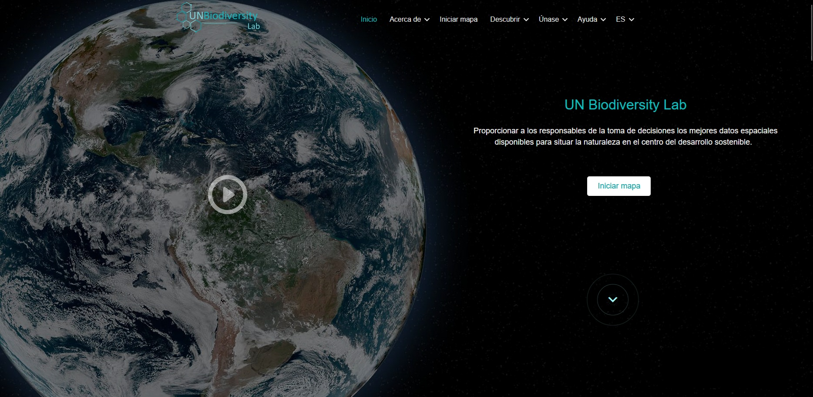

# Guía del usuario de espacios de trabajo seguros del UN Biodiversity Lab (UNBL)

Esta guía explica cómo aprovechar todas las funcionalidades disponibles en su espacio de trabajo seguro en la plataforma UN Biodiversity Lab (UNBL). Si tiene más preguntas, por favor contáctenos en <support@unbiodiversitylab.org>.

!!!Note
	Los términos *conjunto de datos* y *capa* se utilizan de manera intercambiable a lo largo de esta guía. Un conjunto de datos se refiere a una colección de datos espaciales que consta de una o más capas. En UNBL, una carga única o configuración de datos geoespaciales se realiza mediante *'crear una capa'*. Múltiples entradas de capas pueden combinarse y visualizarse en UNBL como un conjunto de datos. Las capas individuales también pueden visualizarse independientemente en UNBL.

## Tabla de contenidos

- **[Conceptos básicos de los espacios de trabajo UNBL](1_basics.es.md)**
	- **[¿Qué es un espacio de trabajo UNBL?](1_basics.es.md#que-es-un-espacio-de-trabajo-unbl)**
	- **[¿Cómo solicito un espacio de trabajo UNBL?](1_basics.es.md#como-solicito-un-espacio-de-trabajo-unbl)**
- **[Visualizar su espacio de trabajo UNBL](2_viewing.es.md)**
	- **[¿Cómo accedo a mi(s) espacio(s) de trabajo?](2_viewing.es.md#como-accedo-a-mis-espacios-de-trabajo)**
	- **[¿Cómo visualizo lugares dentro de mi espacio de trabajo UNBL?](2_viewing.es.md#como-visualizo-lugares-dentro-de-mi-espacio-de-trabajo-unbl)**
	- **[¿Cómo descargo un conjunto de datos para mi área de interés?](2_viewing.es.md#como-descargo-un-conjunto-de-datos-para-mi-area-de-interes)**
	- **[¿Cómo visualizo conjuntos de datos dentro de mi espacio de trabajo?](2_viewing.es.md#como-visualizo-conjuntos-de-datos-dentro-de-mi-espacio-de-trabajo)**
- **[Navegar por la interfaz de administración del espacio de trabajo](3_admin.es.md)**
	- **[¿Cómo accedo a la interfaz de administración?](3_admin.es.md#como-accedo-a-la-interfaz-de-administracion)**
	- **[¿Qué componentes están disponibles dentro de la interfaz de administración?](3_admin.es.md#que-componentes-estan-disponibles-dentro-de-la-interfaz-de-administracion)**
- **[Gestionar usuarios en su espacio de trabajo](4_manage_users.es.md)**
	- **[¿Qué roles y permisos de usuario existen en mi espacio de trabajo UNBL?](4_manage_users.es.md#que-roles-y-permisos-de-usuario-existen-en-mi-espacio-de-trabajo-unbl)**
	- **[¿Cómo agrego nuevos usuarios?](4_manage_users.es.md#como-agrego-nuevos-usuarios)**
	- **[¿Cómo edito o elimino usuarios existentes?](4_manage_users.es.md#como-edito-o-elimino-usuarios-existentes)**
- **[Agregar lugares a su espacio de trabajo y visualizar métricas dinámicas](5_add_places.es.md)**
	- **[¿Cómo agrego lugares?](5_add_places.es.md#como-agrego-lugares)**
	- **[¿Cómo edito lugares?](5_add_places.es.md#como-edito-lugares)**
	- **[¿Cómo muestro métricas para mis lugares agregados?](5_add_places.es.md#como-muestro-metricas-para-mis-lugares-agregados)**
- **[Agregar sus propios datos geoespaciales a su espacio de trabajo](6_add_data.es.md)**
	- **[¿Qué parámetros y metadatos debo completar al crear una capa?](6_add_data.es.md#que-parametros-y-metadatos-debo-completar-al-crear-una-capa)**
	- **[¿Cómo cargo capas ráster en formato GeoTIFF?](6_add_data.es.md#como-cargo-capas-raster-en-formato-geotiff)**
	- **[¿Cómo configuro capas ráster usando servicios de teselas externos?](6_add_data.es.md#como-configuro-capas-raster-usando-servicios-de-teselas-externos)**
	- **[¿Cómo configuro capas vectoriales usando servicios de teselas externos?](6_add_data.es.md#como-configuro-capas-vectoriales-usando-servicios-de-teselas-externos)**
	- **[¿Cómo publico mi capa y la comparto con usuarios externos?](6_add_data.es.md#como-publico-mi-capa-y-la-comparto-con-usuarios-externos)**
	- **[¿Cómo edito mis capas agregadas?](6_add_data.es.md#como-edito-mis-capas-agregadas)**
	- **[¿Cómo creo capas agrupadas?](6_add_data.es.md#como-creo-capas-agrupadas)**
- **[Acceder a la herramienta de planificación espacial integrada ELSA en su espacio de trabajo](7_elsa_tool.es.md)**
- **[¿Y si mi pregunta no fue respondida?](8_support.es.md)**
