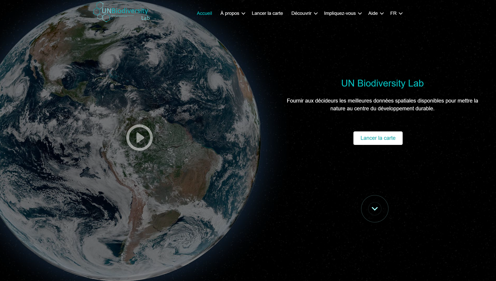

# Guide de l'utilisateur des espaces de travail sécurisés UN Biodiversity Lab (UNBL)

Ce guide explique comment profiter de toutes les fonctionnalités disponibles dans votre espace de travail sécurisé sur la plateforme UN Biodiversity Lab (UNBL). Si vous avez d'autres questions, veuillez nous contacter à <support@unbiodiversitylab.org>.

!!!Note
	Les termes *jeu de données* et *couche* sont utilisés de manière interchangeable dans ce guide. Un jeu de données fait référence à une collection de données spatiales composée d'une ou plusieurs couches. Sur le UNBL, un téléchargement unique ou une configuration de données géospatiales se réalise en *« créant une couche »*. Plusieurs entrées de couches peuvent être combinées et visualisées sur UNBL comme un jeu de données. Les couches individuelles peuvent également être visualisées indépendamment sur le UNBL.

## Table des matières

- **[Principes de base des espaces de travail UNBL](1_basics.fr.md)**
	- **[Qu'est-ce qu'un espace de travail UNBL ?](1_basics.fr.md#quest-ce-quun-espace-de-travail-unbl)**
	- **[Comment demander un espace de travail UNBL ?](1_basics.fr.md#comment-demander-un-espace-de-travail-unbl)**
- **[Visualiser votre espace de travail UNBL](2_viewing.fr.md)**
	- **[Comment accéder à mon/mes espace(s) de travail ?](2_viewing.fr.md#comment-acceder-a-monmes-espaces-de-travail)**
	- **[Comment visualiser les lieux dans mon espace de travail UNBL ?](2_viewing.fr.md#comment-visualiser-les-lieux-dans-mon-espace-de-travail-unbl)**
	- **[Comment télécharger un jeu de données pour ma zone d'intérêt ?](2_viewing.fr.md#comment-telecharger-un-jeu-de-donnees-pour-ma-zone-dinteret)**
	- **[Comment visualiser les jeux de données dans mon espace de travail ?](2_viewing.fr.md#comment-visualiser-les-jeux-de-donnees-dans-mon-espace-de-travail)**
- **[Naviguer dans l'interface d'administration de l'espace de travail](3_admin.fr.md)**
	- **[Comment accéder à l'interface d'administration ?](3_admin.fr.md#comment-acceder-a-linterface-dadministration)**
	- **[Quels composants sont disponibles dans l'interface d'administration ?](3_admin.fr.md#quels-composants-sont-disponibles-dans-linterface-dadministration)**
- **[Gérer les utilisateurs dans votre espace de travail](4_manage_users.fr.md)**
	- **[Quels rôles et permissions d'utilisateur existent dans mon espace de travail UNBL ?](4_manage_users.fr.md#quels-roles-et-permissions-dutilisateur-existent-dans-mon-espace-de-travail-unbl)**
	- **[Comment ajouter de nouveaux utilisateurs ?](4_manage_users.fr.md#comment-ajouter-de-nouveaux-utilisateurs)**
	- **[Comment modifier ou supprimer des utilisateurs existants ?](4_manage_users.fr.md#comment-modifier-ou-supprimer-des-utilisateurs-existants)**
- **[Ajouter des lieux à votre espace de travail et visualiser les métriques dynamiques](5_add_places.fr.md)**
	- **[Comment ajouter des lieux ?](5_add_places.fr.md#comment-ajouter-des-lieux)**
	- **[Comment modifier des lieux ?](5_add_places.fr.md#comment-modifier-des-lieux)**
	- **[Comment afficher les métriques pour mes lieux ajoutés ?](5_add_places.fr.md#comment-afficher-les-metriques-pour-mes-lieux-ajoutes)**
- **[Ajouter vos propres données géospatiales à votre espace de travail](6_add_data.fr.md)**
	- **[Quels paramètres et métadonnées dois-je remplir lors de la création d'une couche ?](6_add_data.fr.md#quels-parametres-et-metadonnees-dois-je-remplir-lors-de-la-creation-dune-couche)**
	- **[Comment télécharger des couches raster au format GeoTIFF ?](6_add_data.fr.md#comment-telecharger-des-couches-raster-au-format-geotiff)**
	- **[Comment configurer des couches raster en utilisant des services de tuiles externes ?](6_add_data.fr.md#comment-configurer-des-couches-raster-en-utilisant-des-services-de-tuiles-externes)**
	- **[Comment configurer des couches vectorielles en utilisant des services de tuiles externes ?](6_add_data.fr.md#comment-configurer-des-couches-vectorielles-en-utilisant-des-services-de-tuiles-externes)**
	- **[Comment publier ma couche et la partager avec des utilisateurs externes ?](6_add_data.fr.md#comment-publier-ma-couche-et-la-partager-avec-des-utilisateurs-externes)**
	- **[Comment modifier mes couches ajoutées ?](6_add_data.fr.md#comment-modifier-mes-couches-ajoutees)**
	- **[Comment créer des couches groupées ?](6_add_data.fr.md#comment-creer-des-couches-groupees)**
- **[Ajouter vos propres métriques personnalisées à votre espace de travail](7_custom_metrics.fr.md)**
- **[Accéder à l'outil de planification spatiale intégrée ELSA dans votre espace de travail](8_elsa_tool.fr.md)**
- **[Et si ma question n'a pas reçu de réponse ?](9_support.fr.md)**
