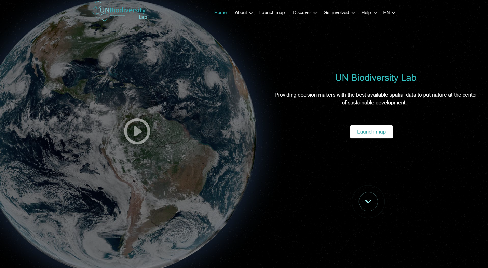

# UN Biodiversity Lab (UNBL) Secure Workspaces User Guide

This guide explains how to take advantage of all available features in your secure workspace on the UN Biodiversity Lab (UNBL) platform. If you have any further questions, please contact us at <support@unbiodiversitylab.org>.

!!!Note
	The terms *dataset* and *layer* are used intermittently throughout this guide. A dataset refers to a collection of spatial data consisting of one or more layers. On UNBL, a single upload or configuration of geospatial data is realized through *‘creating a layer’*. Multiple layer entries can be combined and visualized on UNBL as a dataset. Single layers can also be visualized independently on UNBL.
	
## Table of Contents

- **[Basics of UNBL Workspaces](1_basics.md)**
	- **[What is a UNBL workspace?](1_basics.md#what-is-a-unbl-workspace)**
	- **[How do I request a UNBL workspace?](1_basics.md#how-do-i-request-a-unbl-workspace)**
- **[Viewing Your UNBL Workspace](2_viewing.md)**
	- **[How do I access my workspace(s)?](2_viewing.md#how-do-i-access-my-workspaces)**
	- **[How do I view places within my UNBL workspace?](2_viewing.md#how-do-i-view-places-within-my-unbl-workspace)**
	- **[How do I download a dataset for my area of interest?](2_viewing.md#how-do-i-download-a-dataset-for-my-area-of-interest)**
	- **[How do I view datasets within my workspace?](2_viewing.md#how-do-i-view-datasets-within-my-workspace)**
- **[Navigating the Workspace Admin Interface](3_admin.md)**	
	- **[How do I access the admin interface?](3_admin.md#how-do-i-access-the-admin-interface)**
	- **[What components are available within the admin interface?](3_admin.md#what-components-are-available-within-the-admin-interface)**
- **[Managing Users in Your Workspace](4_manage_users.md)**
	- **[What user roles and permissions exist in my UNBL workspace?](4_manage_users.md#what-user-roles-and-permissions-exist-in-my-unbl-workspace)**
	- **[How do I add new users?](4_manage_users.md#how-do-i-add-new-users)**
	- **[How do I edit or delete existing users?](4_manage_users.md#how-do-i-edit-or-delete-existing-users)**
- **[Adding Places to Your Workspace and Viewing Dynamic Metrics for Them](5_add_places.md)**
	- **[How do I add places?](5_add_places.md#how-do-i-add-places)**
	- **[How do I edit places?](5_add_places.md#how-do-i-edit-places)**
	- **[How do I display metrics for my added places?](5_add_places.md#how-do-i-display-metrics-for-my-added-places)**
- **[Adding Your Own Geospatial Data to Your Workspace](6_add_data.md)**
	- **[What parameters and metadata do I fill in when creating a layer?](6_add_data.md#what-parameters-and-metadata-do-i-fill-in-when-creating-a-layer)**
	- **[How do I upload raster layers in GeoTIFF format?](6_add_data.md#how-do-i-upload-raster-layers-in-geotiff-format)**
	- **[How do I configure raster layers using external tile services?](6_add_data.md#how-do-i-configure-raster-layers-using-external-tile-services)**
	- **[How do I configure vector layers using external tile services?](6_add_data.md#how-do-i-configure-vector-layers-using-external-tile-services)**
	- **[How do I publish my layer and share it with external users?](6_add_data.md#how-do-i-publish-my-layer-and-share-it-with-external-users)**
	- **[How do I edit my added layers?](6_add_data.md#how-do-i-edit-my-added-layers)**
	- **[How do I create group layers?](6_add_data.md#how-do-i-create-group-layers)**
- **[Accessing the ELSA Integrated Spatial Planning Tool in Your Workspace](7_elsa_tool.md)**
- **[What if my Question was not Answered?](8_support.md)**