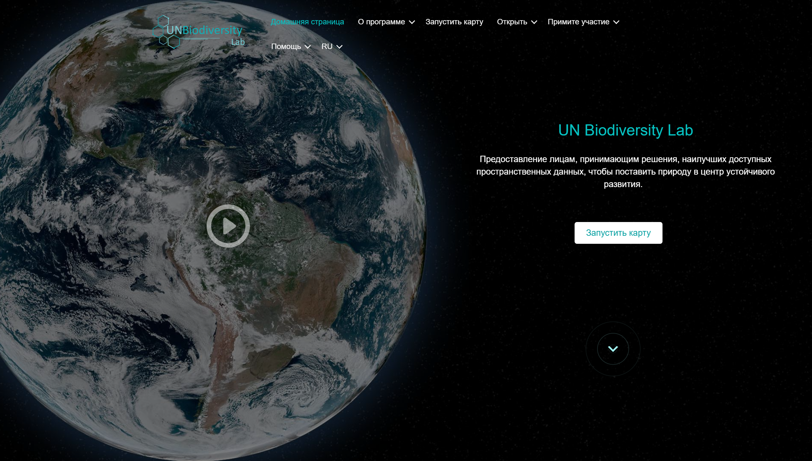

# Руководство пользователя защищённых рабочих пространств Лаборатории ООН по биоразнооьразию (UNBL)

Данное руководство объясняет, как использовать все доступные функции в вашем защищённом рабочем пространстве на платформе Лаборатории ООН по биоразнооьразию (UNBL). Если у вас есть дополнительные вопросы, пожалуйста, свяжитесь с нами по адресу <support@unbiodiversitylab.org>.

!!!Note
	Термины *набор данных* и *слой* используются взаимозаменяемо в данном руководстве. Набор данных относится к коллекции пространственных данных, состоящей из одного или нескольких слоёв. В UNBL единичная загрузка или конфигурация геопространственных данных реализуется через *«создание слоя»*. Несколько записей слоёв могут быть объединены и визуализированы в UNBL как набор данных. Отдельные слои также могут визуализироваться независимо в UNBL.

## Содержание

- **[Основы рабочих пространств UNBL](1_basics.ru.md)**
	- **[Что такое рабочее пространство UNBL?](1_basics.ru.md#chto-takoe-rabochee-prostranstvo-unbl)**
	- **[Как мне запросить рабочее пространство UNBL?](1_basics.ru.md#kak-zaprosit-rabochee-prostranstvo-unbl)**
- **[Просмотр вашего рабочего пространства UNBL](2_viewing.ru.md)**
	- **[Как зайти в моё(и) рабочее пространство(а)?](2_viewing.ru.md#kak-poluchit-dostup-k-moemu-rabochemu-prostranstvuam)**
	- **[Как просматривать места в моём рабочем пространстве UNBL?](2_viewing.ru.md#kak-prosmatrivat-mesta-v-moem-rabochem-prostranstve-unbl)**
	- **[Как скачать набор данных для моей области интереса?](2_viewing.ru.md#kak-skachat-nabor-dannyx-dlya-moej-oblasti-interesov)**
	- **[Как мне просматривать наборы данных в моём рабочем пространстве?](2_viewing.ru.md#kak-prosmatrivat-nabory-dannyx-v-moem-rabochem-prostranstve)**
- **[Навигация по администротивному интерфейсу рабочего пространства](3_admin.ru.md)**
	- **[Как получить доступ к административному интерфейсу](3_admin.ru.md#kak-poluchit-dostup-k-interfejsu-administrirovaniya)**
	- **[Какие компоненты доступны в административном интерфейсе?](3_admin.ru.md#kakie-komponenty-dostupny-v-interfejse-administrirovaniya)**
- **[Управление пользователями в вашем рабочем пространстве](4_manage_users.ru.md)**
	- **[Какие роли и разрешения для пользователей существуют в моём рабочем пространстве UNBL?](4_manage_users.ru.md#kakie-roli-i-razresheniya-polzovatelej-sushhestvuyut-v-moem-rabochem-prostranstve-unbl)**
	- **[Как мне добавить новых пользователей?](4_manage_users.ru.md#kak-dobavit-novyx-polzovatelej)**
	- **[Как мне редактировать или удалять существующих пользователей?](4_manage_users.ru.md#kak-redaktirovat-ili-udalyat-sushhestvuyushhix-polzovatelej)**
- **[Добавление мест в ваше рабочее пространство и просмотр динамических показателей](5_add_places.ru.md)**
	- **[Как мне добавить места?](5_add_places.ru.md#kak-dobavit-mesta)**
	- **[Как мне редактировать места?](5_add_places.ru.md#kak-redaktirovat-mesta)**
	- **[Как мне отображать показатели для моих добавленных мест?](5_add_places.ru.md#kak-otobrazhat-metriki-dlya-moix-dobavlennyx-mest)**
- **[Добавление собственных геопространственных данных в ваше рабочее пространство](6_add_data.ru.md)**
	- **[Какие параметры и метаданные мне заполнять при создании слоя?](6_add_data.ru.md#kakie-parametry-i-metadannye-ya-zapolnyayu-pri-sozdanii-sloya)**
	- **[Как загрузить растровые слои в формате GeoTIFF?](6_add_data.ru.md#kak-zagruzit-rastrovye-sloi-v-formate-geotiff)**
	- **[Как настроить растровые слои с использованием внешних тайловых сервисов WMS/WMTS?](6_add_data.ru.md#kak-nastroit-raster-wms-wmts)**
	- **[Как настроить растровые слои с использованием Google Earth Engine (GEE)?](6_add_data.ru.md#kak-nastroit-google-earth-engine)**
	- **[Как настроить растровые слои с использованием Spatiotemporal Asset Catalog (STAC)?](6_add_data.ru.md#kak-nastroit-stac)**
	- **[Как настроить векторные слои с использованием внешних тайловых сервисов?](6_add_data.ru.md#kak-nastroit-vektornye-sloi-s-ispolzovaniem-vneshnix-tajlovyx-servisov)**
	- **[Как мне опубликовать мой слой и поделиться им с внешними пользователями?](6_add_data.ru.md#kak-opublikovat-moj-sloj-i-podelitsya-im-s-vneshnimi-polzovatelyami)**
	- **[Как мне редактировать мои добавленные слои?](6_add_data.ru.md#kak-redaktirovat-moi-dobavlennye-sloi)**
	- **[Как мне создавать групповые слои?](6_add_data.ru.md#kak-sozdavat-gruppovye-sloi)**
- **[Доступ к инструменту интегрированного пространственного планирования ELSA в вашем рабочем пространстве](7_elsa_tool.ru.md)**
- **[Что делать, если я не нашел ответ на свой вопрос?](8_support.ru.md)**
